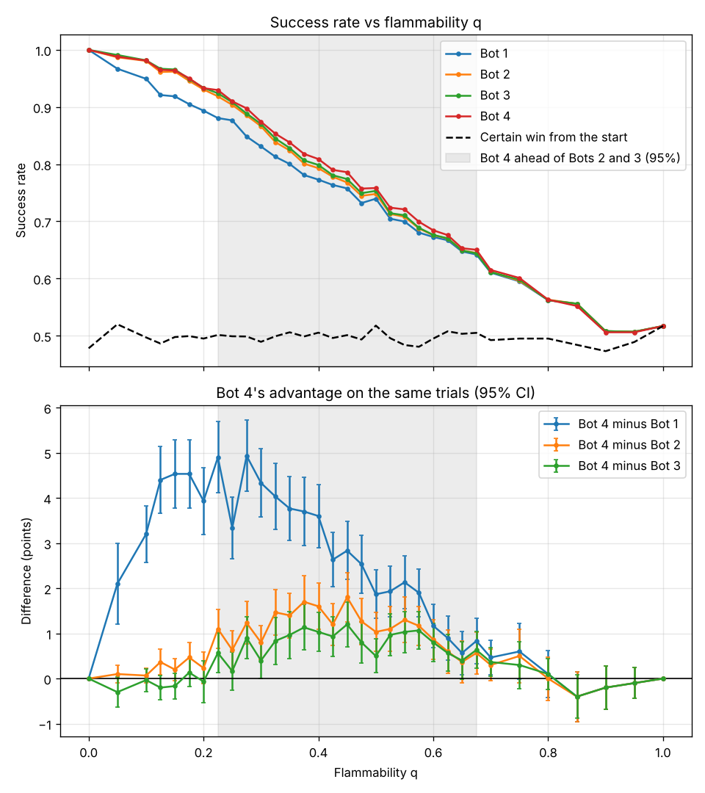
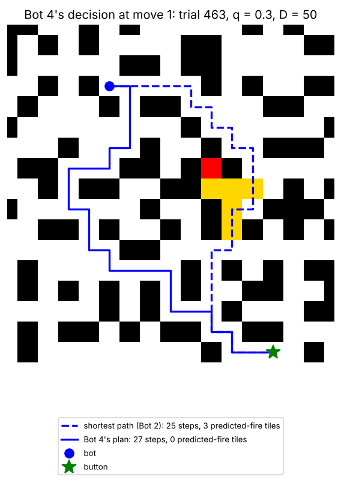

# Project 1: This Ship is on Fiiiiire!

A bot on a randomly generated D x D ship has to reach the fire-suppression
button before the fire spreading through the ship gets to it (or to the
button). This directory has the ship generator, the fire model, Bots 1-4, and
the experiment, analysis and visualisation scripts.

## Running it

Needs Python 3 with `numpy` and `matplotlib` (and `pytest` for the tests).
Developed and tested on Python 3.13.

```bash
cd "project 1"
pip install numpy matplotlib pytest

python -m pytest                                   # 105 tests, about 15 seconds

# Experiments: one CSV row per (trial, bot); uses every core
# (about 0.7 s per trial per core at D = 50, all four bots).
python experiments.py --D 50 --q 0:1:0.05 --trials 1000 --out results/main.csv
python analyze.py results/main.csv.gz --out results --bots bot1 bot2 bot3 bot4

# Replay a single trial (trial numbers match the CSV) or find an interesting one
python visualize.py --D 50 --q 0.3 --trial 17 --out trial17.png
python visualize.py --D 50 --q 0.3 --where bot3=0 bot4=1 --bots bot3 bot4 --out case.png

# One of Bot 4's decisions: burning and predicted-fire tiles, its plan, and Bot 2's
python decision.py --D 50 --q 0.3 --trial 463 --out decision.png
```

Bots are named by spec strings, so variants can be compared in one run:
`bot4:threshold=0.5`, `bot4:penalty=50`, `bot4:lookahead=false`,
`bot4:fire_metric=manhattan`.

## Files

| File | What it does |
|---|---|
| `ship.py` | The ship as a 2D grid of `Tile` objects (`ship.grid[r][c]`), and its generation (both phases from the spec). No fire/bot code, so it can be reused in later projects. |
| `fire.py` | The spread rule: `spread_fire` updates the tiles' `on_fire` flags once per time step. |
| `planning.py` | The search algorithms, written from the lecture pseudocode: BFS, A*, the Manhattan heuristic, distance maps, the certain-win check. |
| `planners.py` | One function per way of choosing a path. Each bot is one of these plus "replan every step or not". Bot 4's race model lives here. |
| `bots.py` | The single `Bot` class and the table saying how Bots 1-4 are built. |
| `simulation.py` | Runs a bot on a trial in the order the spec gives, moving the bot and spreading the fire on the tiles (and counts moves Bot 2 couldn't have made). |
| `experiments.py` | Parallel, reproducible parameter sweeps that write CSVs. |
| `analyze.py` | Success rates with 95% CIs, paired bot comparisons, failure breakdowns, charts. |
| `visualize.py` | Draws what each bot did on one trial. |
| `decision.py` | Draws one of Bot 4's real decisions: what it predicted, its plan, and the shortest path it turned down. |
| `tests/` | Unit tests (see "Correctness checks"). |
| `results/` | Data and charts from the runs described below. |

## Design

### Ship
As in the original plan, the ship is a D x D grid of `Tile` objects:
`ship.grid[r][c]` is the tile at row r, column c, and a position is a
`(row, col)` tuple. (This README says "cell" and "tile" interchangeably.)
Each tile tracks:

| Attribute | Meaning |
|---|---|
| `is_open` | open floor, or wall |
| `on_fire` | burning right now |
| `has_bot` | the bot is standing here |
| `has_button` | the button is here |
| `neighbors` | positions of the open tiles next to it (up, down, left, right) |

Walls never change after generation, so each tile's list of open neighbours
is filled in once, and every search simply walks `tile.neighbors`.

`Ship.generate` follows the spec exactly. Phase 1 (`grow_maze`) opens a
random interior tile, then repeatedly opens a random wall with exactly one
open neighbour. Phase 2 (`reduce_dead_ends`) opens a random wall next to a
random dead end until at most half of the original dead ends remain. Phase 1
keeps its list of candidate walls up to date as it goes (opening a tile only
changes its 4 neighbours' counts), so it is O(D^2) instead of rescanning the
grid every iteration (O(D^4)); phase 2 likewise only rechecks the tiles
around each opening. Only the first open tile has to be in the interior;
later tiles may be on the edge of the grid.

### Fire
Each step every open tile that isn't burning catches fire with probability
$1 - (1 - q)^K$, where $K$ is its number of burning neighbours. As the TA
feedback asked, the update is **synchronous**: `fire.spread_fire` first goes
over every tile and collects the ones that catch fire, counting $K$ from the
fire as it was at the start of the step, and only then sets them on fire. So
a tile that catches fire can't spread it in the same step
(`test_update_is_synchronous` checks this).

The fire does not react to the bot. So every run of a trial starts the
fire's random number generator from the same point (`Trial.start` hands each
run a fresh copy of it), and all the bots face the **same** fire, as the
instructor's guidance suggests ("run both bots against the same fire
progression"). That makes bot comparisons paired and much less noisy. Bots
only ever see the tiles as they are at the current time step.

### Time step and outcomes
`simulation.run_bot` follows the spec's order: the bot picks a move, moves,
presses the button if it is on it, and otherwise the fire advances. Every
failure is labelled with its cause:

| Outcome | Meaning |
|---|---|
| `entered_fire` | the bot moved into a burning cell (only Bot 1 does this) |
| `caught` | the fire spread onto the bot's cell |
| `button_burned` | the button caught fire first; nobody can press it any more |
| `trapped` | the bot is alive but every route to the button runs through fire |

The last two end the trial early. That doesn't change any result, because
the fire never goes out, so once either happens the bot is certain to fail.

### Bots: one class, four planners

There is a single `Bot` class (`bots.py`). A bot is a name, a **planner**
(a function in `planners.py` that returns a path to the button, or `None`)
and a flag saying whether to call the planner again every step:

| Bot | Planner | Replans? | Search |
|---|---|---|---|
| Bot 1 | `avoid_fire` | no, plans once at t = 0 | BFS avoiding the initial fire cell |
| Bot 2 | `avoid_fire` | every step | BFS avoiding every burning cell |
| Bot 3 | `avoid_fire_and_neighbors`, falling back to `avoid_fire` | every step | BFS avoiding burning cells and their neighbours |
| Bot 4 | `avoid_predicted_fire` | every step | A* with a race model of the fire, described next |

Bot 3's fallback is literally a call to Bot 2's planner. The bot's own cell
is never avoided. The button is avoided like any other cell, so a button
next to the fire means Bot 3 falls back to Bot 2's rule.

All planners have the same signature,
`planner(ship, pos, button, q, **options)`, and read the fire from the tiles
(`ship.fire_cells()`). So a new bot is one line in the `BOTS` table, and
variants are spec strings such as `bot4:threshold=0.5,penalty=50`.

### Searches (`planning.py`, from the lecture notes)

The searches follow the pseudocode from lecture and use its names: a
`fringe` of states still to explore, a `closed_set` of states already
explored, and `prev[child]` = the state the child was reached from, with
`prev[start] = None`. Following `prev` back from the goal rebuilds the path.
A state is a tile position `(row, col)`.

- **BFS** (`bfs_path`) is GraphSearch with a queue as the fringe, so the
  oldest state comes off first and the first time the goal comes off, it is
  along a shortest path. "Restricted states" are the tiles the bot must
  avoid (the fire for Bots 1 and 2; the fire and its neighbours for Bot 3).
  One addition to the notes: a child that is already in `prev` is already
  on the fringe, so it isn't added a second time. Every tile is then on the
  fringe at most once and keeps the first tile it was reached from.
- **A\*** (`astar_path`) is uniform cost search with
  $\text{priority}(n) = f(n) = g(n) + h(n)$, as in the notes: `dist[n]` is
  $g(n)$, the cheapest cost found so far from the start, `dist_to_child =
  dist[curr] + cost(curr, child)`, and a child is added or updated when it
  is new or `dist_to_child < dist[child]`. Like the notes' A*, there is no
  closed list. Python's `heapq` has no "add or update", so an updated child
  is simply added again; its old copy has a higher priority, and when it
  comes off later it changes nothing.
- `bfs_distances` and `fire_distances` are the same BFS with no goal, run
  until the fringe is empty to get the distance to every tile
  (`fire_distances` starts with every burning tile on the fringe at once).

### Bot 4: avoid the fire that will probably get there first

**The idea.** Bot 4 treats every cell as a race between the bot and the
fire. If the fire will probably win the race to a cell, Bot 4 treats that
cell as if it were already burning. It then plans with A*, where burning
cells are walls and "probably burning by the time I get there" cells cost
extra.

**The race.** Each step, for every open cell $c$:

- $k(c)$ = the number of moves the bot needs to reach $c$: BFS from the bot,
  avoiding cells that are burning now.
- $d(c)$ = the number of cells the fire must travel to reach $c$: a
  multi-source BFS through open cells, starting from every burning cell.

Along a single route, the fire's front advances one cell in a step with
probability $q$: the next cell on the route has one burning neighbour, which
gets one chance per step to ignite it. So in $k$ steps the front advances
$A_k \sim \text{Binomial}(k, q)$ cells, and

$$
P(\text{fire reaches } c \text{ first}) = P\big(A_{k(c)} \ge d(c)\big) = \sum_{j=d(c)}^{k(c)} \binom{k(c)}{j} q^j (1-q)^{k(c)-j}
$$

For the button, $k$ is one less, since the bot presses it before the fire
moves. A cell is **predicted fire** if this probability is above a
threshold $\theta$ (0.6 by default).

Bot 4 doesn't evaluate the sum for every cell. $P(A_k \ge d)$ only gets
smaller as $d$ grows, so `danger_radius` computes once per $q$, for each
$k$, the largest fire distance that still counts as dangerous, and keeps the
table in a dictionary so it is only built once. The check per cell is then
one comparison: $d(c) \le \text{radius}[k(c)]$.

**The search.** A* from the bot to the button, where entering a cell $c$
costs

$$
w(c) = \begin{cases}
\infty & \text{if } c \text{ is burning now (never entered)} \\
1 + \lambda & \text{if } c \text{ is predicted fire} \\
1 & \text{otherwise}
\end{cases}
$$

with penalty $\lambda = 20$ by default. The heuristic is the Manhattan
distance to the button, $h(c) = |r_c - r_g| + |c_c - c_g|$. It is the cost
of a relaxed problem (the same grid with the walls removed), so it is
admissible: $h(c) \le C^*(c, G)$. It is also consistent, since every step
costs at least 1 and $h$ changes by at most 1 per step:
$h(n) \le C^*(n, n') + h(n')$. So A* returns the cheapest path. Bot 4 takes
the plan's first step, then does it all again with the new fire.

```
each step, given pos, burning, q:
    d ← BFS distance from the burning cells to every cell
    k ← BFS distance from pos to every cell, avoiding burning cells
    predicted ← cells with P(Binomial(k, q) ≥ d) > θ        (k - 1 for the button)
    cost ← ∞ for burning cells, 1 + λ for predicted cells, 1 otherwise
    plan ← A*(pos → button, cost, heuristic = Manhattan distance to the button)
    if no plan: trapped (every route runs through fire)
    take the plan's first step
```

**Short-but-risky vs long-but-safe.** A path's cost is its length plus
$\lambda$ for every predicted-fire cell on it. So Bot 4 takes a detour of up
to $\lambda$ extra steps to avoid one predicted-fire cell, but goes through
predicted fire when every way around is longer than that (or runs through
predicted fire too). That is the trade-off the TA feedback asked for.

**Why this is not "Bot 3 with a wider buffer"** (the one thing the
assignment rules out):

- The avoided region depends on **where the bot is**. A cell right next to
  the fire that the bot can reach first is not avoided. At q = 0.3, a cell
  five cells from the fire that the bot would only reach in 20 steps is
  avoided (the fire gets there first 76% of the time).
- It depends on **q**: a slow fire predicts a thin band, a fast fire a wide
  one.
- It is **soft**: predicted fire is a cost to trade against detour length,
  not a wall.

The decision figure under Results shows all three in one picture.

**How good is the race model?** Each burning cell gives each unburnt
neighbour its own q-coin every step, so once a cell ignites, the wait until
it ignites a given neighbour is a Geometric($q$) number of steps,
independent of everything else. The fire reaches $c$ at the earliest time
over *all* routes, and the race model only counts one shortest route. So:

- On a tree-shaped region with one burning cell, there is only one route,
  and the formula is **exact**.
- Otherwise, extra routes (loops opened in phase 2, other burning cells) can
  only make the real fire faster. The true probability is never lower than
  the model's: the model is a **slightly optimistic lower bound**.

Both points are checked in `tests/test_planning.py` against simulated fires
(a corridor, where the model should be exact, and a real ship, where it
should never predict more fire than really comes).

**Known limitation: $k(c)$ is the bot's shortest distance, not its arrival
time on the plan.** On a detour, the bot reaches cells (and the button)
later than $k(c)$, so they are more dangerous than the model thinks.
Detours therefore look safer than they are. That is what loses q = 0.85,
trial 96 under Results. Fixing it would mean searching over (cell, time)
pairs instead of cells, so that each cell is scored at the step the plan
actually reaches it.

**Where the design came from, and what changed.** The brief was: A* with a
Manhattan-distance heuristic between the fire and the bot; burning cells
cost extra; and open cells with a high (> 60%) probability of catching fire
are treated as burning and cost extra too. Three things changed while
formalising it:

- *Heuristic.* An A* heuristic has to estimate the remaining cost **to the
  goal**, so it is the Manhattan distance to the button. The fire-to-bot
  comparison is still there: it is the race, which compares how far the bot
  and the fire each are from every cell.
- *"> 60% chance of catching fire".* Read literally, the chance a cell
  catches fire next step is $1 - (1-q)^K$, with $K$ its burning neighbours.
  Only cells touching the fire have $K \ge 1$, so this rule can only ever
  flag cells inside Bot 3's buffer: with $K = 1$ only when $q > 0.6$, and
  even with $K = 4$ never when $q \le 0.2$. That would be Bot 3 with a
  thinner buffer, the version the assignment forbids, and at low q it would
  be exactly Bot 2. The race model asks the same question ("will this cell
  be on fire?") at the time that matters: when the bot would get there. The
  literal rule is kept as `bot4:lookahead=false`. In the tuning runs it was
  no better than Bot 2 (+0.07 ± 0.16 points).
- *Distance for the fire.* The fire can only spread through open cells, so
  $d(c)$ is a BFS through the maze, not the Manhattan distance (which would
  flag cells the fire can only reach the long way round). The Manhattan
  version is kept as `bot4:fire_metric=manhattan`. It did slightly worse
  in tuning (-0.15 ± 0.23 points) and is 25% slower.

**Assumption:** Bot 4 knows q, the ship's flammability.

### Efficiency

The code is written to be easy to follow first: a grid of `Tile` objects,
`(row, col)` positions, sets and plain loops. Within that, these choices keep
it fast enough for large experiments:

- **Ship generation is O(D^2).** Phase 1 keeps its candidate walls in a list
  plus a dictionary of their positions in it, instead of rescanning the grid
  every iteration (O(D^4)). Phase 2 only rechecks the tiles around each
  opening instead of recounting every dead end.
- **Each tile's open neighbours are worked out once**, since walls never
  change.
- **Trials stop as soon as the outcome is certain** (button burned, or every
  route cut off).
- **Every bot replays the same fire** from the same random generator state,
  so comparisons are paired: they need about 16x fewer trials than
  independent samples for the same precision on a difference.
- **Bot 4** costs two BFSs, one pass over the tiles and one A* per move.
  The binomial tail is never summed during a trial: `danger_radius` turns
  it into a lookup table once per (q, θ) and keeps it in a dictionary, so
  each tile's check is one comparison. The Manhattan heuristic keeps A*
  focused on the button.
- **Trials run in parallel** on every core. Each trial's seed depends only on
  (seed, q, trial index), so results don't depend on how work is split up.

At D = 50 a trial takes about 0.7 s per core for all four bots plus the
certain-win check, so the 83,000-trial main run takes several hours on 4
cores.

**How the results below were produced.** The experiments were run with an
earlier version of this same code that stored the grid as flat numpy arrays
(2-3 times faster). The `Tile` version was then checked against those
results: rerunning 825 of the trials (25 at each of the 33 values of q) gave
identical rows for every bot (3,300 of 3,300), with the same outcome,
reason, number of steps, departures from Bot 2's rule and certain-win flag.
After BFS and A* were rewritten to follow the lecture pseudocode, 495 more
trials (15 at each q) were rerun: again identical (1,980 of 1,980 rows).
The ship generator gives identical ships from the same seeds. Only the
timing column differs. (The stored CSVs also had a few columns for analyses
that are no longer part of this project; those were dropped.)

### Certain wins (the instructor's data-collection hint)
`Trial.fireproof()` asks, before simulating anything, whether the bot has a
path that even the fastest possible fire (q = 1) cannot catch. The fire
moves at most one cell per step whatever q is, so:

1. a multi-source BFS from the fire gives the earliest step the fire could
   *possibly* reach each cell (`planning.fire_distances`);
2. a second BFS looks for a path on which the bot enters every cell strictly
   before that (the button: no later, since it is pressed before the fire
   moves) (`planning.fireproof_path`).

If such a path exists, the trial is a certain win for any bot that takes
it (tested: a bot that follows this path wins against the real fire at every
q). This doesn't depend on q at all, which is why success levels off at
about 52% as q approaches 1: at q = 1 the fire really is that fast, and only
the certain wins are left. The experiments record it for every trial.

### Do the bots actually decide differently?
A move is one Bot 2 could have made if it steps along *some* shortest path to
the button through currently unburnt cells. `run_bot(..., count_deviations=True)`
counts each bot's moves that fail that test (Bot 2's count is always 0;
tested). This is independent of how ties between equally short paths are
broken, so a nonzero count means the bot really made a different kind of
decision. The experiments record the count for every bot and trial.

## How Bot 4 got here (process)

1. **First version.** Bot 4 started out more ambitious: a step-by-step
   forecast of the fire and an A* over (cell, time) pairs. It worked, but
   it was hard to explain clearly next to Bot 3, and slow.
2. **Instructor's hint: certain wins.** About half of all trials turned out
   to be certain wins at every q, and every bot won every one of them. That
   explains why success levels off near 52% at high q.
3. **Does Bot 4 just copy Bot 2?** Counting the moves Bot 2's rule could not
   make showed that it mostly does, but its departures win far more often
   than they lose (see Results).
4. **Simplified.** Bot 4 was replaced by the design above: the same "who
   gets there first" question, answered by a closed-form race and a plain A*
   over cells. At the same time the bots became one `Bot` class with
   interchangeable planner functions, and Bots 2 and 3 literally rerun their
   BFS every step.
5. **Tuning on held-out trials** (below): kept θ = 0.6 and λ = 20.
6. **Final run** of all four bots on 83,000 trials.
7. **Back to the original plan's grid, and the lecture pseudocode.** The code
   was rewritten around a 2D grid of `Tile` objects with `(row, col)`
   positions, as the plan specified, and BFS and A* were rewritten to follow
   the lecture notes. Neither change altered a single result (see
   "Efficiency").

## Deviations from the original plan

The ship is stored as the plan describes: a 2D grid of `Tile` objects,
each tracking whether it is open and whether it currently holds the bot, the
button or fire, with the fire updated from neighbouring tiles every step.

1. **Bot 4's details differ from the brief** in the three ways listed under
   "Where the design came from": Manhattan distance to the button as the
   heuristic, the race model instead of the one-step 60% rule, and maze
   distance for the fire.
2. **The plan's heuristic was the Euclidean distance to the button.** A*
   uses the Manhattan distance instead: the bot can only move up, down, left
   and right, so the Manhattan distance is the exact cost on a grid without
   walls. It is still admissible and never smaller than the Euclidean
   distance, so it guides the search better.
3. **BFS differs from the notes' GraphSearch in one line:** a child that is
   already on the fringe is not added again (see "Searches").
4. **Additions that were not in the plan**, each from the instructor's
   guidance: the same fire for every bot on each trial ("run both bots
   against the same fire progression"), the certain-win check (the
   data-collection hint) and the count of moves Bot 2 couldn't have made
   ("are there situations where your bots make different decisions?"). Also
   early stopping once failure is certain, which changes no result.
5. The directory is named `project 1` (with a space) as requested, so quote
   it in shells: `cd "project 1"`.

## Correctness checks (`tests/`)
- Ship: phase 1 yields a tree with no tile left to open; phase 2 at least
  halves the dead ends and only opens tiles; every open tile is reachable;
  generation is reproducible; each tile's neighbour list is right;
  `clear()` removes the bot, button and fire.
- Fire: synchronous update, catch frequency matches $1 - (1 - q)^K$, no
  spread at q = 0, fire stays on open tiles, the same generator state gives
  the same fire.
- Search: BFS paths are valid and shortest; A* with unit costs finds
  shortest paths; A* with mixed costs matches plain uniform cost search; the
  Manhattan heuristic never overestimates.
- Race model: `danger_radius` agrees with the binomial formula for every
  (k, d); it matches simulated fires on a corridor; it never predicts more
  fire than simulated fires produce on a real ship; at q = 1 a cell is
  predicted fire exactly when the fire is at most as far from it as the
  bot; predicted fire is not a fixed buffer (a corridor where moving the bot
  changes which cells are flagged); the one-step rule only flags tiles next
  to the fire.
- Bots: Bot 1 plans once; Bot 2 never deviates from its own rule; Bot 3
  avoids the buffer when it can and falls back to Bot 2's planner when it
  can't; Bot 4 with no penalty never leaves Bot 2's rule; every run makes one
  legal move per step and only Bot 1 walks into fire; with q = 0 every bot
  wins whenever winning is possible; every run of a trial sees the same
  fire; a trial from the main run reproduces its recorded outcomes.
- Certain wins: a bot that follows the fireproof path always wins, at every
  q.

## Results

### What was run

| Run | Ship size D | q values | Trials per q | Purpose |
|---|---|---|---|---|
| Main, whole range | 50 | 0 to 1 in steps of 0.05 | 1,000 | overall picture |
| Main, interesting range | 50 | 0.1 to 0.7 in steps of 0.025 | 3,000 | where the bots differ |
| Bot 4 tuning | 50 | 0.05-0.6 | 500 (separate seed) | threshold, penalty, variants |
| Ship size | 25 and 100 | 0.1 to 0.8 | 2,000 and 400 | how much D matters |

The main run is 83,000 trials, each on a freshly generated ship. On every
trial all the bots face the same ship, start cells and fire. Seeds come from
(seed, q, trial index), so any row can be replayed with `visualize.py`. Raw
data: `results/main.csv.gz`; every table: `results/summary.md`.

**How much data is enough.** 3,000 trials per q in the interesting range
give 95% CIs of about ±1.6 points on each success rate. More importantly,
because the bots share each trial's fire, their *difference* can be
measured trial by trial: at q = 0.4, Bot 4 minus Bot 2 is +1.6 ± 0.5 points
paired, where independent samples of the same size would give ±2.0.
Matching the paired precision with independent samples would take about 16
times as many trials.

**How the interesting range was found.** A first pass over the whole range
showed that below q ≈ 0.1 Bots 2-4 win about 98% or more of the trials and
are within a few tenths of a point of each other, and above q ≈ 0.75 all
four bots are within a point of each other. The extra trials went to the
range in between.

### The centerpiece: success rate against q



The dashed line is the share of trials that are certain wins from the start
(next section): no bot ever loses one of those, so no bot can fall below it.

- **Equally good (q near 0).** At q = 0 every bot wins 100%. Up to
  q ≈ 0.2, Bots 2-4 are within about half a point of each other. Bot 1 is
  the exception: it never replans, so even a slow fire that creeps onto its
  path kills it (96.7% at q = 0.05).
- **Bot 4 ahead (q = 0.225 to 0.675, shaded).** Here Bot 4 beats both Bot 2
  and Bot 3 with 95% confidence at 17 of the 19 tested q values (at 0.25
  and 0.65 it is ahead, but within the noise). Its lead peaks at
  +1.8 ± 0.5 points over Bot 2 and +1.2 ± 0.5 over Bot 3 (q = 0.45), and is
  +3 to +5 points over Bot 1 for q = 0.125-0.4.
- **Equally bad (q ≥ 0.8).** All four bots are within 0.6 points of each
  other. At q = 1 every bot wins exactly the 51.7% of trials that are
  certain wins: the fire is as fast as the bot, so the start decides
  everything.

| q | Bot 1 | Bot 2 | Bot 3 | Bot 4 | Certain wins |
|---|---|---|---|---|---|
| 0 | 100.0% | 100.0% | 100.0% | 100.0% | 47.8% |
| 0.1 | 94.9% | 98.1% | 98.2% | 98.1% | 49.7% |
| 0.2 | 89.4% | 93.1% | 93.4% | 93.3% | 49.5% |
| 0.3 | 83.1% | 86.6% | 87.0% | 87.4% | 48.9% |
| 0.4 | 77.3% | 79.3% | 79.9% | 80.9% | 50.5% |
| 0.5 | 74.0% | 74.8% | 75.3% | 75.8% | 51.8% |
| 0.6 | 67.3% | 67.6% | 67.6% | 68.4% | 49.5% |
| 0.7 | 61.0% | 61.2% | 61.1% | 61.5% | 49.2% |
| 0.8 | 56.2% | 56.3% | 56.2% | 56.3% | 49.5% |
| 0.9 | 50.8% | 50.8% | 50.8% | 50.6% | 47.3% |
| 1 | 51.7% | 51.7% | 51.7% | 51.7% | 51.7% |

**Where Bot 4 does not outperform.** At q ≤ 0.2, Bot 4 ties Bots 2 and 3
(Bot 3 is up to 0.3 points ahead at q = 0.05-0.15, within the noise). A slow
fire gives the cells near it moderate risks: at q = 0.2, a cell next to the
fire that the bot reaches within 4 steps has a 20-59% chance of burning
first. That is under Bot 4's 60% threshold, so Bot 4 walks right past, while
Bot 3's buffer avoids exactly those cells. Of the 69 trials at q ≤ 0.2 that Bot
4 lost and Bot 3 won, 65 were "fire spread onto bot". At q = 0.85-0.95,
Bot 4 is 0.1-0.4 points behind the others (within the noise: over all
q ≥ 0.8 it lost 15 trials Bot 2 won and won 8 Bot 2 lost), from detours that
look safe but aren't (q = 0.85, trial 96 below).

### Certain wins (the hint)

About half of all trials (47-52%) are certain wins at *every* q, decided by
two BFSs before the fire moves at all (the dashed line above). Every bot won
every one of them (41,283 of 41,283 for each bot), so as the instructor's
hint suggests, a data-collection run could count them as wins without
simulating them. We simulated them anyway, to confirm it: none of the bots
is built to look for a fireproof path. Only the other half of the trials can
separate the bots, which is why their differences look small in the
success-rate chart.

### Does Bot 4 decide differently from Bot 2?


| Bot | Leaves Bot 2's rule? | Trials | Won where Bot 2 lost | Lost where Bot 2 won |
|---|---|---|---|---|
| Bot 3 | yes | 8,699 (10.5%) | 466 | 299 |
| Bot 3 | no | 74,301 | 75 | 0 |
| Bot 4 | yes | 9,060 (10.9%) | 698 | 197 |
| Bot 4 | no | 73,940 | 233 | 50 |

Bot 4 makes exactly Bot 2's kind of move in about 89% of trials. When it
chooses differently, it wins 3.5 times as often as it loses against Bot 2.
Bot 3 departs about as often, but its departures only help 1.6 times as
often as they hurt: its buffer is a fixed rule that ignores whether the
detour is worth it. Bot 4 also departs much less than Bot 3 at low q (1% vs 3.5% of
trials at q = 0.1), which is the low-q weakness above seen from another
angle. Bot 4's 233 wins (and 50 losses) without ever leaving Bot 2's rule
come from choosing among several equally short paths: the penalty steers it
to the one with fewer predicted-fire cells, where Bot 2 picks arbitrarily.

### What a Bot 4 decision looks like



q = 0.3, trial 463, first move. The shortest path (Bot 2's choice) runs
through 3 predicted-fire cells, for a cost of 25 + 3 × 20 = 85. Bot 4's
plan is 2 steps longer and avoids them all, for a cost of 27. The predicted
region is not a band of fixed width. Two cells 4 steps from the fire are
treated differently: (43, 40), which the bot would reach in 15 moves, is
flagged, and (40, 41), which it could reach in 11, is not. At q = 0.3 the
fire advances 4 cells within 15 steps more than 60% of the time, but not
within 11. Bot 4 won in 27 steps. Bot 2 kept to
the short route and was trapped after 24 steps; Bot 3 also detoured, on a
different route, and was cut off after 28.


### Why bots fail


Pooled over every q (`results/summary.md`):

| Bot | Walked into fire | Fire spread onto bot | Button burned first | Cut off from button |
|---|---|---|---|---|
| Bot 1 | 40% | 25% | 36% | 0% |
| Bot 2 | 0% | 14% | 40% | 45% |
| Bot 3 | 0% | 5% | 45% | 50% |
| Bot 4 | 0% | 7% | 46% | 47% |

- **Bot 1** dies most often by walking into fire: it never looks again
  after planning.
- **Bot 2** is caught hugging the fire's edge (14% of its failures) or
  heads down routes the fire is about to close.
- **Bot 3's** buffer cuts "fire spread onto bot" to 5% of failures, but the
  detours cost time, so more of its failures are a burned button.
- **Bot 4** sits between Bots 2 and 3 on "fire spread onto bot" (7%).

**Was there a better decision?** Because every bot faces the same fire, a
trial that one bot lost and another won shows directly that a different
sequence of moves would have saved the loser. That is true for 13.5% of Bot
1's failures, 6.1% of Bot 2's, 4.8% of Bot 3's and 2.3% of Bot 4's. For the
rest, none of the four strategies found a way out. Head to head, Bot 4 lost
312 trials that Bot 3 won and won 754 that Bot 3 lost (247 and 931 against
Bot 2). Its losses sort by q:

| q | Bot 4 lost, Bot 3 won | Bot 4 won, Bot 3 lost | Bot 4 lost, Bot 2 won | Bot 4 won, Bot 2 lost |
|---|---|---|---|---|
| 0 to 0.2 | 69 | 56 | 27 | 68 |
| 0.225 to 0.7 | 229 | 687 | 203 | 848 |
| 0.75 to 1 | 14 | 11 | 17 | 15 |

At low q, Bot 3's buffer is the better decision more often than Bot 4's;
at high q the two kinds of loss are about even.

Two of Bot 4's losses, one for each weakness:

- **q = 0.2, trial 2252.** The bot starts two cells from the fire, and its
  shortest route runs right past it. By the race model, the first four
  cells on it are 20%, 4%, 49% and 18% likely to be reached by the fire
  first: each one under the 60% threshold, so none is predicted fire, and
  Bots 2 and 4 both take the short route. They are caught on the very
  first step. Bot 3 keeps one cell away and wins in 64. A threshold looks at
  one cell at a time, so several moderate risks in a row never add up to a
  reason to detour.
  
- **q = 0.85, trial 96.** At move 21 the button is 5 steps away, but one cell
  on the way is predicted fire. Bot 4 picks a 17-step detour instead (cost
  17 < 5 + 20). The detour's cells are scored by the bot's *shortest*
  distance to them, so the model doesn't see that the bot will reach the
  button 12 steps later than it could. The fire, spreading at q = 0.85,
  catches the bot after 23 steps. Bots 2 and 3 went straight and won in
  25. This is the "Known limitation" from the design section.
  
  

Two changes would target these losses and keep the design simple:

- A graded penalty $\lambda \cdot P(\text{fire first})$ instead of the 0/1
  threshold, so small risks cost a little instead of nothing.
- Scoring each cell by the step at which the plan actually reaches it,
  instead of the bot's shortest distance to it. That needs a search over
  (cell, time) pairs.

### Ship size

The spec asks for data on as large a ship as is feasible. D = 50 is what
the main run could afford at 83,000 trials. A spot check at D = 25 (2,000
trials per q) and D = 100 (400 trials per q, so roughly ±4 points on
success rates and ±1-2 on paired differences) shows whether the size
matters (`results/size.csv.gz`; per-size tables in `results/size/`):

| q | D = 25: Bot 4 | D = 50: Bot 4 | D = 100: Bot 4 |
|---|---|---|---|
| 0.1 | 96.0% | 98.1% | 97.8% |
| 0.2 | 91.0% | 93.3% | 93.2% |
| 0.3 | 84.6% | 87.4% | 89.8% |
| 0.4 | 77.6% | 80.9% | 80.0% |
| 0.5 | 73.8% | 75.8% | 76.0% |
| 0.6 | 65.8% | 68.4% | 71.2% |
| 0.8 | 55.9% | 56.3% | 59.5% |

Bot 4 minus Bot 3, paired, in points:

| q | D = 25 | D = 50 | D = 100 |
|---|---|---|---|
| 0.1 | -0.1 ± 0.5 | -0.0 ± 0.3 | -0.5 ± 0.7 |
| 0.2 | +0.7 ± 0.6 | -0.1 ± 0.5 | -0.2 ± 0.5 |
| 0.3 | +0.4 ± 0.5 | +0.4 ± 0.4 | +2.0 ± 1.5 |
| 0.4 | +1.1 ± 0.6 | +1.0 ± 0.4 | +1.2 ± 1.3 |
| 0.5 | +0.7 ± 0.6 | +0.5 ± 0.4 | +1.2 ± 1.3 |
| 0.6 | +0.8 ± 0.5 | +0.8 ± 0.4 | +0.5 ± 1.0 |
| 0.8 | -0.3 ± 0.4 | +0.1 ± 0.3 | +0.5 ± 0.7 |

Success at a given q rises somewhat with ship size. The pattern holds at
every size: about 50% of trials are certain wins; Bot 4 ties Bot 3 at
q = 0.1 and leads it by 0.4-1.1 points for q = 0.3-0.6 at D = 25 and 50 (at
D = 100 the estimates are positive but too noisy to be significant on their
own). So the D = 50 conclusions don't look like an artefact of
the ship size. Bot 4's thinking time grows steeply with D, since each move
costs O(D^2) and trials get longer: about 9 ms, 67 ms and 1.1 s per trial at
D = 25, 50 and 100 (q = 0.3, array-based version, timed on an idle
machine; this code takes about 1.8 times as long).

### Bot 4 tuning (held-out trials)

All tuning used a separate seed (7), so the main results were never used to
choose settings. 500 trials at each of q = 0.05, 0.1, 0.15, 0.2, 0.3, 0.4,
0.5, 0.6 (4,000 trials; `results/tuning.csv.gz`, tables in
`results/tuning/`). The last column is the paired difference from the
chosen setting, in points.

| Bot | Success (pooled) | vs chosen setting |
|---|---|---|
| Bot 2 | 86.35% | -1.03 ± 0.38 |
| Bot 3 | 86.67% | -0.70 ± 0.34 |
| Bot 4, θ = 0.4, λ = 5 / 20 / 100 | 87.55% / 87.38% / 87.33% | +0.18 ± 0.18 / 0.00 ± 0.20 / -0.05 ± 0.21 |
| **Bot 4, θ = 0.6, λ = 5 / 20 / 100 / 1000** | 87.35% / **87.38%** / 87.35% / 87.35% | -0.03 ± 0.20 / chosen / -0.03 ± 0.05 / -0.03 ± 0.05 |
| Bot 4, θ = 0.8, λ = 5 / 20 / 100 | 87.02% / 87.10% / 87.08% | -0.35 ± 0.28 / -0.27 ± 0.25 / -0.30 ± 0.25 |
| Bot 4, one-step rule (`lookahead=false`) | 86.42% | -0.95 ± 0.36 |
| Bot 4, Manhattan fire distance | 87.22% | -0.15 ± 0.23 |

- The **look-ahead is what matters**: the literal one-step rule is no
  better than Bot 2, as predicted in the design section.
- θ = 0.4 and 0.6 tie within the noise; 0.8 is worse (it waits until the
  fire is nearly certain). θ = 0.6, the threshold from the brief, was kept.
- The **penalty barely matters** between 5 and 1000: in these mazes,
  detours around predicted fire are usually either short or impossible.
  λ = 20 was kept.
- Measuring the fire's distance through the maze is slightly better than
  the Manhattan distance, and cheaper.

### Thinking time

Mean time spent inside each bot's own code, D = 50. This code was timed on
175 trials (25 at each q from 0.1 to 0.7, four trials at a time on 4
cores); the array-based version's times are from the full main run (the
`ms` column of `results/main.csv.gz`):

| | Bot 1 | Bot 2 | Bot 3 | Bot 4 |
|---|---|---|---|---|
| per move, this code | 23 µs | 514 µs | 584 µs | 3.0 ms |
| per trial, this code | 0.8 ms | 20 ms | 23 ms | 120 ms |
| per move, array version | 9 µs | 170 µs | 202 µs | 1.8 ms |
| per trial, array version | 0.3 ms | 6.3 ms | 7.6 ms | 67 ms |

Bots 2 and 3 rerun one BFS every step. Bot 4 runs two BFSs, scores every
tile and runs A*, about 6 times the work of Bot 2 per move. Bot 4's
`danger_radius` table (about 0.5 s per q) is built once per process and not
included above. This code is 1.7-3 times slower than the array version, the
price of keeping the plan's grid of objects and `(row, col)` positions and
the lecture's form of BFS (which checks for the goal when it comes off the
fringe, so it explores a little more than one that stops as soon as the goal
is found); it makes exactly the same decisions.

### Where each part of the writeup is supported

| Writeup item | Where the evidence is |
|---|---|
| Centerpiece: q vs success, all bots on one graph | `results/centerpiece.png`, success table |
| Enough data for clear trends | "What was run", paired vs independent CIs |
| Range where all bots are equally good / equally bad | Centerpiece bullets and the dashed certain-win line |
| "There, that's where Bot 4 outperforms" | Shaded band in the centerpiece, "Where Bot 4 does not outperform" |
| The hint: telling immediately that a bot will win | "Certain wins" (Design and Results), 41,283 of 41,283 |
| Q1: Bot 4's design and decisions | Bot 4 section (formal definition, pseudocode), decision figures |
| Q1: why it isn't Bot 3 with a wider buffer | "Why this is not Bot 3 with a wider buffer", the one-step rule in tuning |
| Q1: efficiency | "Efficiency" (Design), thinking time |
| Q2: experiments and graphs | "What was run", centerpiece, size check |
| Q3: why bots fail, better decisions? | "Why bots fail", "Was there a better decision?", the two Bot 4 losses, known limitation |
| Does Bot 4 decide differently from Bot 2? | `divergence.png` and the outcome table |
| Process, expectations and surprises | "How Bot 4 got here", tuning |
| Q4: the ideal bot, computation vs intelligence | Thinking time, the known limitation and the two suggested changes, certain wins (when to just run) |
