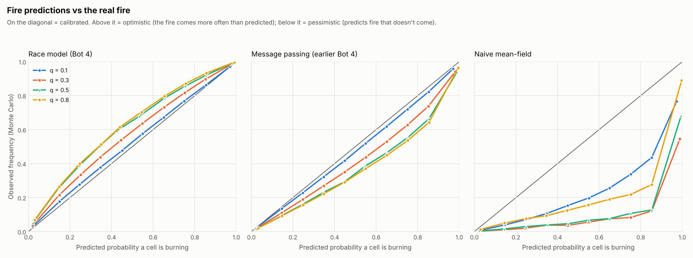
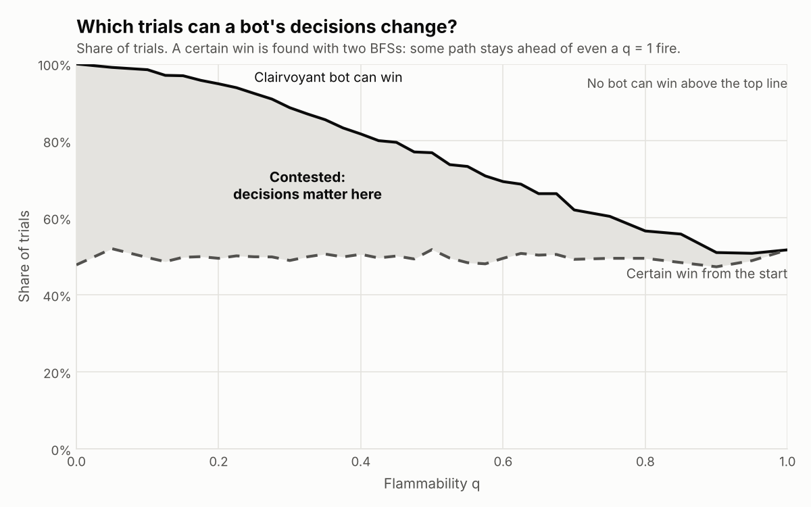
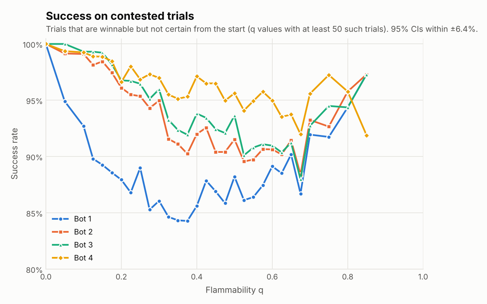
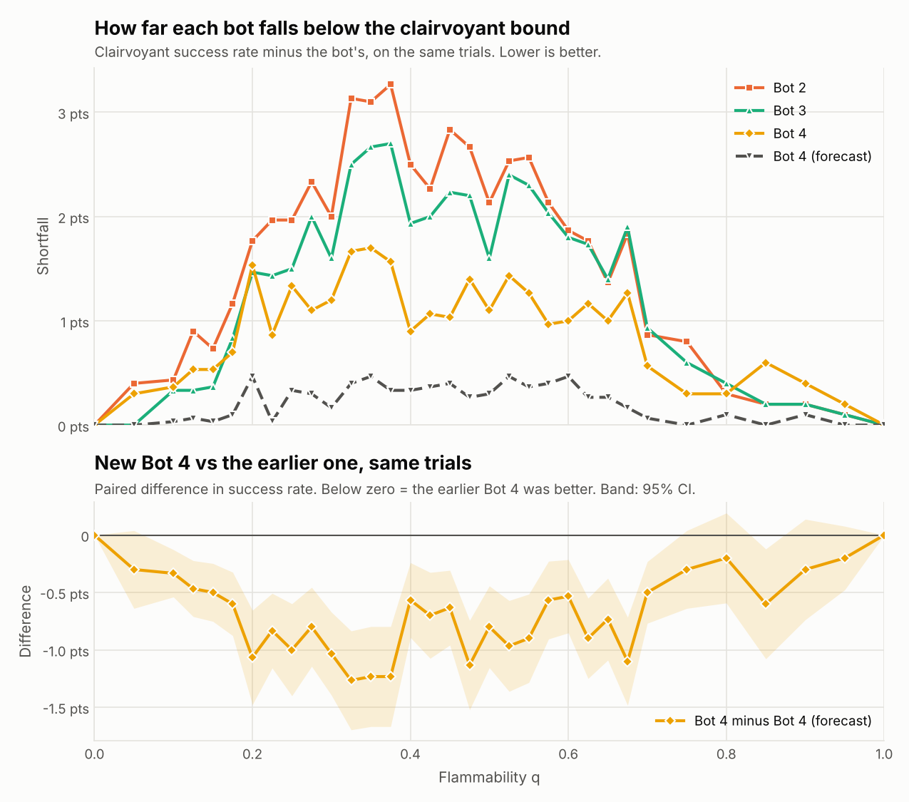

# Project 1: This Ship is on Fiiiiire!

A bot on a randomly generated D x D ship has to reach the fire-suppression
button before the fire spreading through the ship gets to it (or to the
button). This directory has the ship generator, the fire model, Bots 1-4, a
clairvoyant upper bound used for the failure analysis, and the experiment,
analysis and visualisation scripts.

## Running it

Needs Python 3 with `numpy` and `matplotlib` (and `pytest` for the tests).
Developed and tested on Python 3.13.

```bash
cd "project 1"
pip install numpy matplotlib pytest

python -m pytest                                   # 123 tests, a few seconds

# Experiments: one CSV row per (trial, bot); uses every core.
python experiments.py --D 50 --q 0:1:0.05 --trials 1000 --out results/main.csv
python analyze.py results/main.csv.gz --out results --bots bot1 bot2 bot3 bot4

# Replay a single trial (trial numbers match the CSV) or find an interesting one
python visualize.py --D 50 --q 0.3 --trial 17 --out trial17.png
python visualize.py --D 50 --q 0.3 --where bot3=0 bot4=1 --bots bot3 bot4 --out case.png

# One of Bot 4's decisions: burning and predicted-fire cells, its plan, and Bot 2's
python decision.py --D 50 --q 0.3 --trial 463 --out decision.png

# How well Bot 4's fire prediction matches the real fire
python forecast_check.py --out results/forecast_calibration.png

# Bad luck or bad decision? Replay trials Bot 4 lost but Bot 3 won, under 40 fresh fires each
python replay_check.py results/main.csv.gz --lost bot4 --won bot3 --bots bot2 bot3 bot4
```

Bots are named by spec strings, so variants can be compared in one run:
`bot4:threshold=0.5`, `bot4:penalty=50`, `bot4:lookahead=false`,
`bot4:fire_metric=manhattan`, and `bot4_forecast` (the earlier Bot 4).

## Files

| File | What it does |
|---|---|
| `ship.py` | Ship generation (both phases from the spec) and the `Ship` class. No fire/bot code, so it can be reused in later projects. |
| `fire.py` | The spread rule and `FireTrajectory`, one fire realisation per trial. |
| `planning.py` | The search algorithms: BFS, A*, the Manhattan heuristic, distance maps, the certain-win check, and the (cell, time) search of the earlier Bot 4. |
| `planners.py` | One function per way of choosing a path. Each bot is one of these plus "replan every step or not". Bot 4's race model lives here. |
| `bots.py` | The single `Bot` class and the table saying how Bots 1-4 are built. |
| `forecast.py` | The probabilistic fire forecasts used by the earlier Bot 4 (message passing, and the naive mean-field version). |
| `simulation.py` | Runs a bot on a trial in the order the spec gives (and counts moves Bot 2 couldn't have made); clairvoyant upper bound. |
| `experiments.py` | Parallel, reproducible parameter sweeps that write CSVs. |
| `analyze.py` | Success rates with 95% CIs, paired bot comparisons, failure breakdowns, charts. |
| `visualize.py` | Draws what each bot did on one trial. |
| `decision.py` | Draws one of Bot 4's real decisions: what it predicted, its plan, and the shortest path it turned down. |
| `forecast_check.py` | Calibration of the fire predictions against Monte Carlo runs of the real fire. |
| `replay_check.py` | Reruns the starting configurations of chosen trials under many fresh fires, to tell bad luck from bad decisions. |
| `tests/` | Unit tests (see "Correctness checks"). |
| `results/` | Data and charts from the runs described below. |

## Design

### Ship
`generate_layout` follows the spec exactly. Phase 1 (`grow_maze`) opens a
random interior cell, then repeatedly opens a random blocked cell with exactly
one open neighbour. Phase 2 (`reduce_dead_ends`) opens a random closed
neighbour of a random dead end until at most half of the original dead ends
remain. Phase 1 keeps the set of candidate cells up to date incrementally
(opening a cell only changes its 4 neighbours' counts), so it is O(D^2)
instead of rescanning the grid every iteration (O(D^4)). Only the first open
cell has to be in the interior; later cells may be on the edge of the grid.

### Fire
Each step every non-burning open cell ignites with probability
$1 - (1 - q)^K$, where $K$ is its number of burning neighbours. As the TA
feedback asked, the update is **synchronous**: $K$ is counted from the fire as
it was at the start of the step, and newly ignited cells are only added
afterwards, so they cannot spread fire in the same step
(`fire.fire_step`; `test_update_is_synchronous` checks this). The whole update
is a handful of numpy operations on the grid.

The fire does not react to the bot, so `FireTrajectory` simulates it once per
trial (lazily, only as far as anyone needs) and records each cell's ignition
time. All the bots and the clairvoyant bound then face the **same** fire on
each trial, which makes bot comparisons paired and much less noisy. Bots only
ever see the cells burning at the current time step.

### Time step and outcomes
`simulation.run_bot` follows the spec's order: the bot picks a move, moves,
presses the button if it is on it, and otherwise the fire advances. Every
failure is labelled with its cause:

| Outcome | Meaning |
|---|---|
| `entered_fire` | the bot moved into a burning cell (only Bot 1 does this) |
| `caught` | the fire spread onto the bot's cell |
| `button_burned` | the button caught fire first; nobody can press it any more |
| `trapped` | the bot is alive but every route to the button runs through fire |

The last two end the trial early. That doesn't change any result, because
the fire never goes out, so once either happens the bot is certain to fail.

### Bots: one class, four planners

There is a single `Bot` class (`bots.py`). A bot is a name, a **planner**
(a function in `planners.py` that returns a path to the button, or `None`)
and a flag saying whether to call the planner again every step:

| Bot | Planner | Replans? | Search |
|---|---|---|---|
| Bot 1 | `avoid_fire` | no, plans once at t = 0 | BFS avoiding the initial fire cell |
| Bot 2 | `avoid_fire` | every step | BFS avoiding every burning cell |
| Bot 3 | `avoid_fire_and_neighbors`, falling back to `avoid_fire` | every step | BFS avoiding burning cells and their neighbours |
| Bot 4 | `avoid_predicted_fire` | every step | A* with a race model of the fire, described next |

Bot 3's fallback is literally a call to Bot 2's planner. The bot's own cell
is never avoided. The button is avoided like any other cell, so a button
next to the fire means Bot 3 falls back to Bot 2's rule.

All planners have the same signature,
`planner(ship, pos, button, burning, q, **options)`, so a new bot is one
line in the `BOTS` table, and variants are spec strings such as
`bot4:threshold=0.5,penalty=50`.

### Bot 4: avoid the fire that will probably get there first

**The idea.** Bot 4 treats every cell as a race between the bot and the
fire. If the fire will probably win the race to a cell, Bot 4 treats that
cell as if it were already burning. It then plans with A*, where burning
cells are walls and "probably burning by the time I get there" cells cost
extra.

**The race.** Each step, for every open cell $c$:

- $k(c)$ = the number of moves the bot needs to reach $c$: BFS from the bot,
  avoiding cells that are burning now.
- $d(c)$ = the number of cells the fire must travel to reach $c$: a
  multi-source BFS through open cells, starting from every burning cell.

Along a single route, the fire's front advances one cell in a step with
probability $q$: the next cell on the route has one burning neighbour, which
gets one chance per step to ignite it. So in $k$ steps the front advances
$A_k \sim \text{Binomial}(k, q)$ cells, and

$$
P(\text{fire reaches } c \text{ first}) = P\big(A_{k(c)} \ge d(c)\big) = \sum_{j=d(c)}^{k(c)} \binom{k(c)}{j} q^j (1-q)^{k(c)-j}
$$

For the button, $k$ is one less, since the bot presses it before the fire
moves. A cell is **predicted fire** if this probability is above a
threshold $\theta$ (0.6 by default).

Bot 4 doesn't evaluate the sum for every cell. $P(A_k \ge d)$ only gets
smaller as $d$ grows, so `danger_radius` computes once per $q$, for each
$k$, the largest fire distance that still counts as dangerous. The check per
cell is then one comparison: $d(c) \le \text{radius}[k(c)]$.

**The search.** A* from the bot to the button, where entering a cell $c$
costs

$$
w(c) = \begin{cases}
\infty & \text{if } c \text{ is burning now (never entered)} \\
1 + \lambda & \text{if } c \text{ is predicted fire} \\
1 & \text{otherwise}
\end{cases}
$$

with penalty $\lambda = 20$ by default. The heuristic is the Manhattan
distance to the button, $h(c) = |r_c - r_g| + |c_c - c_g|$. Walls can only
make a route longer and every step costs at least 1, so $h$ never
overestimates and A* returns the cheapest path. Bot 4 takes the plan's first
step, then does it all again with the new fire.

```
each step, given pos, burning, q:
    d ← BFS distance from the burning cells to every cell
    k ← BFS distance from pos to every cell, avoiding burning cells
    predicted ← cells with P(Binomial(k, q) ≥ d) > θ        (k - 1 for the button)
    cost ← ∞ for burning cells, 1 + λ for predicted cells, 1 otherwise
    plan ← A*(pos → button, cost, heuristic = Manhattan distance to the button)
    if no plan: trapped (every route runs through fire)
    take the plan's first step
```

**Short-but-risky vs long-but-safe.** A path's cost is its length plus
$\lambda$ for every predicted-fire cell on it. So Bot 4 takes a detour of up
to $\lambda$ extra steps to avoid one predicted-fire cell, but goes through
predicted fire when every way around is longer than that (or runs through
predicted fire too). That is the trade-off the TA feedback asked for.

**Why this is not "Bot 3 with a wider buffer"** (the one thing the
assignment rules out):

- The avoided region depends on **where the bot is**. A cell right next to
  the fire that the bot can reach first is not avoided. At q = 0.3, a cell
  five cells from the fire that the bot would only reach in 20 steps is
  avoided (the fire gets there first 76% of the time).
- It depends on **q**: a slow fire predicts a thin band, a fast fire a wide
  one.
- It is **soft**: predicted fire is a cost to trade against detour length,
  not a wall.

The decision figure under Results shows all three in one picture.

**How good is the race model?** Each burning cell gives each unburnt
neighbour its own q-coin every step, so once a cell ignites, the wait until
it ignites a given neighbour is a Geometric($q$) number of steps,
independent of everything else. The fire reaches $c$ at the earliest time
over *all* routes, and the race model only counts one shortest route. So:

- On a tree-shaped region with one burning cell, there is only one route,
  and the formula is **exact**.
- Otherwise, extra routes (loops opened in phase 2, other burning cells) can
  only make the real fire faster. The true probability is never lower than
  the model's: the model is a **slightly optimistic lower bound**.

`forecast_check.py` measures the gap against 400 Monte Carlo runs of the
real fire on 10 ships per q. The race model is 1-6 points optimistic. The
earlier Bot 4's message-passing forecast is about as far off, in the
pessimistic direction, and the naive forecast it replaced was 13-32 points
too pessimistic:



**Known limitation: $k(c)$ is the bot's shortest distance, not its arrival
time on the plan.** On a detour, the bot reaches cells (and the button)
later than $k(c)$, so they are more dangerous than the model thinks.
Detours therefore look safer than they are. That is what loses q = 0.85,
trial 96 under Results, and it is the main reason the new Bot 4 trails the
earlier one. Fixing it means searching over (cell, time) pairs instead of
cells, which is exactly what the earlier Bot 4 did.

**Where the design came from, and what changed.** The brief was: A* with a
Manhattan-distance heuristic between the fire and the bot; burning cells
cost extra; and open cells with a high (> 60%) probability of catching fire
are treated as burning and cost extra too. Three things changed while
formalising it:

- *Heuristic.* An A* heuristic has to estimate the remaining cost **to the
  goal**, so it is the Manhattan distance to the button. The fire-to-bot
  comparison is still there: it is the race, which compares how far the bot
  and the fire each are from every cell.
- *"> 60% chance of catching fire".* Read literally, the chance a cell
  catches fire next step is $1 - (1-q)^K$, with $K$ its burning neighbours.
  Only cells touching the fire have $K \ge 1$, so this rule can only ever
  flag cells inside Bot 3's buffer: with $K = 1$ only when $q > 0.6$, and
  even with $K = 4$ never when $q \le 0.2$. That would be Bot 3 with a
  thinner buffer, the version the assignment forbids, and at low q it would
  be exactly Bot 2. The race model asks the same question ("will this cell
  be on fire?") at the time that matters: when the bot would get there. The
  literal rule is kept as `bot4:lookahead=false`. In the tuning runs it was
  no better than Bot 2 (+0.07 ± 0.16 points).
- *Distance for the fire.* The fire can only spread through open cells, so
  $d(c)$ is a BFS through the maze, not the Manhattan distance (which would
  flag cells the fire can only reach the long way round). The Manhattan
  version is kept as `bot4:fire_metric=manhattan`. It did slightly worse
  in tuning (-0.15 ± 0.23 points) and is 25% slower.

**Assumption:** Bot 4 knows q, the ship's flammability.

### The earlier Bot 4 (kept as `bot4_forecast`)

Before the current design, Bot 4 was more ambitious. It is still in the
code (`planners.forecast_astar`), and its results on the same trials are in
the comparison under Results.

1. **Certain-win check first.** If some path stays ahead of even the
   fastest possible fire (see "Certain wins"), take it.
2. **Otherwise, forecast the fire.** Dynamic message passing
   (`forecast.MessagePassingForecast`) gives $p_t(c)$, the chance that cell
   $c$ is burning $t$ steps from now, for every cell and every future step.
3. **Search over (cell, time) pairs.** A* where entering cell $c$ on move
   $t$ costs $1 + w \cdot r_t(c)$, with $r_t(c) = -\ln(1 - p_t(c))$ and
   $w = 1000$ (`planning.risk_astar`). Because the cost depends on *when*
   the bot arrives, a detour pays for being slow.

It came within half a point of the clairvoyant bound, but it was hard to
explain next to Bot 3, about twice as slow as the current Bot 4, and its
summed risk was a ranking score rather than a probability (it adds up
correlated risks as if they were independent). The current Bot 4 keeps its
core idea, comparing when the bot and the fire each get to a cell, with a
closed-form race and a plain A* over cells. The race model and message
passing agree exactly on a corridor (`test_race_model_is_exact_on_a_corridor`).

### Efficiency: what made 83,000 trials × 4 bots affordable

- **Ship generation is O(D^2).** Phase 1 keeps its candidate cells in a list
  plus an index map instead of rescanning the grid every iteration (O(D^4)).
- **The fire is vectorised.** One update is a handful of whole-grid numpy
  operations (shifted views count burning neighbours) instead of a Python
  loop over cells.
- **One fire per trial, shared and lazy.** The fire never reacts to the bot,
  so it is simulated once per trial, only as far as anyone needs, and
  replayed for every bot and the clairvoyant bound.
- **Trials stop as soon as the outcome is certain** (button burned, or every
  route cut off).
- **Planners use flat integer cell ids and Python lists**, not tuples or
  numpy scalars, inside BFS and A*.
- **Bot 4** costs two BFSs, one pass over the cells and one A* per move.
  The binomial tail is never summed during a trial: `danger_radius` turns
  it into a lookup table once per (q, θ) and caches it, so each cell's check
  is one comparison. The Manhattan heuristic keeps A* focused on the button.
- **Trials run in parallel** on every core. Each trial's seed depends only on
  (seed, q, trial index), so results don't depend on how work is split up.
- **Paired comparisons** (all bots on the same fire) need about 11x fewer
  trials than independent samples for the same precision on a difference.

### Clairvoyant upper bound
`simulation.oracle_steps` asks whether *any* sequence of moves could have
won, given the entire future of that trial's fire. It is a BFS in which a
cell can be entered on move k only if it is not burning after k fire updates.
Because the fire only grows, arriving anywhere as early as possible is
always best, so each cell is visited once. This bounds every possible bot,
and it splits each failure into **avoidable** (some sequence of moves would
have won) and **unavoidable**.

### Certain wins (the instructor's data-collection hint)
`Trial.fireproof()` asks, before simulating anything, whether the bot has a
path that even the fastest possible fire (q = 1) cannot catch. The fire
moves at most one cell per step whatever q is, so:

1. a multi-source BFS from the fire gives the earliest step the fire could
   *possibly* reach each cell (`planning.fire_distances`);
2. a second BFS looks for a path on which the bot enters every cell strictly
   before that (the button: no later, since it is pressed before the fire
   moves) (`planning.fireproof_path`).

If such a path exists, the trial is a certain win for any bot that takes
it. This doesn't depend on q at all, which is why success levels off at
about 52% as q approaches 1: at q = 1 the fire really is that fast, so
"certain win" and "clairvoyant bot wins" coincide exactly (tested). The
experiments record it for every trial.

It also splits the trials three ways: **certain** from the start, **impossible**
(not even the clairvoyant bot wins), and **contested** (everything else).
Only contested trials can separate good decisions from bad ones, so that is
where bot comparisons are sharpest.

### Do the bots actually decide differently?
A move is one Bot 2 could have made if it steps along *some* shortest path to
the button through currently unburnt cells. `run_bot(..., count_deviations=True)`
counts each bot's moves that fail that test (Bot 2's count is always 0;
tested). This is independent of how ties between equally short paths are
broken, so a nonzero count means the bot really made a different kind of
decision. The experiments record the count for every bot and trial.

## How Bot 4 got here (development log)

1. **First version.** Risk-aware A* over (cell, time) with a naive
   mean-field fire forecast. Risk weight tuned on a separate set of trials.
2. **Calibration check.** The forecast was 13-32 points too pessimistic.
   Switched to message passing (1-7 points off).
3. **First full run (83,000 trials).** Bot 4 beat Bots 1-3 throughout
   q = 0.1-0.7.
4. **Instructor's hint: certain wins.** About half of all trials turned out
   to be certain wins at every q, and every bot won every one of them. That
   explains the plateau near 52% at high q, and it pointed at contested
   trials as the place to compare bots.
5. **Does Bot 4 just copy Bot 2?** Mostly, but its departures from Bot 2's
   rule won far more often than they lost; Bot 3's were close to a coin
   flip.
6. **Bad decisions at low q** led to re-tuning the risk weight (to 1000) and
   adding the certain-win check to the bot. That version came within 0.5
   points of the clairvoyant bound at every q.
7. **Simplified.** That Bot 4 was much more complex than Bot 3 and hard to
   explain, so it was replaced by the design above: the same "who gets there
   first" question, answered by a closed-form race and a plain A* over cells.
   At the same time the bots became one `Bot` class with interchangeable
   planner functions, and Bots 2 and 3 now literally rerun their BFS every
   step.
8. **Tuning round 3 on held-out trials** (below): kept θ = 0.6 and
   λ = 20. Lower thresholds were no better within the noise, and the
   penalty hardly mattered between 5 and 1000.
9. **Final run.** Bots 1-3 reproduced the previous run exactly, outcome and
   step count, on all 83,000 trials, so the refactor changed no behaviour.
   The earlier Bot 4's rows were kept as `bot4_forecast` after checking that
   the kept code reproduces them (120 of 120 sampled trials identical).

## Deviations from the original plan

1. **No `Tile` objects.** The plan stored the ship as a 2D array of `Tile`
   objects. The code holds the same information in numpy arrays and integers
   instead: `ship.grid` (open/blocked), the fire's burning mask and ignition
   times, and the bot and button as flat cell indices. The fire update and
   the "next to the fire" test then become a few whole-grid numpy
   operations, and the planners work on plain ints, which is what made tens
   of thousands of trials per bot affordable. A `Tile` view would be easy to
   add on top for later projects, but it would be slow in the inner loops.
2. **Bot 4's details differ from the brief** in the three ways listed under
   "Where the design came from": Manhattan distance to the button as the
   heuristic, the race model instead of the one-step 60% rule, and maze
   distance for the fire.
3. **Additions that were not in the plan:** a fire realisation shared by all
   bots on each trial (paired comparisons), the clairvoyant bound, the
   certain-win check, the deviation count, early stopping once failure is
   certain, the calibration check, and the replay check for bad luck vs bad
   decisions.
4. The directory is named `project 1` (with a space) as requested, so quote
   it in shells: `cd "project 1"`.

## Correctness checks (`tests/`)
- Ship: phase 1 yields a tree with no cell left to open; phase 2 at least
  halves the dead ends and only opens cells; every open cell is reachable;
  generation is reproducible.
- Fire: synchronous update, ignition frequency matches $1 - (1 - q)^K$, no
  spread at q = 0, fire stays on open cells.
- Search: BFS paths are valid and shortest; A* with unit costs finds
  shortest paths; A* with mixed costs matches plain Dijkstra; the Manhattan
  heuristic never overestimates.
- Race model: `danger_radius` agrees with the binomial formula for every
  (k, d); the race model equals the exact message-passing forecast on a
  corridor; at q = 1 a cell is predicted fire exactly when the fire is at
  most as far from it as the bot; predicted fire is not a fixed buffer
  (a corridor where moving the bot changes which cells are flagged).
- Bots: Bot 1 plans once; Bot 2 never deviates from its own rule; Bot 3
  avoids the buffer when it can and falls back to Bot 2's planner when it
  can't; Bot 4 with no penalty never leaves Bot 2's rule; no bot ever beats
  the clairvoyant bound and only Bot 1 walks into fire; with q = 0 every bot
  wins whenever winning is possible.
- Certain wins: at q = 1 "certain win" agrees exactly with the clairvoyant
  bot; certain-win trials are always winnable.
- The earlier Bot 4: its (cell, time) A* matches an unpruned brute force;
  both forecasts are exact when q = 1; forecast probabilities are valid and
  only grow; it wins every certain-win trial.

## Results

### What was run

| Run | Ship size D | q values | Trials per q | Purpose |
|---|---|---|---|---|
| Main, whole range | 50 | 0 to 1 in steps of 0.05 | 1,000 | overall picture |
| Main, interesting range | 50 | 0.1 to 0.7 in steps of 0.025 | 3,000 | where the bots differ |
| Bot 4 tuning, round 3 | 50 | 0.05-0.6 | 500 (separate seed) | threshold, penalty, variants |
| Ship size | 25 and 100 | 0.1 to 0.8 | 2,000 and 400 | how much D matters |

The main run is 83,000 trials, each on a freshly generated ship. On every
trial all the bots, the clairvoyant bound and the certain-win check face
the same ship, start cells and fire. Seeds come from (seed, q, trial index),
so any row can be replayed with `visualize.py`. Raw data:
`results/main.csv.gz` (it includes the earlier Bot 4 as `bot4_forecast`);
every table: `results/summary.md`, and with the earlier Bot 4:
`results/bot4_versions/summary.md`.

**How much data is enough.** 3,000 trials per q in the interesting range
give 95% CIs of about ±1.6 points on each success rate. More importantly,
because the bots share each trial's fire, their *difference* can be
measured trial by trial: at q = 0.4, Bot 4 minus Bot 2 is +1.6 ± 0.5 points
paired, where independent samples of the same size would give ±2.0.
Matching the paired precision with independent samples would take about 16
times as many trials.

**How the interesting range was found.** A first pass over the whole range
showed that below q ≈ 0.1 Bots 2-4 win nearly every winnable trial, and
above q ≈ 0.75 every bot is within a point of the clairvoyant bound. The
extra trials went to the range in between.

### The centerpiece: success rate against q


- **Equally good (q near 0).** At q = 0 every bot wins 100%. Up to
  q ≈ 0.2, Bots 2-4 are within about half a point of each other and win
  98-100% of the trials a clairvoyant bot could win. Bot 1 is the
  exception: it never replans, so even a slow fire that creeps onto its
  path kills it (96.7% at q = 0.05).
- **Bot 4 ahead (q = 0.225 to 0.675, shaded).** Here Bot 4 beats both Bot 2
  and Bot 3 with 95% confidence at 17 of the 19 tested q values (at 0.25
  and 0.65 it is ahead, but within the noise). Its lead peaks at
  +1.8 ± 0.5 points over Bot 2 and +1.2 ± 0.5 over Bot 3 (q = 0.45), and is
  +3 to +5 points over Bot 1 for q = 0.125-0.4.
- **Equally bad (q ≥ 0.8).** All four bots are within 0.6 points of each
  other and of the clairvoyant bound. At q = 1 every bot wins exactly the
  51.7% of trials that are certain wins (next section): the fire is as fast
  as the bot, so the start decides everything.
- Bot 4 is within 1.7 points of the clairvoyant bound at every q (Bot 3:
  2.7, Bot 2: 3.3, Bot 1: 6.0). The earlier Bot 4 was within 0.5.

| q | Bot 1 | Bot 2 | Bot 3 | Bot 4 | Clairvoyant bound | Earlier Bot 4 |
|---|---|---|---|---|---|---|
| 0 | 100.0% | 100.0% | 100.0% | 100.0% | 100.0% | 100.0% |
| 0.1 | 94.9% | 98.1% | 98.2% | 98.1% | 98.5% | 98.5% |
| 0.2 | 89.4% | 93.1% | 93.4% | 93.3% | 94.8% | 94.4% |
| 0.3 | 83.1% | 86.6% | 87.0% | 87.4% | 88.6% | 88.5% |
| 0.4 | 77.3% | 79.3% | 79.9% | 80.9% | 81.8% | 81.5% |
| 0.5 | 74.0% | 74.8% | 75.3% | 75.8% | 76.9% | 76.6% |
| 0.6 | 67.3% | 67.6% | 67.6% | 68.4% | 69.4% | 69.0% |
| 0.7 | 61.0% | 61.2% | 61.1% | 61.5% | 62.1% | 62.0% |
| 0.8 | 56.2% | 56.3% | 56.2% | 56.3% | 56.6% | 56.5% |
| 0.9 | 50.8% | 50.8% | 50.8% | 50.6% | 51.0% | 50.9% |
| 1 | 51.7% | 51.7% | 51.7% | 51.7% | 51.7% | 51.7% |

**Where Bot 4 does not outperform.** At q ≤ 0.2, Bot 4 ties Bots 2 and 3
(Bot 3 is up to 0.3 points ahead at q = 0.05-0.15, within the noise). A slow
fire gives the cells near it moderate risks: at q = 0.2, a cell next to the
fire that the bot reaches within 4 steps has a 20-59% chance of burning
first. That is under Bot 4's 60% threshold, so Bot 4 walks right past, while
Bot 3's buffer avoids exactly those cells. Of the 69 trials at q ≤ 0.2 that Bot
4 lost and Bot 3 won, 65 were "fire spread onto bot". At q = 0.85-0.95,
Bot 4 is 0.1-0.4 points behind the others (within the noise: over all
q ≥ 0.8 it lost 15 trials Bot 2 won and won 8 Bot 2 lost), from detours that
look safe but aren't (q = 0.85, trial 96 below).

### Which trials can a bot's decisions change?



About half of all trials (47-52%) are certain wins at *every* q, decided by
two BFSs before the fire moves at all. Every bot won every one of them
(41,283 of 41,283 for each bot), so as the instructor's hint suggests, a
data-collection run could count them as wins without simulating them. We
simulated them anyway, to confirm that empirically: none of the bots is
built to look for a fireproof path. As q grows, contested trials (winnable,
but only by deciding well) turn into impossible ones, and by q ≥ 0.8 fewer
than 8% of trials are contested. That is why the bots converge at both
ends: at low q nearly everything is won, and at high q almost nothing is
left to decide.

### Success on contested trials only



Restricted to the trials where decisions matter, the gap is large. For
q = 0.3-0.7, Bot 4 wins 92-97% of contested trials, Bots 2 and 3 88-96%,
and Bot 1 84-92%. (The earlier Bot 4: 98-99.6%.)

### Does Bot 4 decide differently from Bot 2?


| Bot | Leaves Bot 2's rule? | Trials | Won where Bot 2 lost | Lost where Bot 2 won |
|---|---|---|---|---|
| Bot 3 | yes | 8,699 (10.5%) | 466 | 299 |
| Bot 3 | no | 74,301 | 75 | 0 |
| Bot 4 | yes | 9,060 (10.9%) | 698 | 197 |
| Bot 4 | no | 73,940 | 233 | 50 |
| Earlier Bot 4 | yes | 7,751 (9.3%) | 1,102 | 38 |

Bot 4 makes exactly Bot 2's kind of move in about 89% of trials. When it
chooses differently, it wins 3.5 times as often as it loses against Bot 2.
Bot 3 departs about as often, but its departures only help 1.6 times as
often as they hurt: its buffer is a fixed rule that ignores whether the
detour is worth it. (The earlier Bot 4's departures won 29 times as often as
they lost.) Bot 4 also departs much less than Bot 3 at low q (1% vs 3.5% of
trials at q = 0.1), which is the low-q weakness above seen from another
angle. Bot 4's 233 wins (and 50 losses) without ever leaving Bot 2's rule
come from choosing among several equally short paths: the penalty steers it
to the one with fewer predicted-fire cells, where Bot 2 picks arbitrarily.

### What a Bot 4 decision looks like


q = 0.3, trial 463, first move. The shortest path (Bot 2's choice) runs
through 3 predicted-fire cells, for a cost of 25 + 3 × 20 = 85. Bot 4's
plan is 2 steps longer and avoids them all, for a cost of 27. The predicted
region is not a band of fixed width. Two cells 4 steps from the fire are
treated differently: (43, 40), which the bot would reach in 15 moves, is
flagged, and (40, 41), which it could reach in 11, is not. At q = 0.3 the
fire advances 4 cells within 15 steps more than 60% of the time, but not
within 11. Bot 4 won in 27 steps, the clairvoyant optimum. Bot 2 kept to
the short route and was trapped after 24 steps; Bot 3 also detoured, on a
different route, and was cut off after 28.


### Why bots fail


Pooled over every q (`results/summary.md`):

| Bot | Walked into fire | Fire spread onto bot | Button burned first | Cut off from button | Avoidable |
|---|---|---|---|---|---|
| Bot 1 | 40% | 25% | 36% | 0% | 16% |
| Bot 2 | 0% | 14% | 40% | 45% | 9% |
| Bot 3 | 0% | 5% | 45% | 50% | 7% |
| Bot 4 | 0% | 7% | 46% | 47% | 5% |
| Earlier Bot 4 | 0% | 9% | 44% | 46% | 1% |

("Avoidable" is the share of that bot's failures where the clairvoyant bot
could have won.)

- **Bot 1** dies most often by walking into fire: it never looks again
  after planning.
- **Bot 2** is caught hugging the fire's edge (14% of its failures) or
  heads down routes the fire is about to close.
- **Bot 3's** buffer cuts "fire spread onto bot" to 5% of failures, but the
  detours cost time, so more of its failures are a burned button.
- **Bot 4** sits between Bots 2 and 3 on "fire spread onto bot" (7%), and
  only 5% of its failures were avoidable even with perfect knowledge of the
  future.

Two of Bot 4's losses, one for each weakness:

- **q = 0.2, trial 2252.** The bot starts two cells from the fire, and its
  shortest route runs right past it. By the race model, the first four
  cells on it are 20%, 4%, 49% and 18% likely to be reached by the fire
  first: each one under the 60% threshold, so none is predicted fire, and
  Bots 2 and 4 both take the short route. They are caught on the very
  first step. Bot 3 keeps one cell away and wins in 64, the clairvoyant
  optimum. This isn't bad luck: replayed
  under 40 fresh fires, Bot 3 wins 97% of them from this start and Bot 4
  62%. A threshold looks at one cell at a time, so several moderate risks in
  a row never add up to a reason to detour.
  
- **q = 0.85, trial 96.** At move 21 the button is 5 steps away, but one cell
  on the way is predicted fire. Bot 4 picks a 17-step detour instead (cost
  17 < 5 + 20). The detour's cells are scored by the bot's *shortest*
  distance to them, so the model doesn't see that the bot will reach the
  button 12 steps later than it could. The fire, spreading at q = 0.85,
  catches the bot after 23 steps. Bots 2 and 3 went straight and won in
  25, the clairvoyant optimum. This is the "Known limitation" from the
  design section.
  
  

### Bad luck or bad decision? (`replay_check.py`)

A single lost trial can't tell bad luck from a bad decision. So for every
trial where Bot 4 lost but Bot 2 or Bot 3 won, the same ship and starting
cells were replayed under 40 fresh fires (`results/replay_bot4_vs_bot*.txt`):

| Trials where Bot 4 lost but... | Starts | Mean win rate from those starts | Bot 4 better / worse / same |
|---|---|---|---|
| Bot 3 won | 312 | Bot 4 64.1%, Bot 3 68.1%, Bot 2 63.4% | 67 / 195 / 50 |
| Bot 2 won | 247 | Bot 4 51.9%, Bot 2 54.3%, Bot 3 53.3% | 70 / 138 / 39 |

These starts were picked *because* the other bot won, so they favour it. If
Bot 4's losses were just bad luck, the replays would still show Bot 4 ahead.
That is what happened with the earlier Bot 4: from the starts it lost to
Bot 3, it still did better 42 times and worse 5. For the new Bot 4 it mostly
doesn't happen, so many of these losses are genuinely worse decisions. They
are a small minority (Bot 4 lost 312 trials that Bot 3 won, and won 754 that
Bot 3 lost), and they sort by q:

- **q ≤ 0.2 against Bot 3** (69 starts): Bot 4 does worse from 51, better
  from 8. This is the low-q weakness: when the fire is slow, Bot 3's buffer
  is the better decision (trial 2252 above). Against Bot 2 at low q it is a
  coin flip (10 better, 9 worse): there the two bots make the same choice,
  and those losses were luck.
- **q ≥ 0.8** (12 and 15 starts): Bot 4 does worse from almost all of them.
  This is the detour problem (trial 96 above). At q = 0.8, trial 53, Bot 2
  wins 93% of fresh fires from the same start and Bot 4 42%.
- **In between**, Bot 4 does worse from about twice as many of these starts
  as it does better.

Two changes would target these losses and keep the design simple:

- A graded penalty $\lambda \cdot P(\text{fire first})$ instead of the 0/1
  threshold, so small risks cost a little instead of nothing.
- Scoring each cell by the step at which the plan actually reaches it,
  instead of the bot's shortest distance to it. That needs a search over
  (cell, time), which is what the earlier Bot 4 did and why it was
  stronger.

### Bot 4 vs the earlier Bot 4



On the same 83,000 trials, the new Bot 4 is 0.3-1.3 points behind the
earlier one at every q from 0.05 to 0.7 (significantly at most of them).
Pooled, the earlier one won 695 trials the new one lost, and the new one
won 64 the earlier one lost. Pooled over all trials it recovers about half
of the earlier Bot 4's lead over Bot 2 (+0.8 of +1.6 points). In exchange, it is a few lines of
closed-form probability and one A* over cells, about twice as fast (1.8 ms
per move vs 3.7 ms), and easy to explain. The losses concentrate where the
known limitation bites: detours scored with the bot's shortest distance
instead of its real arrival time, and small risks below the threshold
being ignored entirely.

| | Bot 2 | Bot 3 | Bot 4 | Earlier Bot 4 |
|---|---|---|---|---|
| Success, pooled over the 83,000 trials | 78.6% | 78.9% | 79.5% | 80.2% |
| Failures avoidable with perfect knowledge | 9% | 7% | 5% | 1% |
| Contested trials won, q = 0.3-0.7 | 88-95% | 88-96% | 92-97% | 98-99.6% |
| Thinking time per move | 0.17 ms | 0.20 ms | 1.8 ms | 3.7 ms |

### Ship size

A spot check at D = 25 (2,000 trials per q) and D = 100 (400 trials per q,
so roughly ±4 points on success rates and ±1-2 on paired differences), next
to the main D = 50 run (`results/size.csv.gz`; per-size tables in
`results/size/`):

| q | D = 25: Bot 4 (bound) | D = 50: Bot 4 (bound) | D = 100: Bot 4 (bound) |
|---|---|---|---|
| 0.1 | 96.0% (96.7%) | 98.1% (98.5%) | 97.8% (98.2%) |
| 0.2 | 91.0% (91.8%) | 93.3% (94.8%) | 93.2% (93.8%) |
| 0.3 | 84.6% (85.8%) | 87.4% (88.6%) | 89.8% (90.5%) |
| 0.4 | 77.6% (78.8%) | 80.9% (81.8%) | 80.0% (81.0%) |
| 0.5 | 73.8% (75.0%) | 75.8% (76.9%) | 76.0% (77.2%) |
| 0.6 | 65.8% (66.6%) | 68.4% (69.4%) | 71.2% (71.5%) |
| 0.8 | 55.9% (56.8%) | 56.3% (56.6%) | 59.5% (59.5%) |

Bot 4 minus Bot 3, paired, in points:

| q | D = 25 | D = 50 | D = 100 |
|---|---|---|---|
| 0.1 | -0.1 ± 0.5 | -0.0 ± 0.3 | -0.5 ± 0.7 |
| 0.2 | +0.7 ± 0.6 | -0.1 ± 0.5 | -0.2 ± 0.5 |
| 0.3 | +0.4 ± 0.5 | +0.4 ± 0.4 | +2.0 ± 1.5 |
| 0.4 | +1.1 ± 0.6 | +1.0 ± 0.4 | +1.2 ± 1.3 |
| 0.5 | +0.7 ± 0.6 | +0.5 ± 0.4 | +1.2 ± 1.3 |
| 0.6 | +0.8 ± 0.5 | +0.8 ± 0.4 | +0.5 ± 1.0 |
| 0.8 | -0.3 ± 0.4 | +0.1 ± 0.3 | +0.5 ± 0.7 |

Success at a given q rises somewhat with ship size. The pattern holds at
every size: about 50% of trials are certain wins; Bot 4 ties Bot 3 at
q = 0.1 and leads it by 0.4-1.1 points for q = 0.3-0.6 at D = 25 and 50 (at
D = 100 the estimates are positive but too noisy to be significant on their
own); and Bot 4 trails the earlier Bot 4 by up to 1.1 points (tables in
`results/size/`). So the D = 50 conclusions don't look like an artefact of
the ship size. Bot 4's thinking time grows steeply with D, since each move
costs O(D^2) and trials get longer: about 9 ms, 67 ms and 1.1 s per trial at
D = 25, 50 and 100 (q = 0.3, timed separately on an idle machine).

### Bot 4 tuning (held-out trials)

All tuning used a separate seed (7), so the main results were never used to
choose settings. 500 trials at each of q = 0.05, 0.1, 0.15, 0.2, 0.3, 0.4,
0.5, 0.6 (4,000 trials; `results/tuning/round3/`). "Avoidable" is the share
of failures the clairvoyant bot would have won; the last column is the
paired difference from the chosen setting.

| Bot | Success (pooled) | Avoidable | Contested won | vs chosen setting |
|---|---|---|---|---|
| Bot 2 | 86.35% | 13.6% | 95.3% | -1.03 ± 0.38 |
| Bot 3 | 86.67% | 11.4% | 96.1% | -0.70 ± 0.34 |
| Bot 4, θ = 0.4, λ = 5 / 20 / 100 | 87.55% / 87.38% / 87.33% | 5.2% / 6.5% / 6.9% | 98.3% / 97.9% / 97.8% | +0.18 ± 0.18 / 0.00 ± 0.20 / -0.05 ± 0.21 |
| **Bot 4, θ = 0.6, λ = 5 / 20 / 100 / 1000** | 87.35% / **87.38%** / 87.35% / 87.35% | 6.7% / **6.5%** / 6.7% / 6.7% | 97.8% / **97.9%** / 97.8% / 97.8% | -0.03 ± 0.20 / chosen / -0.03 ± 0.05 / -0.03 ± 0.05 |
| Bot 4, θ = 0.8, λ = 5 / 20 / 100 | 87.02% / 87.10% / 87.08% | 9.1% / 8.5% / 8.7% | 97.0% / 97.2% / 97.1% | -0.35 ± 0.28 / -0.27 ± 0.25 / -0.30 ± 0.25 |
| Bot 4, one-step rule (`lookahead=false`) | 86.42% | 13.1% | 95.5% | -0.95 ± 0.36 |
| Bot 4, Manhattan fire distance | 87.22% | 7.6% | 97.5% | -0.15 ± 0.23 |
| Earlier Bot 4 (round 2, same trials, w = 1000, no certain-win check) | 88.00% | 1.7% | 99.5% | +0.62 ± 0.28 |

- The **look-ahead is what matters**: the literal one-step rule is no
  better than Bot 2, as predicted in the design section.
- θ = 0.4 and 0.6 tie within the noise; 0.8 is worse (it waits until the
  fire is nearly certain). θ = 0.6, the threshold from the brief, was kept.
- The **penalty barely matters** between 5 and 1000: in these mazes,
  detours around predicted fire are usually either short or impossible.
  λ = 20 was kept.
- Measuring the fire's distance through the maze is slightly better than
  the Manhattan distance, and cheaper.

Rounds 1 and 2 tuned the earlier Bot 4 (`results/tuning/round1/`,
`round2/`): the risk weight mattered little between 30 and 1000, and the
calibrated forecast beat the naive one.

### Thinking time

Mean time spent inside each bot's own code, D = 50, one core:

| | Bot 1 | Bot 2 | Bot 3 | Bot 4 | Earlier Bot 4 |
|---|---|---|---|---|---|
| per move | 9 µs | 170 µs | 202 µs | 1.8 ms | 3.7 ms |
| per trial | 0.3 ms | 6.3 ms | 7.6 ms | 67 ms | 140 ms |

Bots 2 and 3 rerun one BFS every step. Bot 4 runs two BFSs, scores every
cell and runs A*, about 10 times the work of Bot 2 per move, all of it
plain Python over lists of cells. (The earlier Bot 4's times are from the
previous run, on the same kind of machine.)

### Where each part of the writeup is supported

| Writeup item | Where the evidence is |
|---|---|
| Centerpiece: q vs success, all bots on one graph | `results/centerpiece.png`, success table |
| Enough data for clear trends | "What was run", paired vs independent CIs |
| Range where all bots are equally good / equally bad | Centerpiece bullets, `trial_types.png` |
| "There, that's where Bot 4 outperforms" | Shaded band in the centerpiece, `success_contested.png`, "Where Bot 4 does not outperform" |
| The hint: telling immediately that a bot will win | "Certain wins" (Design), `trial_types.png`, 41,283 of 41,283 |
| Q1: Bot 4's design and decisions | Bot 4 section (formal definition, pseudocode), decision figures |
| Q1: why it isn't Bot 3 with a wider buffer | "Why this is not Bot 3 with a wider buffer", the one-step rule in tuning |
| Q1: efficiency | "Efficiency" (Design), thinking time |
| Q2: experiments and graphs | "What was run", centerpiece, size check |
| Q3: why bots fail, better decisions? | "Why bots fail", the two Bot 4 losses, replay check, known limitation |
| Does Bot 4 decide differently from Bot 2? | `divergence.png` and the outcome table |
| Process, expectations and surprises | Development log, calibration chart, tuning, Bot 4 vs the earlier Bot 4 |
| Q4: the ideal bot, computation vs intelligence | Clairvoyant bound, the earlier Bot 4 (more computation, closer to the bound), thinking time, certain wins (when to just run) |
