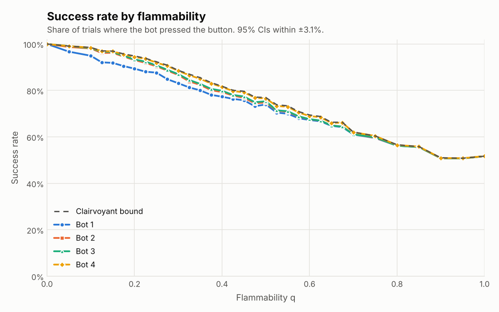
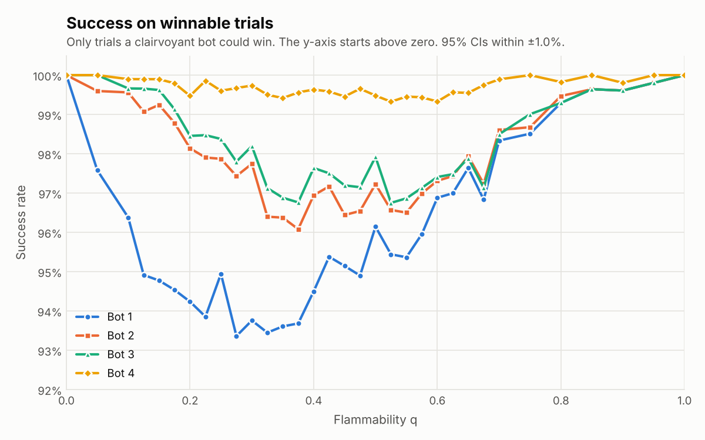
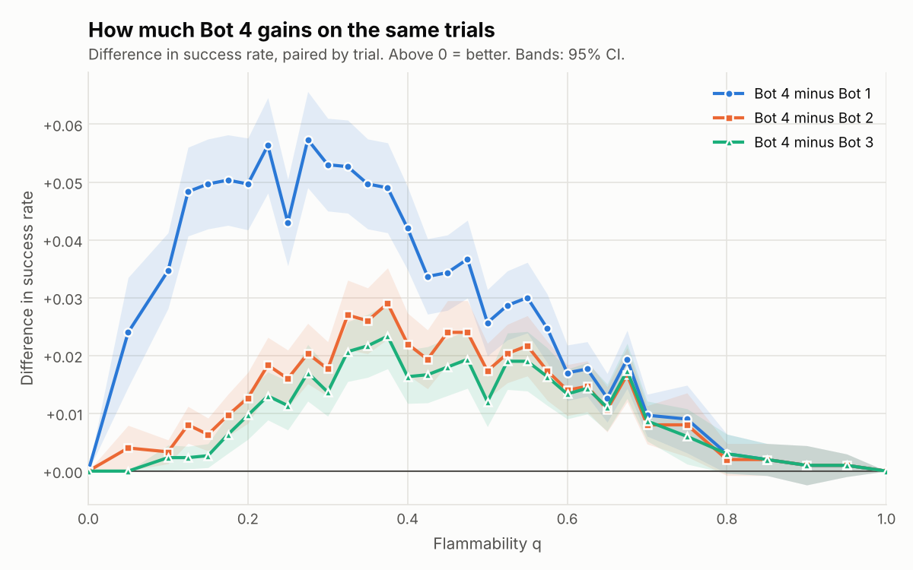

# Project 1: This Ship is on Fiiiiire!

A bot on a randomly generated D x D ship has to reach the fire-suppression
button before the fire spreading through the ship gets to it (or to the
button). This directory has the ship generator, the fire model, Bots 1-4, a
clairvoyant upper bound used for the failure analysis, and the experiment,
analysis and visualisation scripts.

## Running it

Needs Python 3.10+ with `numpy` and `matplotlib` (and `pytest` for the tests).

```bash
cd "project 1"
pip install numpy matplotlib pytest

python -m pytest                                   # 81 tests, a few seconds

# Experiments: one CSV row per (trial, bot); uses every core.
python experiments.py --D 50 --q 0:1:0.05 --trials 1000 --out results/main.csv
python analyze.py results/main.csv.gz --out results   # tables + charts (reads .csv or .csv.gz)

# Replay a single trial (trial numbers match the CSV) or find an interesting one
python visualize.py --D 50 --q 0.3 --trial 17 --out trial17.png
python visualize.py --D 50 --q 0.3 --where bot3=0 bot4=1 --bots bot3 bot4 --out case.png

# How well Bot 4's fire forecast matches the real fire
python forecast_check.py --out results/forecast_calibration.png
```

Bots are named by spec strings, so variants can be compared in one run:
`bot2:lazy=false`, `bot4:risk_weight=30`, `bot4:forecast=meanfield`.

## Files

| File | What it does |
|---|---|
| `ship.py` | Ship generation (both phases from the spec) and the `Ship` class. No fire/bot code, so it can be reused in later projects. |
| `fire.py` | The spread rule and `FireTrajectory`, one fire realisation per trial. |
| `planning.py` | BFS shortest path and the time-dependent, risk-aware A* used by Bot 4. |
| `forecast.py` | Bot 4's probabilistic fire forecasts (message passing, plus the naive mean-field version for comparison). |
| `bots.py` | Bots 1-4 behind one `reset()` / `act()` interface. |
| `simulation.py` | Runs a bot on a trial in the order the spec gives; clairvoyant upper bound. |
| `experiments.py` | Parallel, reproducible parameter sweeps that write CSVs. |
| `analyze.py` | Success rates with 95% CIs, paired bot comparisons, failure breakdowns, charts. |
| `visualize.py` | Draws what each bot did on one trial. |
| `forecast_check.py` | Calibration of the fire forecasts against Monte Carlo runs of the real fire. |
| `tests/` | Unit tests (see "Correctness checks"). |
| `results/` | Data and charts from the runs described below. |

## Design

### Ship
`generate_layout` follows the spec exactly. Phase 1 (`grow_maze`) opens a
random interior cell, then repeatedly opens a random blocked cell with exactly
one open neighbour. Phase 2 (`reduce_dead_ends`) opens a random closed
neighbour of a random dead end until at most half of the original dead ends
remain. Phase 1 keeps the set of candidate cells up to date incrementally
(opening a cell only changes its 4 neighbours' counts), so it is O(D^2)
instead of rescanning the grid every iteration (O(D^4)). Only the first open
cell has to be in the interior; later cells may be on the edge of the grid.

### Fire
Each step every non-burning open cell ignites with probability
1 - (1 - q)^K, where K is its number of burning neighbours. As the TA
feedback asked, the update is **synchronous**: K is counted from the fire as
it was at the start of the step, and newly ignited cells are only added
afterwards, so they cannot spread fire in the same step
(`fire.fire_step`; `test_update_is_synchronous` checks this). The whole update
is a handful of numpy operations on the grid.

The fire does not react to the bot, so `FireTrajectory` simulates it once per
trial (lazily, only as far as anyone needs) and records each cell's ignition
time. All four bots and the clairvoyant bound then face the **same** fire on
each trial, which makes bot comparisons paired and much less noisy. Bots only
ever see the cells burning at the current time step.

### Time step and outcomes
`simulation.run_bot` follows the spec's order: the bot picks a move, moves,
presses the button if it is on it, and otherwise the fire advances. Every
failure is labelled with its cause:

| Outcome | Meaning |
|---|---|
| `entered_fire` | the bot moved into a burning cell (only Bot 1 does this) |
| `caught` | the fire spread onto the bot's cell |
| `button_burned` | the button caught fire first; nobody can press it any more |
| `trapped` | the bot is alive but every route to the button runs through fire |

The last two end the trial early. That doesn't change any result, because
the fire never goes out, so once either happens the bot is certain to fail.

### Bots
- **Bot 1**: BFS once at t = 0, avoiding the initial fire cell, then follows
  that path whatever the fire does.
- **Bot 2**: shortest path avoiding all burning cells, replanned every step.
- **Bot 3**: shortest path avoiding burning cells *and* their neighbours if
  one exists, otherwise Bot 2's path. The bot's own cell is never avoided;
  the button is avoided like any other cell, so a button next to the fire
  means Bot 3 falls back to Bot 2's rule.
- **Bot 4**: risk-aware A*, described next.

### Bot 4: risk-aware, time-dependent A*

Every step Bot 4:

1. **Forecasts the fire.** From the cells burning now and q, it computes
   p_t(c), the probability that cell c is burning t steps from now, for as
   many future steps as the search needs. It uses *dynamic message passing*
   (`forecast.MessagePassingForecast`). The fire is an SI epidemic (each
   burning cell independently ignites each neighbour with probability q per
   step), and message passing tracks, for every directed edge k -> i, the
   chance that k has *not yet* ignited i, computed with i held unburnt. That
   last detail is the key: it stops probability from echoing back and forth
   between neighbours. Each step is a few vectorised gathers over the
   ship's edges.
2. **Searches over (cell, time).** Entering cell c on move t costs
   `1 + risk_weight * -log(1 - p_t(c))`. Summed along a path, the risk term
   is -log of the chance of surviving every cell on it (treating cells as
   independent), so the bot minimises
   `path length + risk_weight * -log P(survive the path)`.
   Because the risk depends on *when* each cell is reached, a longer, safer
   detour is not free: every later cell, and above all the button, is
   reached later, when the fire has had longer to get there. That is
   exactly the shorter-but-riskier vs longer-but-safer trade-off the TA
   feedback points at, priced in one currency.
3. **Takes the first step** of the cheapest plan, then replans next step
   with the new fire.

Details that make it exact and fast:
- *Heuristic.* The BFS distance from each cell to the button through open
  cells, ignoring fire, computed once per trial. Every move costs at least 1,
  so it is admissible and consistent. In a maze it is far tighter than
  Euclidean or Manhattan distance, so A* expands far fewer states.
- *Pruning.* The fire only grows, so forecast risk never decreases over
  time. Reaching a cell earlier and no more expensively is therefore never
  worse, so a state (c, t) is skipped once (c, t') with t' <= t has been
  expanded. `test_risk_astar_matches_brute_force` checks the result against
  an unpruned Dijkstra over every (cell, time) state. The same monotonicity
  means waiting in place never helps, so it is not searched.
- *Laziness and reuse.* Forecast layers are only computed up to the time
  steps the search actually reaches. A forecast is reused while the fire has
  not changed (common at low q), and the edge index used by message passing
  is built once per ship.
- With `risk_weight = 0` Bot 4 is exactly Bot 2 (tested).
- **Assumption:** Bot 4 knows q, the ship's flammability.

**Why message passing and not a simpler forecast.** The first version used
a naive mean-field forecast: treat each neighbour as burning independently
with its current probability. `forecast_check.py` showed it was badly
miscalibrated (chart below). On these mostly tree-shaped ships, probability
leaks along every back-and-forth walk, so cells forecast at 85% actually
burn only about 12% of the time when q = 0.3. Message passing fixes this. It is
exact on trees (and exactly matches the closed-form answer on a corridor in
`test_message_passing_is_exact_on_a_corridor`), and only slightly
pessimistic on these ships, which have a few loops.


### Clairvoyant upper bound
`simulation.oracle_steps` asks whether *any* sequence of moves could have
won, given the entire future of that trial's fire. It is a BFS in which a
cell can be entered on move k only if it is not burning after k fire updates.
Because the fire only grows, arriving anywhere as early as possible is
always best, so each cell is visited once. This bounds every possible bot,
and it splits each failure into **avoidable** (some sequence of moves would
have won) and **unavoidable**.

## Deviations from the original plan

1. **No `Tile` objects.** The plan stored the ship as a 2D array of `Tile`
   objects. The code holds the same information in numpy arrays and integers
   instead: `ship.grid` (open/blocked), the fire's burning mask and ignition
   times, and the bot and button as flat cell indices. The fire update and
   the "next to the fire" test then become a few whole-grid numpy
   operations, and the planners work on plain ints, which is what made tens
   of thousands of trials per bot affordable. If you want a `Tile` view for
   the writeup or later projects it is easy to add on top, but it would be
   slow in the inner loops.
2. **Bots 2 and 3 don't literally rerun BFS every step.** They reuse their
   current plan until fire lands on it (for Bot 3, while it is on a buffered
   plan). This gives the same behaviour: the set of usable cells only
   shrinks, so an untouched shortest path is still a shortest path. The only
   possible difference is which of several equally short paths gets picked.
   `test_lazy_replanning_matches_full_replanning` compares against a fresh
   BFS at every step, and `bot2:lazy=false` / `bot3:lazy=false` replan every
   step if you want the literal version.
3. **Bot 4 still uses A*, with three changes.** (a) The heuristic is the
   true BFS distance to the button instead of Euclidean distance. Both are
   admissible, but the BFS distance is much tighter in a maze. (b) The search
   runs over (cell, time) instead of cells, because a cell's risk depends on
   when the bot arrives. (c) The risk cost comes from a calibrated
   probabilistic forecast, as described above.
4. **Additions that were not in the plan:** a fire realisation shared by all
   bots on each trial (paired comparisons), the clairvoyant bound, early
   stopping once failure is certain, and the forecast calibration check.
5. The directory is named `project 1` (with a space) as requested, so quote
   it in shells: `cd "project 1"`.

## Correctness checks (`tests/`)
- Ship: phase 1 yields a tree with no cell left to open; phase 2 at least
  halves the dead ends and only opens cells; every open cell is reachable;
  generation is reproducible.
- Fire: synchronous update, ignition frequency matches 1 - (1 - q)^K, no
  spread at q = 0, fire stays on open cells.
- Planning: BFS paths are valid and shortest; risk-aware A* matches an
  unpruned brute force; both forecasts are exact when q = 1; message passing
  is exact on a corridor; forecast probabilities are valid and only grow.
- Bots: lazy replanning matches full replanning; no bot ever beats the
  clairvoyant bound; with q = 0 every bot wins whenever winning is possible;
  Bot 4 without risk takes paths as short as Bot 2's.

## Results

### What was run

| Run | Ship size D | q values | Trials per q | Purpose |
|---|---|---|---|---|
| Main, whole range | 50 | 0 to 1 in steps of 0.05 | 1,000 | overall picture |
| Main, interesting range | 50 | 0.1 to 0.7 in steps of 0.025 | 3,000 | where the bots differ |
| Bot 4 tuning | 50 | 0.2, 0.3, 0.4, 0.5 | 500 (separate seed) | risk weight, forecast choice |
| Ship size | 25 and 100 | 0.1 to 0.8 | 2,000 and 400 | how much D matters |

The main run is 83,000 trials. On every trial, all four bots and the
clairvoyant bound face the same ship, start cells and fire. Each trial uses a
freshly generated ship. Seeds are derived from (seed, q, trial index), so any
row can be replayed with `visualize.py`. Raw data: `results/main.csv.gz`;
all tables: `results/summary.md`.

**Why D = 50.** Bot 4 takes about 93 ms per trial at D = 50 and about 1.3 s
at D = 100 (one core). At D = 50, 3,000 trials per q fit in the interesting range,
which gives 95% CIs of about ±1.6 points on success rates and ±0.5 points on
paired differences between bots. The ship-size runs below check how the
picture changes with D.

**Why the interesting range is 0.1 to 0.7.** The first pass over the whole
range showed that below q ≈ 0.1 every bot except Bot 1 almost always wins,
and above q ≈ 0.7 every bot is within a point of the clairvoyant bound. So the
extra trials went to the range in between.

### Success rate



| q | Bot 1 | Bot 2 | Bot 3 | Bot 4 | Clairvoyant bound |
|---|---|---|---|---|---|
| 0 | 100.0% | 100.0% | 100.0% | 100.0% | 100.0% |
| 0.1 | 94.9% | 98.1% | 98.2% | 98.4% | 98.5% |
| 0.2 | 89.4% | 93.1% | 93.4% | 94.3% | 94.8% |
| 0.3 | 83.1% | 86.6% | 87.0% | 88.4% | 88.6% |
| 0.4 | 77.3% | 79.3% | 79.9% | 81.5% | 81.8% |
| 0.5 | 74.0% | 74.8% | 75.3% | 76.5% | 76.9% |
| 0.6 | 67.3% | 67.6% | 67.6% | 69.0% | 69.4% |
| 0.7 | 61.0% | 61.2% | 61.1% | 62.0% | 62.1% |
| 0.8 | 56.2% | 56.3% | 56.2% | 56.5% | 56.6% |
| 1 | 51.7% | 51.7% | 51.7% | 51.7% | 51.7% |

Overall success hides the differences, because most failures can't be
avoided by any strategy. Two views make them visible. The first restricts to
trials that *could* be won:



The second compares bots trial by trial (paired differences, much tighter
than comparing two separate success rates):



### Why bots fail


Pooled over every q (`results/summary.md`):

| Bot | Walked into fire | Fire spread onto bot | Button burned first | Cut off from button | Avoidable |
|---|---|---|---|---|---|
| Bot 1 | 40% | 25% | 36% | 0% | 16% |
| Bot 2 | 0% | 14% | 40% | 45% | 9% |
| Bot 3 | 0% | 5% | 45% | 50% | 7% |
| Bot 4 | 0% | 9% | 44% | 46% | 1% |

("Avoidable" is the share of that bot's failures where the clairvoyant bot
could have won.)

Example trials (`results/examples/`, made with `visualize.py`; trial numbers
match the CSV):

- **q = 0.3, trial 5:** Bot 1 walks along the fire's edge and is caught.
  Bots 2 and 3 head for the button, only reroute once fire blocks their way,
  and arrive after the button has burned. Bot 4 turns south well before
  the fire blocks the direct route and arrives in 61 steps, the clairvoyant
  optimum.
  
- **q = 0.35, trial 48:** Bot 3 keeps its distance from the fire and is
  still on its way when the button burns at step 57. Bots 2 and 4 take the
  route along the fire's edge and press it at step 52. Bot 2 ignores the
  risk; Bot 4's forecast rated the edge route safe enough to be worth the
  time it saves.
  
- **q = 0.2, trial 106:** one of Bot 4's rare avoidable failures. All three
  bots go around the fire and are cut off after 50 steps. The clairvoyant
  bot wins in 51, on a route that passes one cell just 2 steps before the
  fire reaches it. Whether any bot *should* bet on that squeeze, knowing
  only the current fire, is exactly the kind of question Q3 asks.
  

### Ship size

A spot check at D = 25 (2,000 trials per q) and D = 100 (400 trials per q,
so roughly ±4 points on success rates and ±1.5 on paired differences),
next to the main D = 50 run (`results/size.csv.gz`; per-size tables in
`results/size/`):

| q | D = 25: Bot 4 (bound) | D = 50: Bot 4 (bound) | D = 100: Bot 4 (bound) |
|---|---|---|---|
| 0.1 | 96.3% (96.7%) | 98.4% (98.5%) | 98.0% (98.2%) |
| 0.2 | 91.5% (91.8%) | 94.3% (94.8%) | 93.8% (93.8%) |
| 0.3 | 85.5% (85.8%) | 88.4% (88.6%) | 90.5% (90.5%) |
| 0.4 | 78.2% (78.8%) | 81.5% (81.8%) | 80.5% (81.0%) |
| 0.5 | 74.6% (75.0%) | 76.5% (76.9%) | 77.0% (77.2%) |
| 0.6 | 66.3% (66.6%) | 69.0% (69.4%) | 71.2% (71.5%) |
| 0.8 | 56.7% (56.8%) | 56.5% (56.6%) | 59.5% (59.5%) |

Bot 4 minus Bot 3, paired, in points:

| q | D = 25 | D = 50 | D = 100 |
|---|---|---|---|
| 0.1 | +0.2 ± 0.3 | +0.2 ± 0.2 | -0.2 ± 0.5 |
| 0.2 | +1.2 ± 0.5 | +1.0 ± 0.4 | +0.2 ± 0.5 |
| 0.3 | +1.3 ± 0.5 | +1.4 ± 0.4 | +2.8 ± 1.6 |
| 0.4 | +1.8 ± 0.6 | +1.6 ± 0.5 | +1.8 ± 1.5 |
| 0.5 | +1.6 ± 0.6 | +1.2 ± 0.4 | +2.2 ± 1.5 |
| 0.6 | +1.3 ± 0.6 | +1.3 ± 0.4 | +0.5 ± 1.0 |
| 0.8 | +0.5 ± 0.3 | +0.3 ± 0.3 | +0.5 ± 0.7 |

Success at a given q rises somewhat with ship size. The ranking of the bots,
Bot 4's 1-2 point lead over Bot 3, and its closeness to the clairvoyant bound
hold at every size, so the D = 50 conclusions don't look like an artefact of
the ship size. Bot 4's cost grows steeply with D: about 12 ms, 92 ms and
1.3 s per trial at D = 25, 50 and 100.

### Bot 4 tuning and forecast choice

On 2,000 separate tuning trials (`results/tuning/summary.md`), the risk weight
mattered little above 3, with 30 slightly ahead; 30 is the default. Switching
from the naive mean-field forecast to message passing cut the share of
avoidable failures from 6% to 4% at the same weight. The mean-field version was
already well ahead of Bot 3 (14%), so most of the gain comes from planning
over (cell, time) with *any* sensible risk estimate, and the calibrated
forecast adds a smaller extra gain.

### What the data shows (pointers for the writeup)

- **Q2, regimes.** For q ≤ 0.05 every bot except Bot 1 essentially always
  wins. Between 0.1 and 0.7 the bots separate, and the clairvoyant bound
  itself falls from 98.5% to 62%. From 0.8 up, all bots are within 0.5
  points of each other and of the bound: the outcome is decided by where
  everything starts. At q = 1 the fire moves exactly as fast as the bot:
  success (51.7%) matches "the bot starts strictly closer to the button
  than the fire" on 99.8% of trials.
- **Q2, ranking.** Bot 4 > Bot 3 ≥ Bot 2 > Bot 1 throughout the interesting
  range. Bot 4's biggest gains are +2.3 ± 0.6 points over Bot 3 and
  +2.9 ± 0.6 over Bot 2 (both at q = 0.375), and about +5 over Bot 1 for
  q = 0.2-0.35. Bot 4 stays within 0.5 points of the clairvoyant bound at
  every q (largest gap 0.5 points, at q = 0.2). Bot 3's buffer is worth at
  most 0.6 points over Bot 2 (q = 0.325) and is often within noise.
- **Q3.** Most failures are unavoidable: at q = 0.2-0.6, 17.7% of trials
  cannot be won by any sequence of moves. Bot 1 most often dies by walking
  into fire. For Bots 2-4, most failures are being cut off or the button
  burning first, and most of those were unavoidable. Bot 2's avoidable
  losses come from hugging the fire (it is caught in 14% of its failures)
  or heading down routes the fire is about to block (trial 5). Bot 3's
  buffer cuts "fire spread onto bot" to 5% of failures, but its detours
  cost time, so more of its failures are a burned button (trial 48). Only
  1% of Bot 4's failures were avoidable; trial 106 shows one.
- **Q1 and Q4, cost.** Bot 4 takes about 2.5 ms per decision, against about
  10, 16 and 30 µs for Bots 1, 2 and 3: roughly 100x more computation for
  a gain of up to 3 points. At high q every route is dangerous and the race is
  decided by distance, so Bot 4 ends up taking the shortest path: for
  q >= 0.8 its path length matched Bot 2's on over 99% of the trials both
  won. That is the "just make a break for it" regime.
