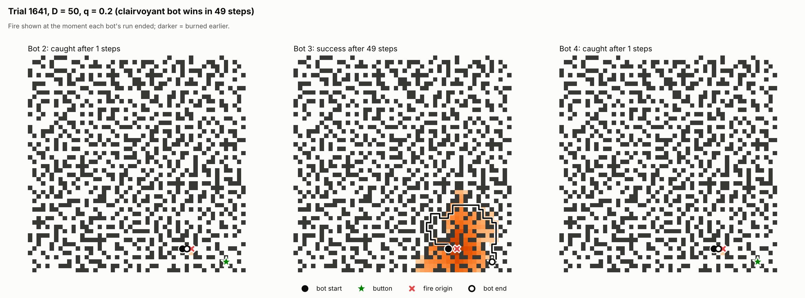
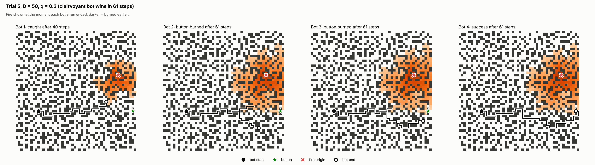
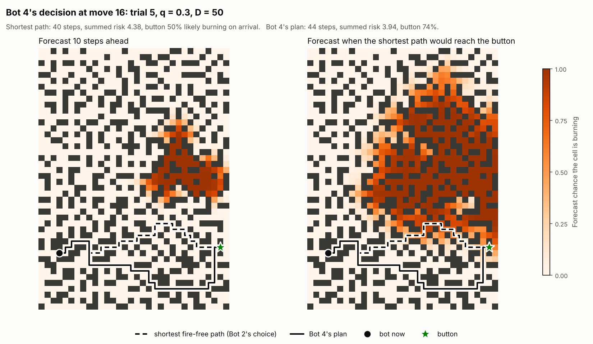
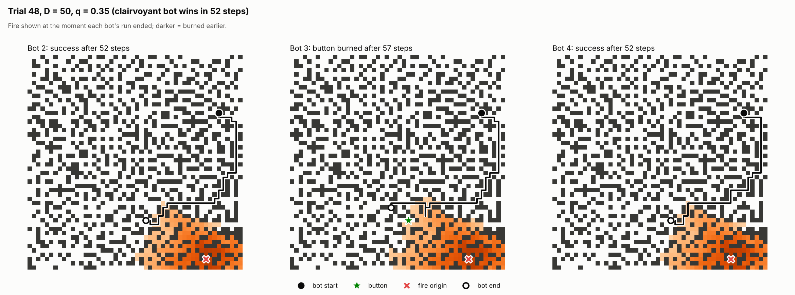
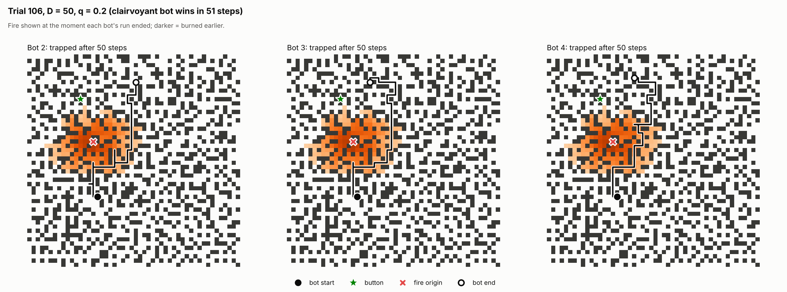

# Project 1: This Ship is on Fiiiiire!

A bot on a randomly generated D x D ship has to reach the fire-suppression
button before the fire spreading through the ship gets to it (or to the
button). This directory has the ship generator, the fire model, Bots 1-4, a
clairvoyant upper bound used for the failure analysis, and the experiment,
analysis and visualisation scripts.

## Running it

Needs Python 3.10+ with `numpy` and `matplotlib` (and `pytest` for the tests).

```bash
cd "project 1"
pip install numpy matplotlib pytest

python -m pytest                                   # 90 tests, a few seconds

# Experiments: one CSV row per (trial, bot); uses every core.
python experiments.py --D 50 --q 0:1:0.05 --trials 1000 --out results/main.csv
python analyze.py results/main.csv.gz --out results   # tables + charts (reads .csv or .csv.gz)

# Replay a single trial (trial numbers match the CSV) or find an interesting one
python visualize.py --D 50 --q 0.3 --trial 17 --out trial17.png
python visualize.py --D 50 --q 0.3 --where bot3=0 bot4=1 --bots bot3 bot4 --out case.png

# How well Bot 4's fire forecast matches the real fire
python forecast_check.py --out results/forecast_calibration.png

# One of Bot 4's decisions: its forecast, its plan, and the shortest path it rejected
python decision.py --D 50 --q 0.3 --trial 463 --out decision.png

# Bad luck or bad decision? Replay trials Bot 4 lost but Bot 3 won, under 40 fresh fires each
python replay_check.py results/main.csv.gz --lost bot4 --won bot3 --bots bot2 bot3 bot4
```

Bots are named by spec strings, so variants can be compared in one run:
`bot2:lazy=false`, `bot4:risk_weight=30`, `bot4:forecast=meanfield`,
`bot4:certain_first=false`.

## Files

| File | What it does |
|---|---|
| `ship.py` | Ship generation (both phases from the spec) and the `Ship` class. No fire/bot code, so it can be reused in later projects. |
| `fire.py` | The spread rule and `FireTrajectory`, one fire realisation per trial. |
| `planning.py` | BFS, the certain-win check (fireproof paths), and the time-dependent, risk-aware A* used by Bot 4. |
| `forecast.py` | Bot 4's probabilistic fire forecasts (message passing, plus the naive mean-field version for comparison). |
| `bots.py` | Bots 1-4 behind one `reset()` / `act()` interface. |
| `simulation.py` | Runs a bot on a trial in the order the spec gives (and counts moves Bot 2 couldn't have made); clairvoyant upper bound. |
| `experiments.py` | Parallel, reproducible parameter sweeps that write CSVs. |
| `analyze.py` | Success rates with 95% CIs, paired bot comparisons, failure breakdowns, charts. |
| `visualize.py` | Draws what each bot did on one trial. |
| `forecast_check.py` | Calibration of the fire forecasts against Monte Carlo runs of the real fire. |
| `decision.py` | Draws one of Bot 4's real decisions: the forecast at two future times, its plan, and the shortest path it turned down. |
| `replay_check.py` | Reruns the starting configurations of chosen trials under many fresh fires, to tell bad luck from bad decisions. |
| `tests/` | Unit tests (see "Correctness checks"). |
| `results/` | Data and charts from the runs described below. |

## Design

### Ship
`generate_layout` follows the spec exactly. Phase 1 (`grow_maze`) opens a
random interior cell, then repeatedly opens a random blocked cell with exactly
one open neighbour. Phase 2 (`reduce_dead_ends`) opens a random closed
neighbour of a random dead end until at most half of the original dead ends
remain. Phase 1 keeps the set of candidate cells up to date incrementally
(opening a cell only changes its 4 neighbours' counts), so it is O(D^2)
instead of rescanning the grid every iteration (O(D^4)). Only the first open
cell has to be in the interior; later cells may be on the edge of the grid.

### Fire
Each step every non-burning open cell ignites with probability
1 - (1 - q)^K, where K is its number of burning neighbours. As the TA
feedback asked, the update is **synchronous**: K is counted from the fire as
it was at the start of the step, and newly ignited cells are only added
afterwards, so they cannot spread fire in the same step
(`fire.fire_step`; `test_update_is_synchronous` checks this). The whole update
is a handful of numpy operations on the grid.

The fire does not react to the bot, so `FireTrajectory` simulates it once per
trial (lazily, only as far as anyone needs) and records each cell's ignition
time. All four bots and the clairvoyant bound then face the **same** fire on
each trial, which makes bot comparisons paired and much less noisy. Bots only
ever see the cells burning at the current time step.

### Time step and outcomes
`simulation.run_bot` follows the spec's order: the bot picks a move, moves,
presses the button if it is on it, and otherwise the fire advances. Every
failure is labelled with its cause:

| Outcome | Meaning |
|---|---|
| `entered_fire` | the bot moved into a burning cell (only Bot 1 does this) |
| `caught` | the fire spread onto the bot's cell |
| `button_burned` | the button caught fire first; nobody can press it any more |
| `trapped` | the bot is alive but every route to the button runs through fire |

The last two end the trial early. That doesn't change any result, because
the fire never goes out, so once either happens the bot is certain to fail.

### Bots
- **Bot 1**: BFS once at t = 0, avoiding the initial fire cell, then follows
  that path whatever the fire does.
- **Bot 2**: shortest path avoiding all burning cells, replanned every step.
- **Bot 3**: shortest path avoiding burning cells *and* their neighbours if
  one exists, otherwise Bot 2's path. The bot's own cell is never avoided;
  the button is avoided like any other cell, so a button next to the fire
  means Bot 3 falls back to Bot 2's rule.
- **Bot 4**: risk-aware A*, described next.

### Bot 4: run when winning is provable, otherwise plan with risk

Every time step Bot 4 makes one of two kinds of decision.

**Mode 1: make a break for it when winning is provable.** The fire moves at
most one cell per step, whatever q is. A multi-source BFS from the cells
burning now (`planning.fire_distances`) therefore gives, for every cell, the
earliest step at which the fire could *possibly* be there. A second BFS
(`planning.fireproof_path`) looks for a path on which the bot enters every
cell strictly before that (the button: no later, since it is pressed before
the fire moves). If such a path exists, the bot is certain to win by
following it, so it commits to it and stops thinking. Committing is safe:
each step the bot moves one cell along the path and the fire can close in
by at most one cell, so the margins never shrink. This is the instructor's
data-collection hint turned into part of the bot. About half of all trials
are certain wins from the very first step, at every q (see Results).

**Mode 2: plan under uncertainty.** Otherwise Bot 4:

1. **Forecasts the fire.** From the cells burning now and q, it computes
   $p_t(c)$, the probability that cell $c$ is burning $t$ steps from now,
   for as many future steps as its search needs. It uses dynamic message
   passing (`forecast.MessagePassingForecast`). The fire is an SI epidemic
   (each burning cell independently ignites each neighbour with probability
   q per step), and message passing tracks, for every directed edge
   $k \to i$, the chance that $k$ has *not yet* ignited $i$, computed as if
   $i$ itself were unburnt. That last detail stops probability from echoing
   back and forth between neighbours, which made the simpler mean-field
   forecast badly wrong (see below).
2. **Searches over (cell, time).** Entering cell $c$ on move $t$ costs
   $1 + w \cdot r_t(c)$ with $r_t(c) = -\ln(1 - p_t(c))$ (for the button,
   $r_{t-1}$, since it is pressed before the fire moves). If cells burned
   independently, the summed risk would be $-\ln P(\text{survive the path})$.
   Because the risk depends on *when* each cell is reached, a slow path
   pays for being slow: its cells, and above all the button, are reached
   later, when the fire has had longer to spread. That is how Bot 4 trades
   a short path near the fire against a long path away from it. With
   $w = 1000$, one extra step is worth only about 0.1% survival, so path
   length is little more than a tie-breaker: the cost of time is already
   in the forecast. (How $w$ was chosen is in the development log.)
3. **Takes the first step** of the cheapest plan, then replans next step
   with the new fire.

```
each step, given pos, burning, q:
    if committed: follow the committed path
    d ← BFS distance from the burning cells to every cell   (fire's best case)
    if some path enters each cell c on move k with k < d[c]:
        commit to the shortest such path; take its first step
    else:
        forecast ← message passing from burning, q (reused if the fire hasn't changed)
        plan ← A* over (cell, t), step cost 1 + w * r_t(cell), heuristic = maze distance
        if no plan: trapped (every route runs through fire)
        take the plan's first step
```

Details that make Mode 2 exact and fast:
- *Heuristic.* The BFS distance from each cell to the button through open
  cells, ignoring fire, computed once per trial. Every move costs at least
  1, so it is admissible and consistent, and in a maze it is far tighter
  than Euclidean or Manhattan distance.
- *Pruning.* The fire only grows, so forecast risk never decreases over
  time. Reaching a cell earlier and no more expensively is therefore never
  worse, so a state (c, t) is skipped once (c, t') with t' <= t has been
  expanded. `test_risk_astar_matches_brute_force` checks the result against
  an unpruned Dijkstra over every (cell, time) state. The same monotonicity
  means waiting in place never helps, so it is not searched.
- *Laziness and reuse.* Forecast layers are only computed as far ahead as
  the search reaches; a forecast is reused while the fire hasn't changed
  (common at low q); the edge index used by message passing is built once
  per ship.
- With `risk_weight = 0` and `certain_first = false` it is exactly Bot 2
  (tested).
- **Assumption:** Bot 4 knows q, the ship's flammability.

**Why message passing and not a simpler forecast.** The first version used
a naive mean-field forecast: treat each neighbour as burning independently
with its current probability. `forecast_check.py` showed it was badly
miscalibrated (chart below). On these mostly tree-shaped ships, probability
leaks along every back-and-forth walk, so at q = 0.3 cells it forecast at
85% actually burned only about 12% of the time. Message passing fixes this.
It is exact on trees (and matches the closed-form answer on a corridor in
`test_message_passing_is_exact_on_a_corridor`), and only slightly
pessimistic on these ships, which have a few loops.


**Known limitation: the summed risk is a ranking score, not a probability.**
Adding $r$ over a path's cells treats them as independent, but they are
positively correlated: if the fire happens to be slow, every cell on the
path is safe at once. Each burning neighbour ignites a cell with its own
independent q-coin per step (exactly the $1 - (1-q)^K$ rule), and every
"cell not burning yet" event gets less likely whenever a coin comes up
heads, so by the Harris inequality, if the forecast were exact,

$$\prod_k \big(1 - p_k(c_k)\big) \;\le\; P(\text{survive the path}) \;\le\; \min_k \big(1 - p_k(c_k)\big)$$

Bot 4 uses the pessimistic end. Two examples: at the first move of q = 0.35
trial 48, Bot 4's own plan had a summed risk of about 10 (an "estimated
survival" of $e^{-10}$), yet the forecast put the button at only 53% likely
to be burning on arrival, and Bot 4 won. At q = 0.3 trial 5, move 16, Bot 4
preferred a 44-step plan to the 40-step shortest one because its summed
risk was lower (3.94 vs 4.38), even though its single riskiest cell was
worse (0.74 vs 0.47). It won that trial too, and the replay check in the
results suggests the effect on outcomes is small, but it is the most likely
place for a better Bot 4 to come from.

### Efficiency: what made 83,000 trials × 4 bots affordable

- **Ship generation is O(D^2).** Phase 1 keeps its candidate cells in a list
  plus an index map instead of rescanning the grid every iteration (O(D^4)).
- **The fire is vectorised.** One update is a handful of whole-grid numpy
  operations (shifted views count burning neighbours) instead of a Python
  loop over cells.
- **One fire per trial, shared and lazy.** The fire never reacts to the bot,
  so it is simulated once per trial, only as far as anyone needs, and
  replayed for all four bots and the clairvoyant bound.
- **Trials stop as soon as the outcome is certain** (button burned, or every
  route cut off).
- **Planners use flat integer cell ids and Python lists**, not tuples or
  numpy scalars, inside BFS and A*.
- **Bots 2 and 3 replan only when fire lands on their plan.** This gives
  the same path lengths as replanning every step (tested).
- **Bot 4:**
  - It checks for a certain win first (two BFSs) and, once it finds one,
    stops thinking.
  - Forecast layers are computed only as far ahead as the search reaches,
    and reused while the fire is unchanged.
  - Message passing uses an edge index built once per ship. Plain gathers
    instead of `.prod(axis=1)` made each forecast step 2.4x faster.
  - A* reads risk with `.item()` on the few cells it touches instead of
    converting whole layers to lists, which halved Bot 4's time per trial.
  - The exact maze-distance heuristic and the dominance pruning keep A*
    small.
- **Trials run in parallel** on every core. Each trial's seed depends only on
  (seed, q, trial index), so results don't depend on how work is split up.
- **Paired comparisons** (all bots on the same fire) need about 11x fewer
  trials than independent samples for the same precision on a difference.

### Clairvoyant upper bound
`simulation.oracle_steps` asks whether *any* sequence of moves could have
won, given the entire future of that trial's fire. It is a BFS in which a
cell can be entered on move k only if it is not burning after k fire updates.
Because the fire only grows, arriving anywhere as early as possible is
always best, so each cell is visited once. This bounds every possible bot,
and it splits each failure into **avoidable** (some sequence of moves would
have won) and **unavoidable**.

### Certain wins (the instructor's data-collection hint)
`Trial.fireproof()` asks, before simulating anything, whether the bot has a
path that even the fastest possible fire (q = 1) cannot catch: one BFS for
the fire's earliest possible arrival at every cell, one BFS for a path that
always stays ahead of it. If so, the trial is a certain win for any bot that
takes such a path. This doesn't depend on q at all, which is why success
levels off at about 52% as q approaches 1: at q = 1 the fire really is that
fast, so "certain win" and "clairvoyant bot wins" coincide exactly (tested).
The experiments record it for every trial; it is also Bot 4's Mode 1.

It also splits the trials three ways: **certain** from the start, **impossible**
(not even the clairvoyant bot wins), and **contested** (everything else).
Only contested trials can separate good decisions from bad ones, so that is
where bot comparisons are sharpest.

### Do the bots actually decide differently?
A move is one Bot 2 could have made if it steps along *some* shortest path to
the button through currently unburnt cells. `run_bot(..., count_deviations=True)`
counts each bot's moves that fail that test (Bot 2's count is always 0;
tested). This is independent of how ties between equally short paths are
broken, so a nonzero count means the bot really made a different kind of
decision. The experiments record the count for every bot and trial.

## How Bot 4 got here (development log)

1. **First version.** Risk-aware A* over (cell, time) with a naive
   mean-field fire forecast. Risk weight tuned on a separate set of trials
   (q = 0.2-0.5): anything from 3 to 100 performed about the same; 30 was
   picked.
2. **Calibration check.** Comparing the forecast with Monte Carlo runs of the
   real fire showed it was 13-32 points too pessimistic. Switched to message
   passing (bias +1 to +5 points). On the tuning trials this cut the share of
   Bot 4's failures that were avoidable from 6% to 4%: the time-dependent
   planning did most of the work, and the better forecast helped a bit more.
3. **First full run (83,000 trials).** Bot 4 beat Bots 1-3 throughout
   q = 0.1-0.7 and sat within 0.5 points of the clairvoyant bound.
4. **Instructor's hint: certain wins.** About half of all trials turned out
   to be certain wins at every q, and every bot won every one of them. That
   explains the plateau near 52% at high q, and it pointed at contested
   trials as the place to compare bots.
5. **Does Bot 4 just copy Bot 2?** Mostly, yes. In a 4,200-trial check, Bot
   4 left Bot 2's rule in only 7.5% of trials. But those trials were 54 wins
   to 1 loss against Bot 2. Bot 3 left the rule more often (10%) and its
   departures were close to a coin flip (23 wins, 17 losses).
6. **Looking for bad decisions.** Of 83,000 trials, Bot 4 lost 34 that Bot 2
   won and 57 that Bot 3 won. None were certain wins. A common pattern
   against Bot 3: at low q, Bot 4 walked past the fire on its very first
   moves and was caught, while Bot 3 detoured and won. The cause was the
   weighting. With $w = 30$, a 10% chance of burning cost the same as 3
   extra steps, so Bot 4 would trade a 10% risk of death for a few steps
   even when the button was in no danger and time was cheap. Time is
   already priced into the forecast, so the step cost should only break
   ties.
7. **Re-tuning on held-out trials, now including low q.** Raising $w$ to
   300 or more recovered 15 of the 57 losses and none of 133 sampled wins
   was lost, but overall success was flat from 30 to 1000 (88.0% vs 87.9%
   pooled). The flaw was real but rare. Kept $w = 1000$ for the principled
   reading (an extra step is worth about 0.1% survival).
8. **Mode 1 added.** Checking for a certain win every step and committing to
   it made "never lose a certain win" a guarantee instead of an observation,
   and made the bot's behaviour easy to state.
9. **Final run** with this Bot 4, recording certain wins and deviations.
10. **Replay check of the remaining losses.** Most of the trials Bot 4 lost
    but another bot won were bad luck: from the same starts, Bot 4 wins more
    often. The clearest exception (q = 0.2, trial 1641) shows exactly where
    the risk score goes wrong: summing correlated risks along a long detour
    made Bot 4 rank a 34%-survival path above a 52%-survival one. That is
    the next thing to fix.

## Deviations from the original plan

1. **No `Tile` objects.** The plan stored the ship as a 2D array of `Tile`
   objects. The code holds the same information in numpy arrays and integers
   instead: `ship.grid` (open/blocked), the fire's burning mask and ignition
   times, and the bot and button as flat cell indices. The fire update and
   the "next to the fire" test then become a few whole-grid numpy
   operations, and the planners work on plain ints, which is what made tens
   of thousands of trials per bot affordable. If you want a `Tile` view for
   the writeup or later projects it is easy to add on top, but it would be
   slow in the inner loops.
2. **Bots 2 and 3 don't literally rerun BFS every step.** They reuse their
   current plan until fire lands on it (for Bot 3, while it is on a buffered
   plan). This gives the same behaviour: the set of usable cells only
   shrinks, so an untouched shortest path is still a shortest path. The only
   possible difference is which of several equally short paths gets picked.
   `test_lazy_replanning_matches_full_replanning` compares against a fresh
   BFS at every step, and `bot2:lazy=false` / `bot3:lazy=false` replan every
   step if you want the literal version.
3. **Bot 4 still uses A*, but with four changes.** (a) The heuristic is the
   true BFS distance to the button instead of Euclidean distance. Both are
   admissible, but the BFS distance is much tighter in a maze. (b) The search
   runs over (cell, time) instead of cells, because a cell's risk depends on
   when the bot arrives. (c) The risk cost comes from a calibrated
   probabilistic forecast (message passing). (d) Before planning, Bot 4
   checks for a path the fire provably cannot catch and, if there is one,
   simply runs (Mode 1).
4. **Additions that were not in the plan:** a fire realisation shared by all
   bots on each trial (paired comparisons), the clairvoyant bound, the
   certain-win check, the deviation count, early stopping once failure is
   certain, the forecast calibration check, and the replay check for bad
   luck vs bad decisions.
5. The directory is named `project 1` (with a space) as requested, so quote
   it in shells: `cd "project 1"`.

## Correctness checks (`tests/`)
- Ship: phase 1 yields a tree with no cell left to open; phase 2 at least
  halves the dead ends and only opens cells; every open cell is reachable;
  generation is reproducible.
- Fire: synchronous update, ignition frequency matches 1 - (1 - q)^K, no
  spread at q = 0, fire stays on open cells.
- Planning: BFS paths are valid and shortest; risk-aware A* matches an
  unpruned brute force; both forecasts are exact when q = 1; message passing
  is exact on a corridor; forecast probabilities are valid and only grow.
- Bots: lazy replanning matches full replanning; no bot ever beats the
  clairvoyant bound; with q = 0 every bot wins whenever winning is possible;
  Bot 4 without risk (and without Mode 1) takes paths as short as Bot 2's.
- Certain wins: at q = 1 "certain win" agrees exactly with the clairvoyant
  bot; certain-win trials are always winnable; Bot 4 wins every one; Bot 2
  never deviates from its own rule.

## Results

### What was run

| Run | Ship size D | q values | Trials per q | Purpose |
|---|---|---|---|---|
| Main, whole range | 50 | 0 to 1 in steps of 0.05 | 1,000 | overall picture |
| Main, interesting range | 50 | 0.1 to 0.7 in steps of 0.025 | 3,000 | where the bots differ |
| Bot 4 tuning, two rounds | 50 | 0.05-0.6 | 500 (separate seed) | risk weight, forecast choice |
| Ship size | 25 and 100 | 0.1 to 0.8 | 2,000 and 400 | how much D matters |

The main run is 83,000 trials, each on a freshly generated ship. On every
trial all four bots, the clairvoyant bound and the certain-win check face
the same ship, start cells and fire. Seeds come from (seed, q, trial index),
so any row can be replayed with `visualize.py`. Raw data:
`results/main.csv.gz`; every table: `results/summary.md`.

**How much data is enough.** Two things make the comparisons tight.
3,000 trials per q in the interesting range give 95% CIs of about ±1.6
points on each success rate. More importantly, because the bots share each
trial's fire, their *difference* can be measured trial by trial: at
q = 0.375, Bot 4 minus Bot 2 is +2.9 ± 0.6 points paired, where independent
samples of the same size would give ±2.0. Matching that with independent
samples would take about 11 times as many trials.

**Why D = 50.** Bot 4 spends about 140 ms thinking per trial at D = 50 and
over a second at D = 100 (one core). D = 50 allowed 3,000 trials per q where
it matters; the ship-size runs below check that the conclusions hold at
other sizes.

**How the interesting range was found.** A first pass over the whole range
showed that below q ≈ 0.1 Bots 2-4 win nearly every winnable trial, and
above q ≈ 0.75 every bot is within a point of the clairvoyant bound. The
extra trials went to the range in between.

### The centerpiece: success rate against q


- **Equally good (q near 0).** At q = 0 every bot wins 100%. Up to
  q ≈ 0.05, Bots 2-4 win 98.7-99.1%, essentially every trial a clairvoyant
  bot could win. Bot 1 is the exception: it never replans, so even a slow
  fire that creeps onto its path kills it (96.7% at q = 0.05).
- **Bot 4 ahead (q = 0.1 to 0.75, shaded).** Here Bot 4 beats both Bot 2 and
  Bot 3 with 95% confidence at every tested q. Its lead peaks at
  +2.9 ± 0.6 points over Bot 2 and +2.4 ± 0.6 over Bot 3 (q = 0.375), and
  about +5 points over Bot 1 for q = 0.125-0.375.
- **Equally bad (q ≥ 0.8).** All four bots are within 0.4 points of each
  other and of the clairvoyant bound. At q = 1 every bot wins exactly the
  51.7% of trials that are certain wins (next section): the fire is as fast
  as the bot, so the start decides everything.
- Bot 4 is within 0.5 points of the clairvoyant bound at every q.

| q | Bot 1 | Bot 2 | Bot 3 | Bot 4 | Clairvoyant bound |
|---|---|---|---|---|---|
| 0 | 100.0% | 100.0% | 100.0% | 100.0% | 100.0% |
| 0.1 | 94.9% | 98.1% | 98.2% | 98.5% | 98.5% |
| 0.2 | 89.4% | 93.1% | 93.4% | 94.4% | 94.8% |
| 0.3 | 83.1% | 86.6% | 87.0% | 88.5% | 88.6% |
| 0.4 | 77.3% | 79.3% | 79.9% | 81.5% | 81.8% |
| 0.5 | 74.0% | 74.8% | 75.3% | 76.6% | 76.9% |
| 0.6 | 67.3% | 67.6% | 67.6% | 69.0% | 69.4% |
| 0.7 | 61.0% | 61.2% | 61.1% | 62.0% | 62.1% |
| 0.8 | 56.2% | 56.3% | 56.2% | 56.5% | 56.6% |
| 1 | 51.7% | 51.7% | 51.7% | 51.7% | 51.7% |

### Which trials can a bot's decisions change?


About half of all trials (47-52%) are certain wins at *every* q, decided by
two BFSs before the fire moves at all. Every bot won every one of them
(41,283 of 41,283), so as the instructor's hint suggests, a data-collection
run could count them as wins without simulating them. We simulated them
anyway, to confirm that empirically for Bots 1-3, which, unlike Bot 4, are
not guaranteed to take a fireproof path. As q
grows, contested trials (winnable, but only by deciding well) turn into
impossible ones, and by q ≥ 0.8 fewer than 8% of trials are contested. That
is why the bots converge at both ends: at low q nearly everything is won,
and at high q almost nothing is left to decide.

### Success on contested trials only


Restricted to the trials where decisions matter, the gap is large. Bot 4
wins at least 97.7% of contested trials at every q. Bots 2 and 3 fall to
about 88-93% in the middle of the range, and Bot 1 to 84-90%.

### Does Bot 4 decide differently from Bot 2?


| Bot | Leaves Bot 2's rule? | Trials | Won where Bot 2 lost | Lost where Bot 2 won |
|---|---|---|---|---|
| Bot 3 | yes | 8,699 (10.5%) | 466 | 299 |
| Bot 3 | no | 74,301 | 75 | 0 |
| Bot 4 | yes | 7,751 (9.3%) | 1,102 | 38 |
| Bot 4 | no | 75,249 | 252 | 1 |

Bot 4 makes exactly Bot 2's kind of move in about 90% of trials. Its
advantage comes from the roughly 1 trial in 10 where it chooses differently,
and those departures win 29 times as often as they lose. Bot 3 departs about
as often, but its departures only help 1.6 times as often as they hurt: its
buffer is a fixed rule that ignores whether the detour is worth its cost.
Bot 4's 252 extra wins without ever leaving Bot 2's rule come from choosing
the safest of several equally short paths, a choice Bot 2 makes arbitrarily.

Why Bot 4's departure rate rises at q ≥ 0.85: when the forecast says every
route is very likely to fail, Bot 4 still picks the least-bad one, which is
often not the shortest. At q ≥ 0.85, 533 of the 536 trials where it departs
from Bot 2's rule are trials no bot could win, so these departures change
nothing. (None of Bot 4's departures, at any q, happen on a certain-win
trial: the shortest guaranteed path has always been a shortest path too.)

### What a Bot 4 decision looks like


q = 0.3, trial 463, first move: the shortest path (Bot 2's choice) runs
through cells the forecast gives up to a 91% chance of burning by the time
the bot would get there. Bot 4 pays 2 extra steps (27 instead of 25) for a
route whose riskiest cell is at 20%. Bot 4 won in 27 steps, the clairvoyant
optimum. Bot 2 kept to the short route and was trapped after 24 steps. Bot 3
also detoured, on a slightly different route, and was cut off after 28.


### Why bots fail


Pooled over every q (`results/summary.md`):

| Bot | Walked into fire | Fire spread onto bot | Button burned first | Cut off from button | Avoidable |
|---|---|---|---|---|---|
| Bot 1 | 40% | 25% | 36% | 0% | 16% |
| Bot 2 | 0% | 14% | 40% | 45% | 9% |
| Bot 3 | 0% | 5% | 45% | 50% | 7% |
| Bot 4 | 0% | 9% | 44% | 46% | 1% |

("Avoidable" is the share of that bot's failures where the clairvoyant bot
could have won.)

- **Bot 1** dies most often by walking into fire: it never looks again
  after planning.
- **Bot 2** is caught hugging the fire's edge (14% of its failures) or
  heads down routes the fire is about to close (trial 5 below).
- **Bot 3's** buffer cuts "fire spread onto bot" to 5% of failures, but the
  detours cost time, so more of its failures are a burned button
  (trial 48 below).
- **Bot 4**: only 1% of its failures were avoidable even with perfect
  knowledge of the future. The rest happened on trials no bot could win.

### Bad luck or bad decision? (`replay_check.py`)

A single lost trial can't tell bad luck from a bad decision. So for every
trial where Bot 4 lost but Bot 2 or Bot 3 won, the same ship and starting
cells were replayed under 40 fresh fires (`results/replay_bot4_vs_bot*.txt`):

| Trials where Bot 4 lost but... | Starts | Mean win rate from those starts | Bot 4 better / worse / same |
|---|---|---|---|
| Bot 3 won | 48 | Bot 4 64.6%, Bot 3 51.9%, Bot 2 53.1% | 42 / 5 / 1 |
| Bot 2 won | 39 | Bot 4 66.4%, Bot 2 54.9%, Bot 3 51.1% | 26 / 5 / 8 |

Most of these losses were bad luck: from the very same starts, Bot 4 wins
more often than the bot that beat it. Of the 10 starts where Bot 4 does
worse on average, most gaps are within the noise of 40 replays (about ±8
points), but three are clear. The largest one exposes Bot 4's main weakness.

**q = 0.2, trial 1641: a genuinely bad decision.** The bot starts 2 cells
from the fire. Bot 4 goes straight past it (27 steps); Bot 3 detours around
(41 steps). Following each opening plan blindly through 4,000 simulated
fires:

| Opening plan | Steps | Summed risk | "Independent" survival estimate | Riskiest-cell bound | True survival |
|---|---|---|---|---|---|
| Bot 4's | 27 | 1.76 | 17.2% | 50.8% | 33.5% |
| Bot 3's | 41 | 2.88 | 5.6% | 61.1% | 52.4% |

Bot 4's summed risk ranks the two paths the wrong way round. The detour
collects many small risks that are really one risk (the same fire front
reaching the same corridor), and adding them as if independent overstates
it. The riskiest-cell bound ranks them correctly. This is the "Known
limitation" above, now with a case where it costs a win. A fix would score
candidate paths with something closer to their joint survival: for example,
a blend of the two bounds, or a few dozen Monte Carlo fire samples to check
the top candidates. That is where the remaining half point of headroom
below the clairvoyant bound would come from. (In the other two clear cases
the first moves were identical or better for Bot 4, and the difference came
from later replanning.)




Example trials (`results/examples/`):

- **q = 0.3, trial 5:** Bot 1 walks along the fire's edge and is caught.
  Bots 2 and 3 head for the button, only reroute once fire blocks their
  way, and arrive after the button has burned. Bot 4 turns south well
  before the fire blocks the direct route and wins in 61 steps, the
  clairvoyant optimum. (This is also the decision analysed under "Known
  limitation" above.)
  
  
- **q = 0.35, trial 48:** Bot 3 keeps its distance from the fire and is
  still on its way when the button burns at step 57. Bots 2 and 4 take the
  route along the fire's edge and press it at step 52.
  
- **q = 0.2, trial 106:** Bots 2-4 all go around the fire and are cut off
  after 50 steps. The clairvoyant bot wins in 51, on a route that passes one
  cell just 2 steps before the fire reaches it. Whether a bot should ever
  bet on a squeeze like that, knowing only the current fire, is exactly the
  question Q3 asks.
  

### Ship size

A spot check at D = 25 (2,000 trials per q) and D = 100 (400 trials per q,
so roughly ±4 points on success rates and ±1.5 on paired differences),
next to the main D = 50 run (`results/size.csv.gz`; per-size tables in
`results/size/`):

| q | D = 25: Bot 4 (bound) | D = 50: Bot 4 (bound) | D = 100: Bot 4 (bound) |
|---|---|---|---|
| 0.1 | 96.4% (96.7%) | 98.5% (98.5%) | 98.2% (98.2%) |
| 0.2 | 91.6% (91.8%) | 94.4% (94.8%) | 93.8% (93.8%) |
| 0.3 | 85.5% (85.8%) | 88.5% (88.6%) | 90.5% (90.5%) |
| 0.4 | 78.3% (78.8%) | 81.5% (81.8%) | 80.2% (81.0%) |
| 0.5 | 74.6% (75.0%) | 76.6% (76.9%) | 77.0% (77.2%) |
| 0.6 | 66.3% (66.6%) | 69.0% (69.4%) | 71.2% (71.5%) |
| 0.8 | 56.7% (56.8%) | 56.5% (56.6%) | 59.5% (59.5%) |

Bot 4 minus Bot 3, paired, in points:

| q | D = 25 | D = 50 | D = 100 |
|---|---|---|---|
| 0.1 | +0.2 ± 0.3 | +0.3 ± 0.2 | +0.0 ± 0.0 |
| 0.2 | +1.2 ± 0.5 | +1.0 ± 0.4 | +0.2 ± 0.5 |
| 0.3 | +1.4 ± 0.5 | +1.4 ± 0.4 | +2.8 ± 1.6 |
| 0.4 | +1.8 ± 0.6 | +1.6 ± 0.5 | +1.5 ± 1.4 |
| 0.5 | +1.5 ± 0.6 | +1.3 ± 0.4 | +2.2 ± 1.5 |
| 0.6 | +1.3 ± 0.6 | +1.3 ± 0.4 | +0.5 ± 1.0 |
| 0.8 | +0.5 ± 0.3 | +0.3 ± 0.3 | +0.5 ± 0.7 |

Success at a given q rises somewhat with ship size. Everything else holds
at every size: about 50% of trials are certain wins, Bot 4 leads Bot 3 by
1-2 points in the middle of the range, and Bot 4 stays within 0.8 points of
the clairvoyant bound. So the D = 50 conclusions don't look like an
artefact of the ship size. Bot 4's thinking time grows steeply with D:
about 18 ms, 135 ms and 1.5 s per trial at D = 25, 50 and 100.

### Bot 4 tuning (held-out trials)

Both rounds used a separate seed (7), so the main results were never used
to choose settings. Both ran before Mode 1 existed, so every Bot 4 here is
Mode 2 only. "Avoidable" is the share of failures the clairvoyant bot would
have won.

**Round 1** (q = 0.2, 0.3, 0.4, 0.5; 500 trials each; `results/tuning/round1/`):

| Bot | Success (pooled) | Avoidable |
|---|---|---|
| Bot 2 | 83.8% | 16.6% |
| Bot 3 | 84.2% | 14.2% |
| Bot 4, mean-field forecast, w = 1 / 3 / 10 / 30 / 100 | 85.3% / 85.5% / 85.5% / 85.6% / 85.6% | 8.1% / 6.9% / 6.6% / 5.9% / 5.9% |
| Bot 4, message passing, w = 3 / 10 / 30 / 100 | 85.6% / 85.8% / 86.0% / 85.9% | 5.9% / 4.9% / 3.6% / 3.9% |

Planning over (cell, time) with *any* reasonable risk estimate does most of
the work (Bot 3 to mean-field Bot 4). The calibrated forecast adds a smaller
gain on top, and larger weights help up to about 30.

**Round 2** (q = 0.05, 0.1, 0.15, 0.2, 0.3, 0.4, 0.5, 0.6; 500 trials each;
`results/tuning/round2/`), run after the diagnostics showed Bot 4 trading
safety for speed at low q:

| Bot | Success (pooled) | Avoidable |
|---|---|---|
| Bot 2 | 86.4% | 13.6% |
| Bot 3 | 86.7% | 11.4% |
| Bot 4, w = 30 / 100 / 300 / 1000 | 87.92% / 87.92% / 87.98% / 88.00% | 2.3% / 2.3% / 1.9% / 1.7% |

Overall the differences between weights are within noise (a few trials out
of 4,000), but the avoidable share keeps falling as the weight rises, which
matches the diagnosis. The final Bot 4 uses w = 1000.

### Thinking time

Mean time spent inside each bot's own code, D = 50, one core:

| | Bot 1 | Bot 2 | Bot 3 | Bot 4 |
|---|---|---|---|---|
| per move | 10 µs | 20 µs | 42 µs | 3.7 ms |
| per trial | 0.3 ms | 0.7 ms | 1.6 ms | 140 ms |

Bot 4 thinks about 90-190 times longer per move than Bots 3 and 2. Almost all
of that is the forecast and the (cell, time) search in Mode 2. Checking for a
certain win costs two BFSs per move, and once Bot 4 has committed to one,
its moves cost almost nothing.

### Where each part of the writeup is supported

| Writeup item | Where the evidence is |
|---|---|
| Centerpiece: q vs success, all bots on one graph | `results/centerpiece.png`, success table |
| Enough data for clear trends | "What was run", paired vs independent CIs |
| Range where all bots are equally good / equally bad | Centerpiece bullets, `trial_types.png` |
| "There, that's where Bot 4 outperforms" | Shaded band in the centerpiece, `success_contested.png` |
| The hint: telling immediately that a bot will win | "Certain wins" (Design), `trial_types.png`, 41,283 of 41,283 |
| Q1: Bot 4's design and decisions | Bot 4 section, pseudocode, decision figures, development log |
| Q1: efficiency | "Efficiency" (Design), thinking time |
| Q2: experiments and graphs | "What was run", centerpiece, size check |
| Q3: why bots fail, better decisions? | "Why bots fail", replay check, example trials, known limitation |
| Does Bot 4 decide differently from Bot 2? | `divergence.png` and the outcome table |
| Process, expectations and surprises | Development log, calibration chart, tuning rounds |
| Q4: the ideal bot, computation vs intelligence | Clairvoyant bound, thinking time, certain wins (when to just run), known limitation |
