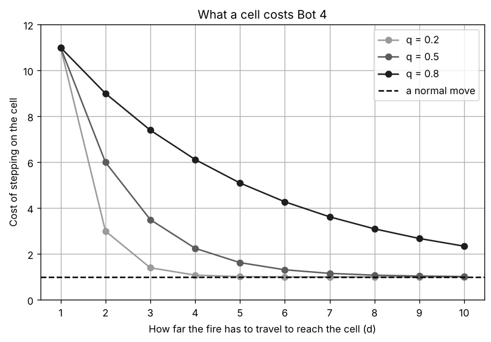
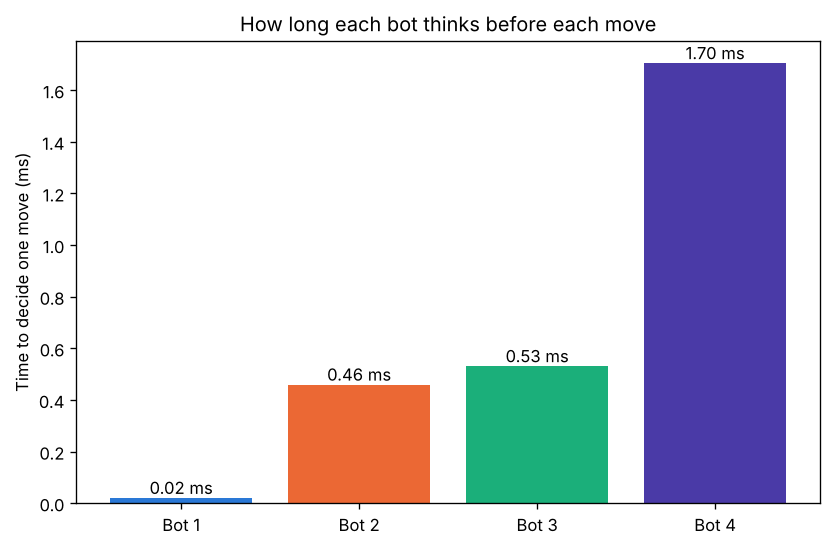
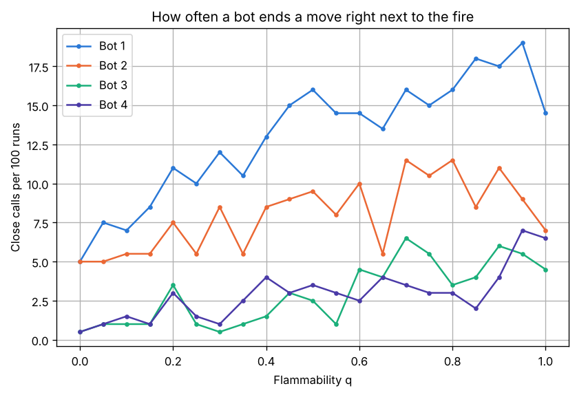
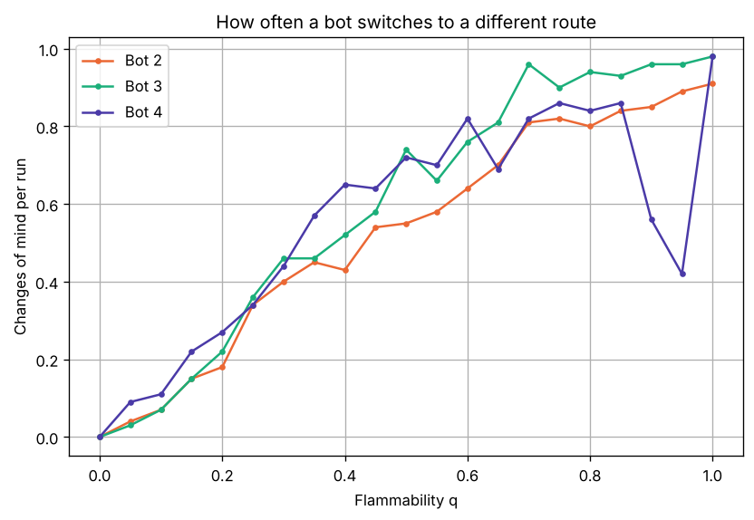

# Project 1: This Ship is on Fiiiiire!

Your Name (NetID)

## 1. How Bot 4 works (Question 1)

Bots 1 and 2 use BFS to find the shortest path to the button that avoids the
burning cells: Bot 1 does it once and follows that plan, and Bot 2 does it again
every step. Bot 3 also avoids every cell next to the fire, and if it can't, it
does what Bot 2 does.

Bot 2 only avoids the cells that are burning right now. But the cells next to
the fire are the ones most likely to burn next, and the faster the fire, the
further that danger reaches. So Bot 4 makes a "heat map" of the ship, where the
closer a cell is to the fire, the hotter it is, and then uses A\* to find the
cheapest path to the button, where hot cells cost more to step on. It goes
around the hot area when the way around isn't too long, and goes through it when
every other way is much longer. Every step, Bot 4 does five things:

1. It runs a BFS that starts from every burning cell at once and only moves
   through open cells, which gives $d$, how many cells the fire has to travel
   to reach each cell.
2. It works out the heat of every open cell that isn't burning:
   $$\text{heat} = q^{\,d-1}.$$
   A cell next to the fire ($d = 1$) has heat 1, and each cell further away
   multiplies the heat by $q$, because for the fire to get there as fast as
   possible it has to win its chance $q$ once for every cell on the way. A
   slow fire's heat dies off quickly ($q = 0.2$: 1, 0.2, 0.04, ...), while a
   fast fire's heat reaches far ($q = 0.8$: 1, 0.8, 0.64, 0.51, ...).
3. It sets the cost of stepping on each cell: $1 + 10 \times \text{heat}$, or
   1,000,000 for a burning cell. That huge cost means "never step here": every
   route that avoids the fire costs far less, so A\* only goes through fire if
   there is no other way, and then Bot 4 knows it is cut off.
4. It runs A\* to the button. A\* always takes out of the fringe the cell with
   the smallest $g + h$, where $g$ is the cost of getting there so far and $h$
   is the Manhattan distance to the button. If going through that cell is the
   cheapest way found so far to one of its neighbours, it saves the new cost
   and `prev` and adds the neighbour to the fringe. When the button comes out,
   it follows `prev` back to get the path.
5. It moves to the first cell of that path. The fire then spreads, and next
   step it does all of this again.



*Figure 1: The cost Bot 4 gives a cell, based on how far the fire has to travel to reach it, for a slow, a medium and a fast fire. A cell right next to the fire always costs 11. For a slow fire ($q = 0.2$) the cost drops back to about a normal move within 3 or 4 cells, while for a fast fire ($q = 0.8$) a cell 10 cells away still costs more than twice a normal move, so Bot 4 stays much further away from a fast fire.*

The heat map and the Manhattan distance do different jobs. The heat map sets the
costs, which decide which path is the cheapest, so it is what makes Bot 4
different from Bot 2. The Manhattan distance never changes the path A\* finds,
because every step costs at least 1, so it is never more than the real cost
left. It only makes A\* look at the cells towards the button first: on 29 ships,
A\* and the same search without it always found the same cheapest cost, but A\*
took 255 cells out of the fringe on average instead of 902.

Here is a small example with $q = 0.3$ (`B` bot, `F` fire, `X` button, `#`
wall):

```
B . . . . . . . .
. # # # # # # # .
. # # # F # # # .
. # # # . # # # .
. . . . . . . X .
```

The bot can go down and along the bottom (11 moves) or along the top and down
the right side (13 moves). The bottom route passes two cells under the fire, and
the cells on the bottom row cost 1.02, 1.08, 1.27, 1.90, 4.00, 1.90, 1.27, 1.08,
so that route costs 16.54 in total, while the top route is far from the fire and
costs 13.12. So Bot 4 takes the top route, even though it is 2 moves longer,
while Bot 2 takes the bottom one because nothing on it is burning yet.

Bot 4 uses everything the bot can see: the layout, the burning cells, its own
position, the button, and $q$. It is not just Bot 3 with a wider buffer: a hot
cell is a cost weighed against a longer route, not a wall, the cost fades with
distance, and it depends on $q$.

To keep the code fast, each tile's open neighbours are worked out once, when the
ship is built, so the searches never have to check for walls. Every step, Bot 4
needs only one BFS, one pass over the ship and one A\*. All four bots reuse the
same ship on a trial, and a run stops as soon as the bot wins or loses. Bot 4
takes about 1.7 ms per move to decide, against 0.5 ms for Bots 2 and 3 (Figure
2), and a trial with all four bots takes about half a second on a 50 by 50 ship.



*Figure 2: How long each bot takes on average to decide one move. Bot 1 only plans once at the start, so it barely thinks at all. Bot 4 takes about 3 to 4 times longer than Bots 2 and 3, because every step it runs a BFS from the fire, builds the heat map and then runs A\*, instead of a single BFS.*

## 2. Experiments and results (Question 2)

I used $D = 50$ for the main run, because a trial on a 100 by 100 ship takes
about 10 times longer (5 seconds against half a second), so the same experiment
would take about 6 hours instead of about 35 minutes. I also ran Bot 4 on 25 by
25 and 100 by 100 ships with 100 trials at each $q$, and its success rate
followed the same curve, staying within about 8 points of the 50 by 50 results.
I tried every $q$ from 0 to 1 in steps of 0.05, with 200 trials at each one:
4,200 trials, with all four bots on every one. Trial $i$ always uses seed $i$
for the ship and the starting cells, so every $q$ uses the same 200 ships. Only
the fire uses random numbers, and I reset its seed before each bot's run, so
every bot on a trial faces exactly the same fire, and a difference between two
bots comes from their decisions and not from one of them getting an easier fire.


*Figure 3: Success rate against flammability $q$ for every bot, with 200 trials at each $q$ (the same 200 ships at every $q$).*

*Table 1: Success rates at some values of $q$ (from results/success_by_q.csv).*

| $q$ | Bot 1 | Bot 2 | Bot 3 | Bot 4 |
|---|---|---|---|---|
| 0.1 | 95.5% | 97.5% | 97.5% | 97.5% |
| 0.2 | 88.5% | 91.0% | 92.0% | 92.5% |
| 0.3 | 84.0% | 86.5% | 88.0% | 88.5% |
| 0.4 | 79.0% | 81.5% | 83.0% | 83.5% |
| 0.5 | 74.5% | 76.0% | 75.5% | 77.0% |
| 0.6 | 71.0% | 71.0% | 70.5% | 71.0% |
| 0.7 | 65.0% | 65.0% | 64.5% | 66.0% |
| 0.8 | 62.5% | 62.5% | 61.5% | 59.5% |
| 0.9 | 56.0% | 56.0% | 56.0% | 53.0% |
| 1 | 53.0% | 53.0% | 53.0% | 53.0% |

For very small $q$ all the bots are about equally good (at $q = 0$ they all win
every trial), and for large $q$ they are equally bad. From $q = 0.6$ up, Bot 1,
which never replans, has exactly the same success rate as Bot 2, and at $q = 1$
all four bots win 53% of the trials. The fire then moves as fast as the bot, so
the only thing that matters is whether the bot started closer to the button than
the fire.

Table 2 shows the difference in success rate between Bot 4 and each other bot,
on the same trials.

*Table 2: Bot 4's success rate minus each other bot's on the same trials, in percentage points (from results/bot4_advantage.csv).*

| $q$ range | vs Bot 1 | vs Bot 2 | vs Bot 3 |
|---|---|---|---|
| 0.1 to 0.2 | +3.0 | +0.3 | +0.0 |
| 0.25 to 0.65 | +3.1 | +1.5 | +0.8 |
| 0.7 to 1 | −1.7 | −1.7 | −1.5 |
| all $q$ | +1.3 | +0.1 | −0.1 |

So there, between $q = 0.2$ and 0.7, is where Bot 4 outperforms the other three.
It is ahead of or tied with Bots 2 and 3 at every $q$ in that range, and its
biggest lead is 2.5 points over Bot 2 at $q = 0.35$. With only 200 trials, a gap
of 1 or 2 points at a single $q$ could just be luck, so the clearest evidence is
the middle range as a whole: from $q = 0.25$ to 0.65, Bot 4 is 1.5 points ahead
of Bot 2 and 0.8 points ahead of Bot 3 on average, and it is ahead of or tied
with both of them at every one of those $q$ values. It is also 3 to 6 points
ahead of Bot 1 for $q$ from 0.15 to 0.4. For $q$ up to 0.15 there is no real
difference between Bots 2, 3 and 4, and when the fire is very fast Bot 4 does
worse: for $q$ from 0.8 to 1 it is 2.5 points behind Bot 2 (Section 3 explains
why). Over all $q$ the gains and losses cancel out, which is why the "all $q$"
row is close to zero.

## 3. Why the bots fail, what I learned, and the ideal bot (Questions 3 and 4)


*Figure 4: How each bot's failures break down, over every $q$ (from results/failure_reasons.csv). Bot 1 is the only bot that walks into the fire, and Bots 3 and 4 get caught by the fire spreading onto them much less often than Bot 2, because they keep their distance from it.*

Figure 4 shows why each bot fails. A third of Bot 1's failures (33%) come from
walking into the fire, which no other bot ever does, because Bot 1 never looks
again after planning. Bot 2 walks along the edge of the fire, so 19% of its
failures are the fire spreading onto it, while Bots 3 and 4 bring that down to
9% and 7%. For Bots 2, 3 and 4, almost all failures are the button burning first
(36 to 40%) or getting cut off (46 to 53%): the fire got to the button, or
across every route to it, first.

To see how each bot gets into trouble, I counted two things during every run.
The first is close calls: moves that end right next to a burning cell, which is
exactly the spot where the next spread can catch the bot. Figure 5 shows that
Bots 3 and 4 have far fewer close calls than Bots 1 and 2: at $q = 0.5$, Bot 2
ends 9.5 moves next to the fire per 100 runs, against 3.5 for Bot 4 and 2.5 for
Bot 3. Bot 2 only avoids the burning cells themselves, so it happily walks along
the edge of the fire, and Bot 1 has the most close calls of all (16 per 100 runs
at $q = 0.5$) because it never looks at the fire again after planning.



*Figure 5: How many moves end right next to a burning cell, per 100 runs (from results/close_calls_by_q.csv). Bots 3 and 4 keep their distance from the fire, so they have far fewer close calls than Bots 1 and 2.*

The second is changes of mind: how often the bot's new plan is not just the rest
of its old plan, so it has switched to a different route (Figure 6). Every
replanning bot changes its mind more as the fire gets faster, from about 0.1
times per run at $q = 0.1$ to about once per run at $q = 1$, because a faster
fire blocks routes more often. Bot 4 usually changes its mind more than Bot 2
when $q$ is between 0.05 and 0.6 (for example 0.65 times per run at $q = 0.4$,
against 0.43 for Bot 2), since its heat map shifts every time the fire grows,
which is how it finds safer detours. At $q$ = 0.9 and 0.95 it changes its mind
the least of the three (0.56 and 0.42 times per run, against 0.85 and 0.89 for
Bot 2): once it picks a long detour, it tends to stick with it. Together,
Figures 5 and 6 show that Bot 4 really does decide differently from Bot 2: it
ends far fewer moves next to the fire, and it switches routes more often in the
middle range.



*Figure 6: How many times per run a bot switches to a different route (from results/change_plan_by_q.csv). Bot 1 never plans again, so it is always 0 and not shown.*

Was there a better decision? For Bots 1 and 2, the close calls point to it:
staying one cell further from the fire, which is what Bots 3 and 4 do, avoids
most of the moments where the fire can spread onto the bot. For Bot 4, its
high-$q$ results answer it: from $q = 0.8$ up it does 2.5 points worse than Bot
2, and on those trials simply running straight for the button, like Bot 2 does,
would have saved it.

Bot 4's high-$q$ losses all come from the same design choice. When $q$ is large
the heat dies off slowly, so a big area around the fire is hot and Bot 4 takes
detours to stay away from it. But with a fire that fast, a longer route just
gives the fire more time to cut the bot off, and the best move is to run
straight for the button. For example, in trial 98 at $q = 0.8$, Bots 1, 2 and 3
went straight to the button and won in 31 moves, while Bot 4 took a longer route
around the heat and was cut off after 39 moves. A simple fix would be a smaller
penalty when $q$ is high, or no penalty at all from about $q = 0.75$ up, which
makes Bot 4 just take a shortest path there, like Bot 2.

As I expected, Bot 4 detoured around the fire when it was worth it and was the
best bot in the middle range. Some things surprised me: even at $q = 1$ the bots
still win 53% of the time, because the bot often just starts closer to the
button than the fire; Bot 2 is much better than I expected, since even in the
middle range Bot 4 only beats it by about 1.5 points; and being careful isn't
always smart, because at high $q$ Bot 4's caution lost trials that the simpler
bots won.

The ideal bot would pick the moves that give it the best chance of pressing the
button. It would use the same information as Bot 4 (the layout, the fire, its
own position, the button and $q$), but it would compute two things Bot 4
doesn't. First, a better picture of where the fire will be: it could copy the
current fire and spread it forward many times with $q$, and count how often each
cell is burning at each future step. Second, timing: it would search over (cell,
step) pairs and score each cell at the step it actually gets there, since a cell
next to the fire is safe if the bot crosses it now and deadly ten steps later.
Then it would take the path with the best chance of reaching the button, which
would also fix the high-$q$ problem, because a long detour would pay for being
slow. But thinking takes time (Bot 4 already spends about 1.7 ms per move,
against 0.5 ms for Bot 2, as Figure 2 shows), and in real life the fire keeps
spreading while the bot thinks. So I would only think hard when it matters: keep
the plan while the fire is far from it, plan again only when the fire gets
close, and run fewer fire simulations when the fire is far away. My results show
when thinking is worth it: in the middle range of $q$, where Bot 4 beat the
simpler bots. It is smart to just make a break for it when the fire is very fast
(from $q = 0.6$ up, Bot 1, which never plans again, did exactly as well as Bot
2) or when the shortest path is already far from the fire, because the fire only
grows, so waiting or taking a detour only gives it more time.
