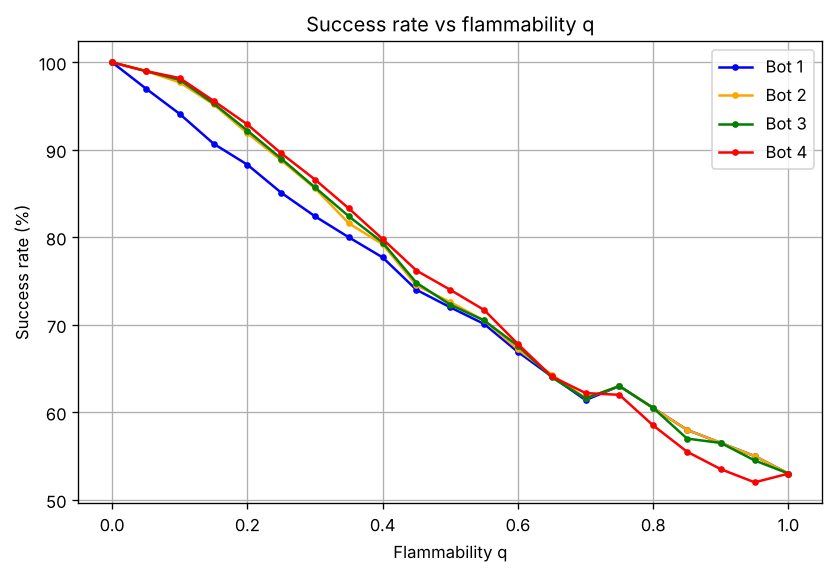
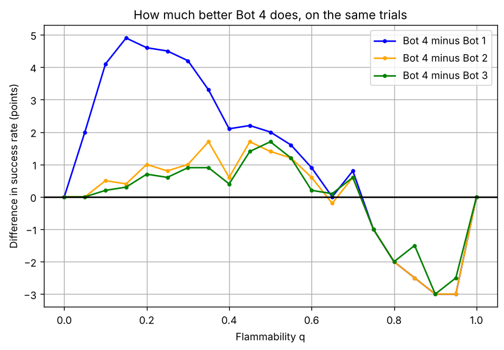
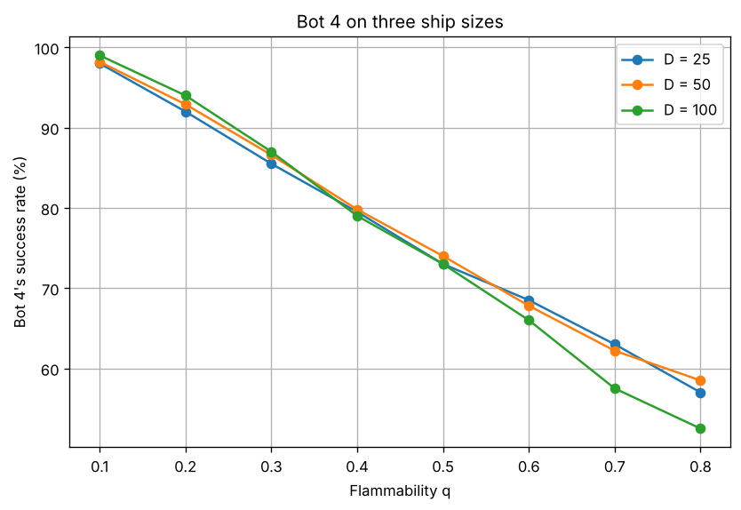
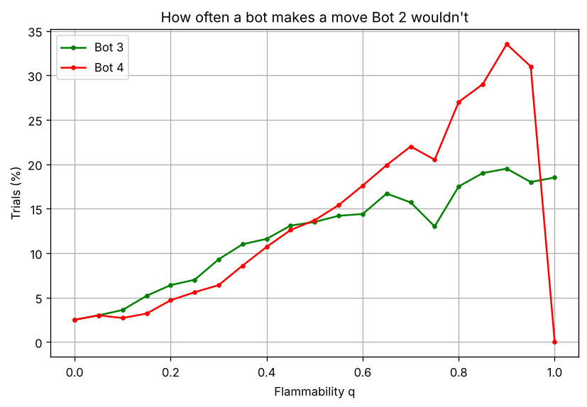
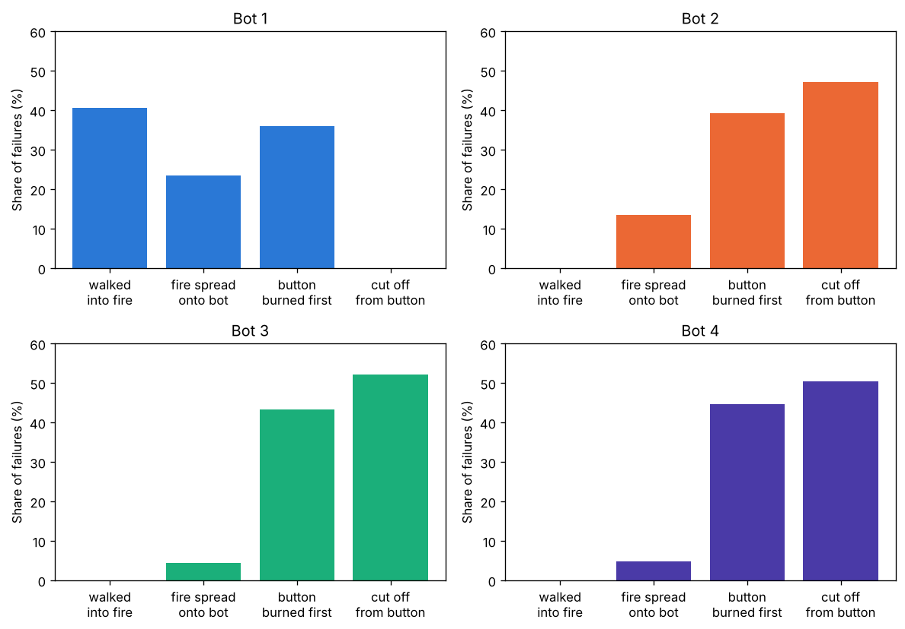
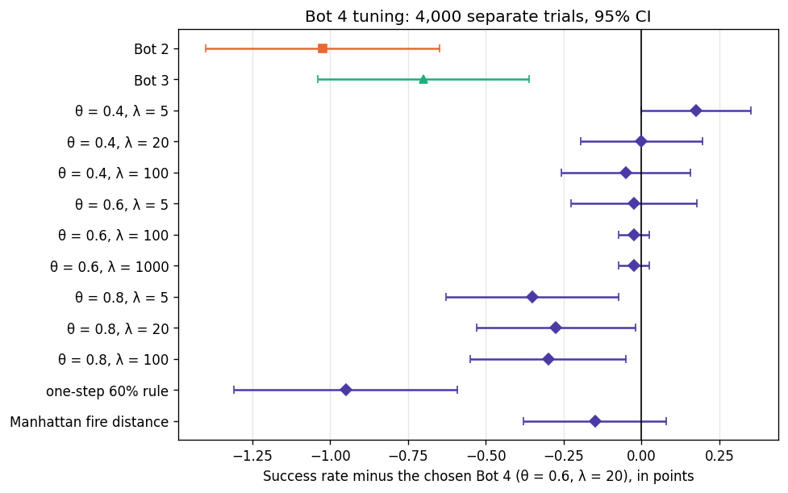

# Project 1: This Ship is on Fiiiiire!

Your Name (NetID)

## 1. How I built it and how Bot 4 works (Question 1)

I wrote everything in Python, with one file for each step: `ship.py` builds the
ship, `fire.py` spreads the fire, `search.py` has BFS and A\*, `bots.py` has one
function per bot that returns the path it wants to take, `simulation.py` runs
one bot on one trial, `experiments.py` runs all the trials, and `analysis.py`
makes the tables and charts.

The ship is a $D \times D$ grid of `Tile` objects, like in my original plan.
Each tile keeps track of whether it is open or blocked, whether it is on fire,
whether the bot or the button is on it, and its open neighbours. The first
phase of building the ship makes a tree, meaning there is only one route
between any two cells, and the second phase opens up dead ends, which adds
loops. Those loops are what give the bots a choice to make.

The fire spreads all at once, as the TA pointed out: I first decide which cells
catch fire using the fire as it was at the start of the step, and only then set
them on fire, so a cell that just caught fire can't spread it in the same step.
Only the fire uses random numbers, so before each bot's run I reset them with
the same seed. That way every bot on a trial faces exactly the same fire, and we
can compare the bots trial by trial. When a bot fails, I record why: it walked
into the fire, the fire spread onto it, the button burned first, or it got cut
off because every route to the button runs through fire.

The searches follow the pseudocode from lecture (a fringe, a closed set, and
`prev` to rebuild the path). Bots 1 and 2 use BFS to find the shortest path that
avoids the burning cells: Bot 1 does it once and follows that plan, and Bot 2
does it again every step. Bot 3 also avoids every cell next to the fire, and if
it can't, it does what Bot 2 does.

Bot 2 only avoids the cells that are burning right now. But the cells next to
the fire are the ones most likely to burn next, and the faster the fire, the
further that danger reaches. So Bot 4 makes a "heat map" of the ship, where the
closer a cell is to the fire, the hotter it is, and then uses A\* to find the
cheapest path to the button, where hot cells cost more to step on. It goes
around the hot area when the way around isn't too long, and goes through it
when every other way is much longer. Every step, Bot 4 does five things:

1. It runs a BFS that starts from every burning cell at once and only moves
   through open cells, which gives $d$, how many cells the fire has to travel
   to reach each cell.
2. It works out the heat of every open cell that isn't burning:
   $$\text{heat} = q^{\,d-1}.$$
   A cell next to the fire ($d = 1$) has heat 1, and each cell further away
   multiplies the heat by $q$, because for the fire to get there as fast as
   possible it has to win its chance $q$ once for every cell on the way. A
   slow fire's heat dies off quickly ($q = 0.2$: 1, 0.2, 0.04, ...), while a
   fast fire's heat reaches far ($q = 0.8$: 1, 0.8, 0.64, 0.51, ...).
3. It sets the cost of stepping on each cell: $1 + 10 \times \text{heat}$, or
   1,000,000 for a burning cell. That huge cost means "never step here": every
   route that avoids the fire costs far less, so A\* only goes through fire if
   there is no other way, and then Bot 4 knows it is cut off.
4. It runs A\* to the button. A\* always takes out of the fringe the cell with
   the smallest $g + h$, where $g$ is the cost of getting there so far and $h$
   is the Manhattan distance to the button. If going through that cell is the
   cheapest way found so far to one of its neighbours, it saves the new cost
   and `prev` and adds the neighbour to the fringe. When the button comes out,
   it follows `prev` back to get the path.
5. It moves to the first cell of that path. The fire then spreads, and next
   step it does all of this again.

The heat map and the Manhattan distance do different jobs. The heat map sets
the costs, which decide which path is the cheapest, so it is what makes Bot 4
different from Bot 2. The Manhattan distance never changes the path A\* finds,
because every step costs at least 1, so it is never more than the real cost
left. It only makes A\* look at the cells towards the button first: on 29
ships, A\* and the same search without it always found the same cheapest cost,
but A\* took 255 cells out of the fringe on average instead of 902.

Here is a small example with $q = 0.3$ (`B` bot, `F` fire, `X` button, `#` wall):

```
B . . . . . . . .
. # # # # # # # .
. # # # F # # # .
. # # # . # # # .
. . . . . . . X .
```

The bot can go down and along the bottom (11 moves) or along the top and down
the right side (13 moves). The bottom route passes two cells under the fire, and
the cells on the bottom row cost 1.02, 1.08, 1.27, 1.90, 4.00, 1.90, 1.27,
1.08, so that route costs 16.54 in total, while the top route is far from the
fire and costs 13.12. So Bot 4 takes the top route, even though it is 2 moves
longer, while Bot 2 takes the bottom one because nothing on it is burning yet.

Bot 4 uses everything the bot can see: the layout, the burning cells, its own
position, the button, and $q$. It is not just Bot 3 with a wider buffer: a hot
cell is a cost weighed against a longer route, not a wall, the cost fades with
distance, and it depends on $q$. This is my original plan of A\* with the
fire's risk in the path cost, with two changes: I used the Manhattan distance
instead of the Euclidean one, because the bot only moves up, down, left and
right, and I dropped my idea of treating any cell with over a 60% chance of
catching fire as burning, because only cells touching the fire can catch fire
next step, so that would just be Bot 3 again.

## 2. Experiments and results (Question 2)

I used $D = 50$ and tried every $q$ from 0 to 1 in steps of 0.05. The bots only
really differ between $q = 0.1$ and 0.7, so I ran 1,000 trials at each of those
values and 200 at the others: 14,600 trials, with all four bots on every one.
Trial $i$ always uses seed $i$ for the ship and the starting cells. One success
rate from 1,000 trials is only known to about $\pm 2.5$ points, but since the
bots face the same fire I can compare them trial by trial, which is much more
exact: at $q = 0.4$ the gap between Bot 4 and Bot 2 is known to $\pm 0.8$
points instead of $\pm 3.5$.



*Figure 1: Success rate against flammability $q$ for every bot. The dashed line is the share of trials that are a certain win from the start. Below $q = 0.1$ and from 0.75 up there are only 200 trials (trials 0 to 199), which happen to have slightly more certain wins (53% against 50%), which is why the curves step up a little at 0.75.*

*Table 1: Success rates at some values of $q$.*

| $q$ | Bot 1 | Bot 2 | Bot 3 | Bot 4 |
|---|---|---|---|---|
| 0.1 | 94.1% | 97.7% | 98.0% | 98.2% |
| 0.2 | 88.3% | 91.9% | 92.2% | 92.9% |
| 0.3 | 82.4% | 85.6% | 85.7% | 86.6% |
| 0.4 | 77.7% | 79.2% | 79.4% | 79.8% |
| 0.5 | 72.0% | 72.6% | 72.3% | 74.0% |
| 0.6 | 66.9% | 67.2% | 67.6% | 67.8% |
| 0.7 | 61.4% | 61.6% | 61.6% | 62.2% |
| 0.8 | 60.5% | 60.5% | 60.5% | 58.5% |
| 0.9 | 56.5% | 56.5% | 56.5% | 53.5% |
| 1 | 53.0% | 53.0% | 53.0% | 53.0% |

For very small $q$ all the bots are about equally good (at $q = 0$ they all win
every trial), and for large $q$ they are equally bad: at $q = 1$ every bot wins
exactly 53%, because the fire moves as fast as the bot, so the bot only wins if
it started far enough ahead. Figure 2 and
Table 2 show the gap between Bot 4 and the others on the same trials.



*Figure 2: Bot 4's success rate minus each other bot's on the same trials, in percentage points. Above zero means Bot 4 won more often.*

*Table 2: Bot 4's success rate minus each other bot's on the same trials, in points, with 95% confidence intervals.*

| $q$ range | vs Bot 1 | vs Bot 2 | vs Bot 3 |
|---|---|---|---|
| 0.1 to 0.2 | +4.5 ± 0.7 | +0.6 ± 0.3 | +0.4 ± 0.2 |
| 0.25 to 0.65 | +2.3 ± 0.3 | +1.0 ± 0.3 | +0.8 ± 0.2 |
| 0.7 to 1 | −0.7 ± 0.6 | −0.8 ± 0.5 | −0.6 ± 0.5 |
| all $q$ | +2.3 ± 0.3 | +0.6 ± 0.2 | +0.5 ± 0.2 |

So there, between $q = 0.1$ and 0.7, is where Bot 4 outperforms the other three.
It is ahead of Bots 2 and 3 at every $q$ in that range except 0.65 (a tie), and
it beats both with 95% confidence at $q$ = 0.2, 0.25, 0.3, 0.35, 0.45, 0.5 and
0.55. Its biggest lead is about 1.7 points, and it is 4 to 5 points ahead of
Bot 1 for $q$ from 0.1 to 0.3. When the fire is very fast it does worse: for $q$
from 0.8 to 1 it is $2.1 \pm 0.9$ points behind Bot 2 (Section 3 explains why).

The gaps look small in Figure 1 because about half the trials are decided
before the fire even moves. For the instructor's hint, I check this before the
simulation: the fire moves at most one cell per step, so a BFS from the fire
gives the earliest step it could reach each cell, and a second BFS looks for a
path where the bot gets to every cell before that. If such a "fireproof" path
exists, the bot wins for sure by following it, whatever the fire does. That is
true for 50% of the trials, and Bots 1, 2 and 3 won every one of them (7,348 out
of 7,348), so a data-collection run could count these as wins without
simulating them. Bot 4 won all but 9, which is a clue to its weak spot.



*Figure 3: Bot 4's success rate on ships of size 25, 50 and 100. $D = 50$ is the main run, and $D = 25$ and 100 have 200 trials at each $q$. The three lines are almost on top of each other, so the size of the ship hardly matters.*

To see whether the size of the ship matters, I also ran Bot 4 on 25 by 25 and
100 by 100 ships (Figure 3). A bigger ship makes the bot's path to the button
longer, but it makes the fire's path longer too, so the race between them stays
about the same. The 100 by 100 ships do a few points worse at $q = 0.7$ and 0.8,
but with 200 trials each rate is only known to about $\pm 7$ points there, and
those ships also had a few fewer certain wins (47% against 50%), so I can't say
the size really matters.

To check whether Bot 4 really decides differently from Bot 2, I count every move
Bot 2's rule couldn't have made, meaning a move that isn't along some shortest
fire-free path to the button (Bot 2's own count is always zero).



*Figure 4: Share of trials where Bot 3 or Bot 4 makes at least one move Bot 2 couldn't have made. Bot 4 does this more as $q$ grows, because its heat reaches further from the fire. The one exception is $q = 1$: there every cell has heat $1^{d-1} = 1$, so every step costs the same and Bot 4 moves exactly like Bot 2.*

Bot 4 mostly agrees with Bot 2: in 88% of trials every move it makes is one Bot 2
could have made, because when the fire is far away the heat on the shortest path
is tiny. But in the 1,724 trials where it does leave Bot 2's rule, it wins 114
that Bot 2 lost and loses only 55 that Bot 2 won. Bot 3 leaves Bot 2's rule
about as often (1,639 trials), but its detours help about as often as they hurt
(60 against 53), since its buffer doesn't ask whether a detour is worth it.

## 3. Why the bots fail, what I learned, and the ideal bot (Questions 3 and 4)



*Figure 5: How each bot's failures break down, over every $q$.*

Bot 1 mostly dies by walking into the fire (41% of its failures), because it
never looks again after planning. Bot 2 walks along the edge of the fire, so 13%
of its failures are the fire spreading onto it, while Bots 3 and 4 bring that
down to 5%. For Bots 2, 3 and 4, almost all failures are the button burning
first (39 to 45%) or getting cut off (47 to 52%): the fire got to the button, or
across every route to it, first.

Was there a better decision? Since every bot faces the same fire, if another
bot won a trial that a bot lost, then a better set of moves existed. That is
true for 11.4% of Bot 1's failures, 4.7% of Bot 2's, 4.1% of Bot 3's and only
1.9% of Bot 4's. In the rest, no bot found a way out. But Bot 4's bad decisions
depend a lot on $q$: for $q$ up to 0.7 it won 115 trials that Bot 3 lost and
lost only 23 that Bot 3 won, but from 0.75 up it won 3 and lost 23.

Those high-$q$ losses all come from the same design choice. When $q$ is large the
heat dies off slowly, so a big area around the fire is hot and Bot 4 takes
detours to stay away from it. But with a fire that fast, a longer route just
gives the fire more time to cut the bot off, and the best move is to run
straight for the button. In all 25 trials at $q \ge 0.75$ that Bot 4 lost and
Bot 2 won, Bot 4 had made detour moves. For example, in trial 98 at $q = 0.8$,
Bots 1, 2 and 3 went straight to the button and won in 31 moves, while Bot 4 made
9 detour moves and was cut off after 38. The 9 certain wins Bot 4 lost are the
same story: all at $q \ge 0.8$, all with detours, while the other bots took the
shortest path and won. Two simple fixes would help: check for a fireproof path
first and just follow it if there is one (this would have saved those 9
trials), and use a smaller penalty when $q$ is high.



*Figure 6: Tuning on 800 separate trials ($q$ = 0.2, 0.4, 0.6 and 0.8, 200 each): each setting's success rate minus Bot 4 with penalty 10, in points, with 95% confidence intervals. Every bar except penalty 30 is within the noise of zero.*

I tuned the penalty on 800 trials the main run never uses (Figure 6). Penalties
5, 10 and 20 were within the noise of each other and 30 did worse, so I kept 10.
Bot 2 even came out half a point ahead on these trials, but all of that comes
from $q = 0.8$, where it was 3 points ahead, and penalty 5 also did a little
better there, which fits the detour problem above.

As I expected, Bot 4 detoured around the fire when it was worth it and was the
best bot in the middle range. Some things surprised me: half the trials are
decided before the fire moves, which is why the curves level off at about 53% instead of falling to zero; Bot 2 is much
better than I expected, since Bot 4 agrees with it in 88% of trials; and being
careful isn't always smart, because at high $q$ Bot 4's caution lost trials that
the simpler bots won.

The ideal bot would pick the moves that give it the best chance of pressing the
button. It would need two things Bot 4 doesn't have: a better picture of where
the fire will be (for example by simulating the fire forward many times and
counting how often each cell burns), and timing, meaning it would score each
cell at the step it actually gets there, since a cell next to the fire is safe
if the bot crosses it now and deadly ten steps later. That would also fix the
high-$q$ problem, because a long detour would pay for being slow. But thinking
takes time (Bot 4 already spends about 1.9 ms per move, against 0.5 ms for
Bot 2), and in real life the fire keeps spreading while the bot thinks. My
results show when thinking is worth it: in the middle range of $q$,
where Bot 4 beat the simpler bots. It is smart to just make a break for it when
there is a fireproof path, when the fire is very fast, or when the shortest path
is already far from the fire, because the fire only grows, so waiting or taking
a detour only gives it more time.
