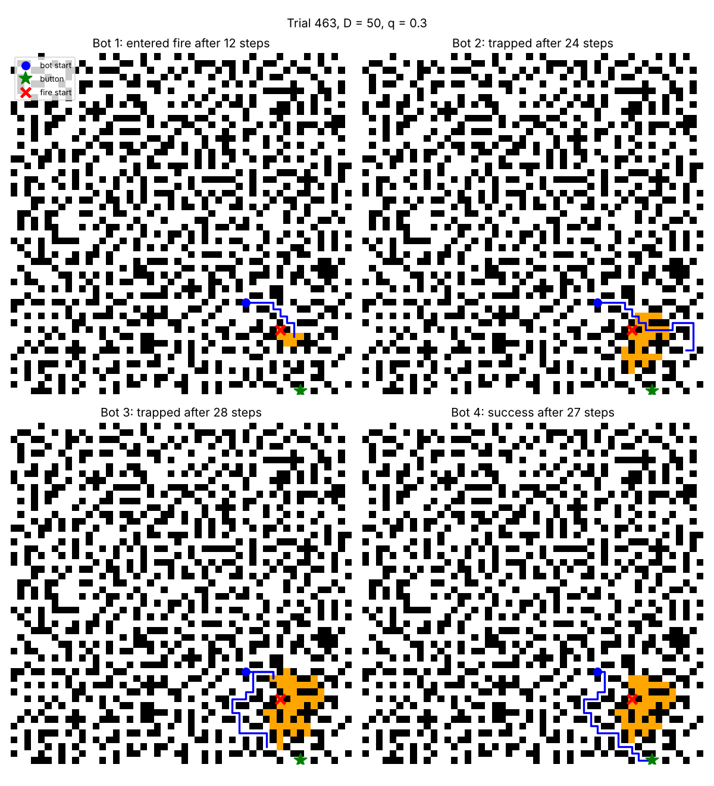
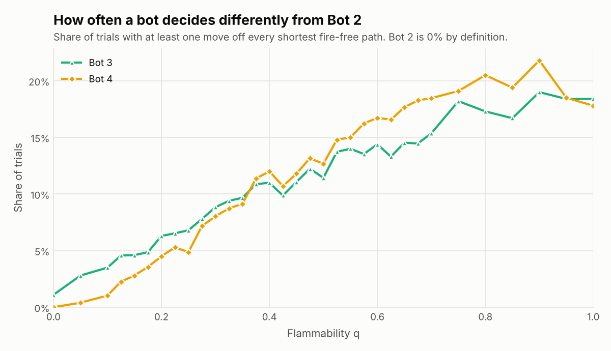
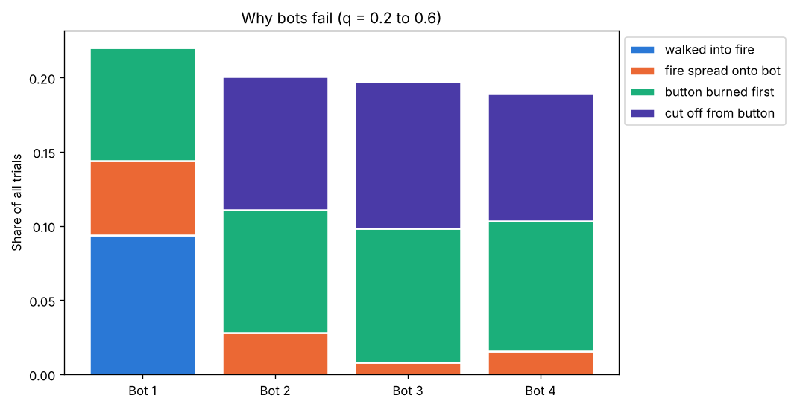
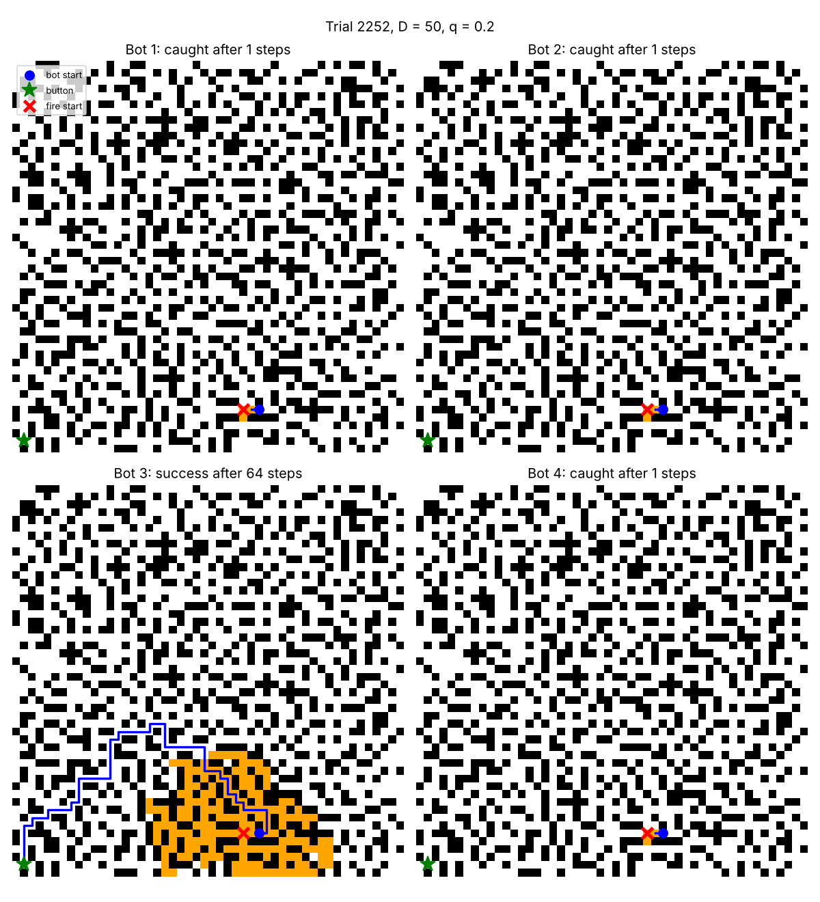
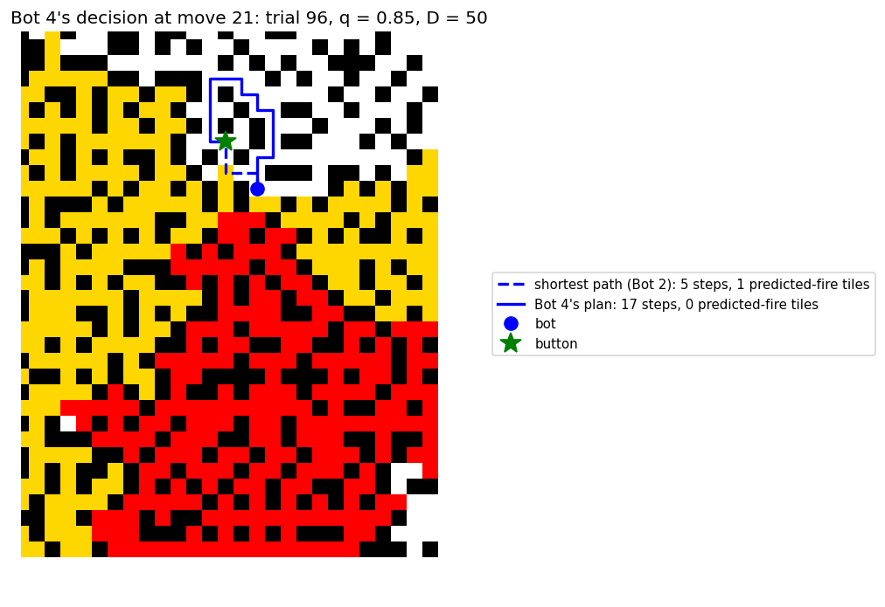
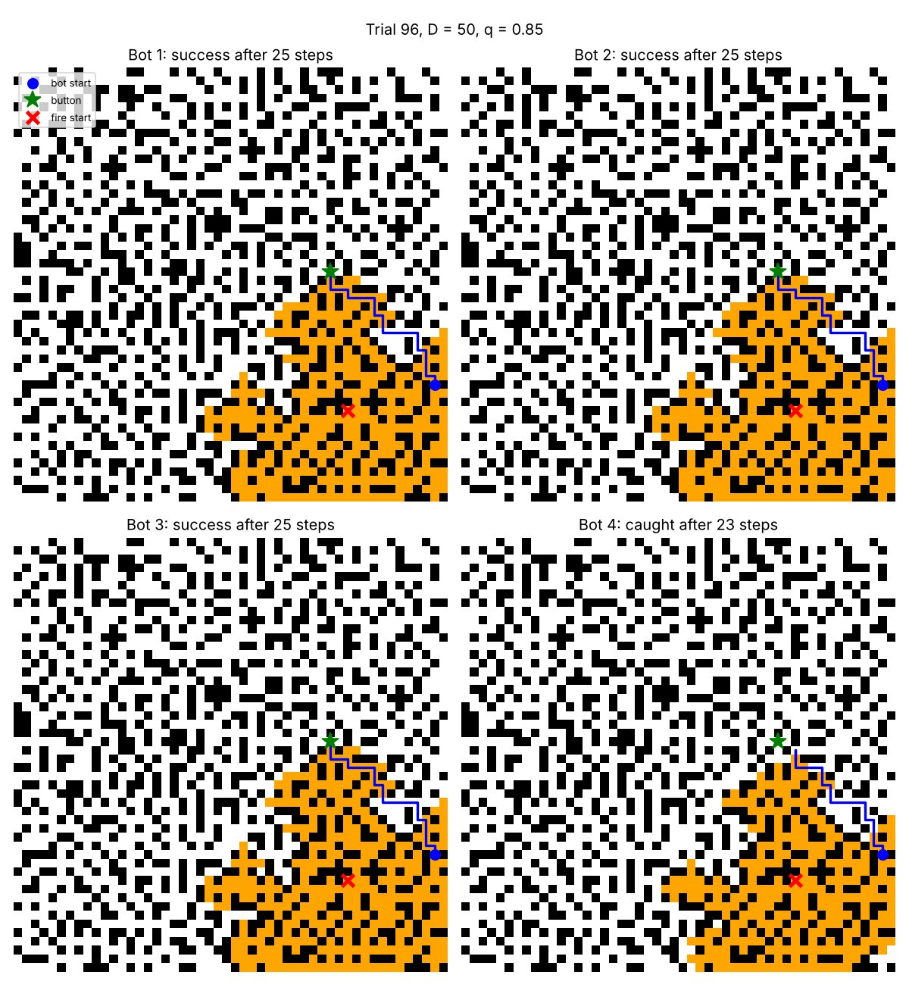

# Summary

I built the ship generator, the fire model and four bots in Python, and ran
every bot on the same 83,000 random trials (ship size $D = 50$, 33 values of
$q$). Bots 1-3 follow the assignment. **Bot 4 treats every cell as a race
between the bot and the fire:** for each cell it computes the probability that
the fire gets there before the bot does, treats cells the fire will probably
win as expensive, and plans with A\*.

{width=66%}

- **Bot 4 is the best bot for $0.225 \le q \le 0.675$.** There it beats both
  Bot 2 and Bot 3 with 95% confidence at 17 of the 19 tested values of $q$, by
  up to 1.8 points over Bot 2 and 1.2 points over Bot 3 (Figure 1).
- **For $q \le 0.2$, Bots 2-4 are equally good**, and **for $q \ge 0.8$ all
  four bots are equally bad**: the fire is so fast that the starting positions
  decide the outcome.
- **The hint:** about half of all trials (47-52% at every $q$) are certain wins
  that two BFSs can recognise before the simulation starts. Every bot won
  every one of them (41,283 of 41,283).
- Bot 4 makes a move Bot 2 never would in 10.9% of trials. When it does, it
  wins 3.5 times as often as it loses against Bot 2 on the same fire.
- Bot 4 has two diagnosable weaknesses, at low and at very high $q$
  (Section 5), and both trace back to specific design choices.

# 1 Implementation

## 1.1 The ship

The ship is a $D \times D$ grid of `Tile` objects (`ship.grid[r][c]`), and a
position is a `(row, col)` tuple. Each tile tracks:

| Attribute | Meaning |
|---|---|
| `is_open` | open floor, or wall |
| `on_fire` | burning right now |
| `has_bot` | the bot is standing here |
| `has_button` | the button is here |
| `neighbors` | positions of the open tiles next to it (up, down, left, right) |

Walls never change after generation, so each tile's list of open neighbours is
computed once, and every search simply walks `tile.neighbors`.

Generation follows the assignment exactly:

1. **Phase 1** opens a random interior cell, then repeatedly opens a random
   wall that has exactly one open neighbour, until none is left. Every new
   cell touches exactly one open cell when it opens, so the open cells form a
   tree: exactly one route between any two cells, and many dead ends.
2. **Phase 2** repeatedly picks a random dead end and opens a random wall next
   to it, until at most half of the original dead ends remain. These openings
   create loops, and loops are what give the bots choices: without them there
   is only one route to the button.

At $D = 50$ a ship has on average 1,631 open cells (65% of the grid). Phase 1
leaves about 449 dead ends, and phase 2 cuts them to about 224. Generating a
ship takes about 19 ms.

**Efficiency.** Rescanning the grid for walls with exactly one open neighbour
in every iteration of phase 1 would cost $O(D^2)$ per opening, so $O(D^4)$ in
total. Instead I keep the list of candidate walls up to date: opening a cell
only changes the open-neighbour counts of its four neighbours, so each opening
adds or removes at most four candidates. A dictionary from position to index
in the list lets a candidate be removed in $O(1)$ (move the last entry into
its slot). Phase 1 is then $O(D^2)$ overall. Phase 2 likewise only rechecks
the opened cell and its neighbours, the only cells whose dead-end status can
change.

## 1.2 The fire

Every time step, each open cell that isn't burning catches fire with
probability $1 - (1 - q)^K$, where $K$ is its number of burning neighbours.
As the TA's feedback asked, **the update is synchronous**: `spread_fire` first
goes over every cell and decides which ones catch fire, counting $K$ from the
fire as it was at the start of the step, and only then sets them on fire. A
cell that catches fire therefore cannot spread it in the same step (a unit
test checks this at $q = 1$: after $t$ updates exactly the cells within
distance $t$ are burning).

**Every bot faces the same fire.** The fire never reacts to the bot. So each
trial stores the state of its random number generator, and every run of that
trial starts the fire from a fresh copy of it. One random number is drawn for
every cell in every update (walls included, in row order), so the same
generator state always produces exactly the same fire. All four bots on a
trial therefore face the same fire, as the instructor suggests, and the
differences between them come from their decisions, not from luck. This also
makes the comparisons *paired*, which turns out to be worth about 16 times as
many trials (Section 3.1).

## 1.3 One time step

At $t = 0$ the bot, the button and the first fire cell are placed on three
different random open cells. Then, every step, in the assignment's order: the
bot chooses a neighbour and moves there; if that cell is the button, the
button is pressed and the bot wins; otherwise the fire spreads once. Every
failure is labelled with its cause:

| Outcome | Meaning |
|---|---|
| walked into fire | the bot moved onto a burning cell (only Bot 1 ever does) |
| fire spread onto bot | the fire spread onto the bot's cell |
| button burned first | the button caught fire, so it can never be pressed |
| cut off from button | every route to the button runs through fire |

The last two end the trial early. That changes no result: the fire never goes
out, so once either happens, the bot is certain to fail.

None of my bots ever uses the "stay in place" action. The fire only grows, so
following a route later than necessary is never better than following it now:
every cell is reached later, by which time it can only be more likely to burn.

## 1.4 Searches and Bots 1-3

All searches follow the pseudocode from lecture, with its variable names: a
`fringe` of states still to explore, a `closed_set` of states already
explored, and `prev[child]`, the state the child was reached from
(`prev[start] = None`). Following `prev` back from the goal rebuilds the path.

- **BFS** (`bfs_path`) is GraphSearch with a queue as the fringe, so the first
  time the goal comes off the fringe, it is along a shortest path. The tiles
  the bot must avoid are the "restricted states". I added one line to the
  lecture version: a child that is already in `prev` (already on the fringe)
  isn't added a second time, so every cell keeps the first cell it was reached
  from. Without that line, the path BFS returns among several equally short
  ones depends on which parent was found last.
- **Bot 1** runs BFS once at $t = 0$, avoiding the initial fire cell, and then
  follows that plan whatever happens.
- **Bot 2** reruns BFS every step, avoiding all burning cells, and takes the
  first step of the new plan.
- **Bot 3** reruns BFS every step, avoiding burning cells *and* every cell
  next to one. If no such path exists, it falls back to Bot 2's planner.

The four strategies differ only in how they choose a path, so there is one
`Bot` class: a name, a **planner** function (which returns a path to the
button, or nothing) and a flag saying whether to call the planner again every
step. Bots 1 and 2 are the same planner with and without replanning; Bot 3's
fallback is literally a call to Bot 2's planner; Bot 4 is one more planner.
The bot sees the fire only by looking at the tiles' `on_fire` flags, as they
are at the current step.

# 2 Bot 4: avoid the fire that will probably get there first (Question 1)

## 2.1 The idea

Bot 2 avoids where the fire *is*. But the bot doesn't care where the fire is
now; it cares whether the fire will be on a cell **when the bot gets there**.
A cell three steps from the fire is harmless if the bot crosses it next move,
and deadly if the bot would only reach it in twenty moves. So Bot 4 asks, for
every cell: *who will get there first, the bot or the fire?* Cells the fire
will probably win are treated like fire, as an expensive cost rather than a
wall, and the bot plans the cheapest route with A\*.

## 2.2 The race

Every step, for every open cell $c$:

- $k(c)$ = the number of moves the bot needs to reach $c$: a BFS from the bot
  that avoids the cells burning now.
- $d(c)$ = how many cells the fire must travel to reach $c$: a BFS through
  the open cells (the fire cannot cross walls) that starts from every burning
  cell at once.

Along a single route, the fire's front advances one cell per step with
probability $q$: the next cell on the route has exactly one burning neighbour,
so it ignites with probability $1 - (1 - q)^1 = q$, independently each step.
After $k$ steps the front has therefore advanced
$A_k \sim \text{Binomial}(k, q)$ cells, and

$$
P(\text{fire gets to } c \text{ first}) = P\big(A_{k(c)} \ge d(c)\big) = \sum_{j = d(c)}^{k(c)} \binom{k(c)}{j}\, q^j (1 - q)^{k(c) - j}.
$$

For the button I use $k - 1$ instead of $k$, because the bot presses the
button before the fire moves. A cell is **predicted fire** if this probability
is above the threshold $\theta = 0.6$. Cells the bot cannot reach at all are
never flagged.

For example, at $q = 0.3$ a cell 5 cells from the fire that the bot would
only reach in 20 steps is predicted fire (the fire wins that race 76% of the
time), while a cell right next to the fire that the bot reaches in 1 step is
not (30%).

**Computing it quickly.** Bot 4 never sums the binomial during a trial.
$P(A_k \ge d)$ only gets smaller as $d$ grows, so for each $k$ there is a
largest fire distance $\text{radius}[k]$ that still counts as dangerous.
`danger_radius` builds this table once per $(q, \theta)$ by updating the
binomial distribution one step at a time, and keeps it in a dictionary. The
check for a cell is then a single comparison: $d(c) \le \text{radius}[k(c)]$.

## 2.3 The search

Bot 4 runs A\* from its position to the button. Entering cell $c$ costs

| Cell $c$ | Cost $w(c)$ |
|---|---|
| burning now | $\infty$ (never entered) |
| predicted fire | $1 + \lambda$ |
| any other open cell | $1$ |

with penalty $\lambda = 20$. The heuristic is the Manhattan distance to the
button, $h(c) = |r_c - r_\text{button}| + |c_c - c_\text{button}|$. It is the
cost of a relaxed problem (the same grid with every wall removed), so it never
overestimates: $h(c) \le C^*(c, \text{button})$. It is also consistent, since
every step costs at least 1 and $h$ changes by at most 1 per step:
$h(n) \le C^*(n, n') + h(n')$. So the first time the button comes off the
fringe, A\* has found the cheapest path.

As in the lecture notes, A\* is uniform cost search with priority
$f(n) = g(n) + h(n)$, where $g(n)$ is the cheapest cost found so far
(`dist[n]`), and it has no closed list. A child is added to the fringe, or
updated, when it is new or when `dist_to_child = dist[curr] + cost(curr, child)`
beats its current `dist`. Python's heap has no "add or update", so an updated
child is simply added again; its older copy has a higher priority and changes
nothing when it eventually comes off.

The whole decision, every step:

```
given the bot's position, the burning cells and q:
    d <- BFS distance from the burning cells to every cell (through the maze)
    k <- BFS distance from the bot to every cell, avoiding burning cells
    predicted <- cells with P(Binomial(k, q) >= d) > 0.6     (k - 1 for the button)
    cost <- infinity for burning cells, 1 + 20 for predicted cells, 1 otherwise
    plan <- A*(bot -> button, cost, h = Manhattan distance to the button)
    if there is no plan: trapped (every route runs through fire)
    otherwise take the plan's first step
```

## 2.4 Short-but-risky versus long-but-safe

A plan's cost is its length plus $\lambda$ for every predicted-fire cell on
it. So Bot 4 accepts a detour of up to 20 extra steps to avoid one
predicted-fire cell, but goes straight through predicted fire when every way
around is longer than that (or runs through predicted fire too). This is the
trade-off between shorter, riskier paths and longer, safer ones that the TA's
feedback asked for: the shortest path is not avoided because it is near the
fire, only because the fire will probably reach it first.

{width=44%}

Figure 2 shows a real decision. The predicted region is not a band of fixed
width: two cells 4 steps from the fire are treated differently. Cell
(43, 40), which the bot would reach in 15 moves, is flagged (the fire covers 4
cells within 15 steps 70% of the time), while (40, 41), which the bot could
reach in 11, is not (43%). Figure 3 shows the outcome on this trial: Bot 4
took its detour and won in 27 steps; Bot 2 kept to the short route and was
cut off after 24 steps; Bot 3 also detoured, by a different route, and was cut
off after 28; Bot 1 walked into the fire.

{width=78%}

## 2.5 How Bot 4 uses the available information

Bot 4 uses everything the bot can observe: the layout (open cells), which
cells are burning right now, its own position, the button's position, and
$q$. From these it computes two distance maps, turns them into a prediction of
which cells the fire will reach before the bot, and plans a route that weighs
the length of the route against how much predicted fire it crosses. Since it
replans every step, every new fire cell immediately changes both maps, the
prediction and the plan.

**Assumption:** Bot 4 knows $q$, the ship's flammability.

## 2.6 Why this is not Bot 3 with a wider buffer

The assignment's one restriction is that Bot 4 cannot be Bot 3 with a wider
buffer around the fire. Bot 4's avoided region is different in three ways:

- **It depends on where the bot is.** A cell right next to the fire that the
  bot can reach first is not avoided, and a cell far from the fire that the
  bot would only reach much later can be (Figure 2).
- **It depends on $q$.** A slow fire predicts a thin band (or nothing), a fast
  fire a wide one.
- **It is soft.** Predicted fire is a cost to trade against detour length,
  not a wall.

## 2.7 How good is the race model?

Each burning cell gives each unburnt neighbour its own chance $q$ every step.
The fire reaches a cell at the earliest time over *all* routes, while the
race model only follows one shortest route. So:

- On a tree-shaped region with one burning cell there is only one route, and
  the formula is **exact**.
- Otherwise, extra routes (the loops from phase 2, or several burning cells)
  can only make the real fire faster. The true probability is never lower
  than the model's: the model is a **slightly optimistic lower bound**.

Both properties are checked by unit tests against simulated fires: on a
corridor the model matches 1,500 simulated fires, and on a real ship it never
predicts more fire than the simulations produce.

**Known limitation.** $k(c)$ is the bot's *shortest* distance to $c$, not the
step at which its plan actually reaches $c$. On a detour the bot reaches cells
(and the button) later than $k(c)$, so they are more dangerous than the model
thinks, and detours look safer than they are. Section 5.3 shows this losing a
trial.

## 2.8 Where the design came from, and what changed

My original idea was A\* with a Manhattan-distance heuristic between the fire
and the bot, where burning cells cost extra and open cells with a high (more
than 60%) chance of catching fire are treated as burning. Three things changed
when I formalised it:

- **The heuristic.** An A\* heuristic has to estimate the remaining cost *to
  the goal*, so it is the Manhattan distance to the button. The comparison
  between the fire and the bot is still there: it is the race, which compares
  how far the bot and the fire each are from every cell.
- **The 60% rule.** Read literally, "catches fire with more than 60%
  probability" means $1 - (1 - q)^K > 0.6$ for the next step. Only cells
  touching the fire have $K \ge 1$, so this rule can only ever flag cells
  inside Bot 3's buffer: with $K = 1$ only when $q > 0.6$, and even with
  $K = 4$ never when $q \le 0.2$. That would be Bot 3 with a thinner buffer
  (exactly what the assignment rules out), and at low $q$ it would be exactly
  Bot 2. The race asks the same question, "will this cell be on fire?", but at
  the time that matters: when the bot would get there. I kept the literal rule
  as a variant and tested it: it did no better than Bot 2 (Section 6).
- **The fire's distance.** The fire can only spread through open cells, so
  $d(c)$ is measured through the maze, not with the Manhattan distance (which
  would flag cells the fire can only reach the long way round). The Manhattan
  version did slightly worse in tuning (within the noise) and is slower.

My plan also said the A\* heuristic would be the *Euclidean* distance to the
button. The bot can only move up, down, left and right, so the Manhattan
distance is the exact cost on a grid with no walls: it is still admissible,
and since it is never smaller than the Euclidean distance it guides the search
better.

## 2.9 Efficiency

The code favours readability (a grid of objects, `(row, col)` tuples, plain
loops), and within that:

- **Ship generation is $O(D^2)$** instead of $O(D^4)$ (Section 1.1).
- **Each tile's open neighbours are computed once**, since walls never change.
- **The binomial tail is never summed during a trial**: `danger_radius` turns
  it into a lookup table once per $(q, \theta)$, so each cell's check is one
  comparison.
- **The Manhattan heuristic keeps A\* focused on the button**; with $h = 0$ it
  would be plain uniform cost search and explore in every direction.
- **Trials stop as soon as the outcome is certain** (button burned, or every
  route cut off).
- **Paired comparisons:** because every bot faces the same fire, about 16
  times fewer trials are needed for the same precision on a difference.
- **Trials run in parallel** on every core. Each trial's random seed depends
  only on (seed, $q$, trial number), so results don't depend on how the work
  is split up, and any single trial can be replayed.

Mean time spent inside each bot's own code ($D = 50$, 175 trials, 25 at each
$q$ from 0.1 to 0.7):

| | Bot 1 | Bot 2 | Bot 3 | Bot 4 |
|---|---|---|---|---|
| per move | 23 µs | 514 µs | 584 µs | 3.0 ms |
| per trial | 0.8 ms | 20 ms | 23 ms | 120 ms |

Bots 2 and 3 run one BFS per step. Bot 4 runs two BFSs, scores every cell and
runs A\*: about 6 times Bot 2's work per move. A whole trial, with all four
bots and the certain-win check, takes about 0.7 s on one core, so the 83,000
trials of the main run took several hours on 4 cores.

# 3 Experiments (Question 2)

## 3.1 What I ran

| Run | Ship size $D$ | Values of $q$ | Trials per $q$ | Purpose |
|---|---|---|---|---|
| Main, whole range | 50 | 0 to 1 in steps of 0.05 | 1,000 | the overall picture |
| Main, interesting range | 50 | 0.1 to 0.7 in steps of 0.025 | 3,000 | where the bots differ |
| Bot 4 tuning | 50 | 0.05 to 0.6 | 500 (separate seed) | threshold, penalty, variants |
| Ship size | 25 and 100 | 0.1 to 0.8 | 2,000 and 400 | does $D$ matter? |

The main run is 83,000 trials, each on a freshly generated ship, with all four
bots on each one. I chose $D = 50$ so that the main run fits in several hours
on 4 cores; Section 3.5 checks $D = 25$ and $D = 100$.

**Finding the interesting range.** A first pass over the whole range showed
that below $q \approx 0.1$ Bots 2-4 win about 98% of trials or more and are
within a few tenths of a point of each other, and that above $q \approx 0.75$
all four bots are within a point of each other. So I concentrated the data
in between: every $q$ from 0.1 to 0.7, in steps of 0.025, got 3,000 trials
instead of 1,000.

**How much data is enough.** 3,000 trials per $q$ give 95% confidence
intervals of about $\pm 1.6$ points on each success rate, which is not enough
on its own to separate bots that differ by 1-2 points. But because the bots
share each trial's fire, the *difference* between two bots can be measured
trial by trial: at $q = 0.4$, Bot 4 minus Bot 2 is $+1.6 \pm 0.5$ points
paired, where two independent samples of the same size would give
$\pm 2.0$. Matching the paired precision with independent samples would take
about 16 times as many trials.

## 3.2 The centerpiece: success rate against $q$

Figure 1 (in the summary) is the centerpiece. The numbers behind it:

| $q$ | Bot 1 | Bot 2 | Bot 3 | Bot 4 | Certain wins |
|---|---|---|---|---|---|
| 0 | 100.0% | 100.0% | 100.0% | 100.0% | 47.8% |
| 0.1 | 94.9% | 98.1% | 98.2% | 98.1% | 49.7% |
| 0.2 | 89.4% | 93.1% | 93.4% | 93.3% | 49.5% |
| 0.3 | 83.1% | 86.6% | 87.0% | **87.4%** | 48.9% |
| 0.4 | 77.3% | 79.3% | 79.9% | **80.9%** | 50.5% |
| 0.5 | 74.0% | 74.8% | 75.3% | **75.8%** | 51.8% |
| 0.6 | 67.3% | 67.6% | 67.6% | **68.4%** | 49.5% |
| 0.7 | 61.0% | 61.2% | 61.1% | 61.5% | 49.2% |
| 0.8 | 56.2% | 56.3% | 56.2% | 56.3% | 49.5% |
| 0.9 | 50.8% | 50.8% | 50.8% | 50.6% | 47.3% |
| 1 | 51.7% | 51.7% | 51.7% | 51.7% | 51.7% |

(Every table in this writeup is generated from `results/main.csv.gz`; the full
tables for all 33 values of $q$, with confidence intervals, are in
`results/summary.md`.)

- **All equally good ($q \le 0.2$).** At $q = 0$ every bot wins every trial.
  Up to $q = 0.2$, Bots 2-4 are within 0.6 points of each other. Bot 1 is the
  exception: it never replans, so even a slow fire that creeps onto its path
  kills it (96.7% at $q = 0.05$, against 98.7-99.1% for the others).
- **There, that's where Bot 4 outperforms ($0.225 \le q \le 0.675$, shaded).**
  Bot 4 beats both Bot 2 and Bot 3 with 95% confidence at 17 of the 19 tested
  values of $q$ (at 0.25 and 0.65 it is ahead, but within the noise). Its lead
  peaks at $+1.8 \pm 0.5$ points over Bot 2 and $+1.2 \pm 0.5$ over Bot 3, at
  $q = 0.45$, and it is 3 to 5 points ahead of Bot 1 for $q$ from 0.125 to
  0.4.
- **All equally bad ($q \ge 0.8$).** All four bots are within 0.6 points of
  each other. At $q = 1$ every bot wins exactly the 51.7% of trials that are
  certain wins: the fire spreads at every chance, so it moves as fast as the
  bot, and the problem reduces to whether the bot started ahead of it, as the
  assignment predicts.

The differences between the bots look small next to the overall decline with
$q$. Section 3.3 explains why: in half of all trials no decision can matter.

## 3.3 The hint: telling immediately that the bot will win

Before simulating anything, I ask whether the bot has a path that **even the
fastest possible fire** ($q = 1$) cannot catch. The fire moves at most one cell
per step whatever $q$ is, so:

1. a BFS that starts from the fire cell gives the earliest step at which the
   fire could *possibly* reach each cell, $d(c)$;
2. a second BFS, one move at a time, looks for a path on which the bot enters
   every cell strictly before that (it is standing there during the fire's
   $k$-th update after its $k$-th move, so it needs $d(c) > k$), and reaches
   the button no later than that ($d(\text{button}) \ge k$, since the button is
   pressed before the fire moves). Arriving anywhere earlier is never worse,
   so each cell needs to be considered only once.

If such a **fireproof path** exists, the trial is a certain win for any bot
that follows it, whatever the fire does. A unit test checks this: a bot that
plans the fireproof path once and follows it wins every such trial at every
$q$. This check costs two BFSs, far less than a simulation.

**What it showed.** About half of all trials (47-52%) are certain wins, at
*every* $q$, because the check doesn't depend on $q$. And **every bot won
every one of them: 41,283 of 41,283, for each bot**, even though none of the
bots looks for a fireproof path. So a data-collection run could count these
trials as wins without simulating them, roughly halving the work. (I simulated
them anyway, to confirm that empirically.) It also explains the shape of
Figure 1: success can never drop below the dashed line, which is why it levels
off near 52% at high $q$, and only the other half of the trials can tell the
bots apart.

## 3.4 Where Bot 4 does not outperform

- **Low $q$ ($q \le 0.2$).** Bot 4 ties Bots 2 and 3 (Bot 3 is up to 0.3
  points ahead at $q$ = 0.05-0.15, within the noise). A slow fire gives the
  cells near it only moderate risks: at $q = 0.2$, a cell next to the fire
  that the bot reaches within 4 steps has a 20-59% chance of burning first.
  That is under Bot 4's 60% threshold, so Bot 4 walks right past the fire,
  while Bot 3's buffer avoids exactly those cells. Of the 69 trials at
  $q \le 0.2$ that Bot 4 lost and Bot 3 won, 65 were "fire spread onto bot".
- **Very high $q$ (0.85-0.95).** Bot 4 is 0.1-0.4 points behind the others,
  within the noise (over all $q \ge 0.8$ it lost 15 trials Bot 2 won and won
  8 that Bot 2 lost). These losses come from detours that look safe but
  aren't (Section 5.3).

## 3.5 Does the ship size matter?

The assignment asks for data on as large a ship as is feasible. A spot check
at $D = 25$ (2,000 trials per $q$) and $D = 100$ (400 trials per $q$, so
roughly $\pm 4$ points on success rates):

| $q$ | Bot 4, $D = 25$ | Bot 4, $D = 50$ | Bot 4, $D = 100$ | Bot 4 minus Bot 3, $D = 25$ | $D = 50$ | $D = 100$ |
|---|---|---|---|---|---|---|
| 0.1 | 96.0% | 98.1% | 97.8% | $-0.1 \pm 0.5$ | $-0.0 \pm 0.3$ | $-0.5 \pm 0.7$ |
| 0.3 | 84.6% | 87.4% | 89.8% | $+0.4 \pm 0.5$ | $+0.4 \pm 0.4$ | $+2.0 \pm 1.5$ |
| 0.4 | 77.6% | 80.9% | 80.0% | $+1.1 \pm 0.6$ | $+1.0 \pm 0.4$ | $+1.2 \pm 1.3$ |
| 0.6 | 65.8% | 68.4% | 71.2% | $+0.8 \pm 0.5$ | $+0.8 \pm 0.4$ | $+0.5 \pm 1.0$ |
| 0.8 | 55.9% | 56.3% | 59.5% | $-0.3 \pm 0.4$ | $+0.1 \pm 0.3$ | $+0.5 \pm 0.7$ |

Success at a given $q$ rises somewhat with $D$, but the pattern is the same at
every size: about half the trials are certain wins, Bot 4 ties Bot 3 at low
$q$ and leads it in the middle range (at $D = 100$ the estimates are positive
but too noisy to be significant on their own). So the conclusions at $D = 50$
are not an artefact of the ship size. Bot 4's thinking time grows quickly
with $D$, since each move costs $O(D^2)$ and trials get longer: a trial takes
about 16 times as long at $D = 100$ as at $D = 50$.

# 4 Do the bots make different decisions?

The instructor's warning: a complex Bot 4 might only ever make the same
decisions as Bot 2. To check, I count every move that **Bot 2's rule could not
have made**: a move that does not step along *some* shortest path to the
button through the cells that aren't burning. This doesn't depend on how ties
between equally short paths are broken, so a nonzero count means a genuinely
different decision. (Bot 2's own count is always zero, which a unit test
checks.) Because all bots face the same fire, the outcomes can then be
compared trial by trial.

{width=70%}

| Bot | Leaves Bot 2's rule? | Trials | Won where Bot 2 lost | Lost where Bot 2 won |
|---|---|---|---|---|
| Bot 3 | yes | 8,699 (10.5%) | 466 | 299 |
| Bot 3 | no | 74,301 | 75 | 0 |
| Bot 4 | yes | 9,060 (10.9%) | 698 | 197 |
| Bot 4 | no | 73,940 | 233 | 50 |

- **Bot 4 mostly agrees with Bot 2:** in 89% of trials every one of its
  moves is one Bot 2 could have made. That is expected: when the fire is far
  away or slow, the race model predicts nothing on the shortest path, and the
  cheapest A\* path is a shortest path. Bot 2 is a good strategy most of the
  time.
- **When Bot 4 disagrees, it is usually right:** it wins 698 trials Bot 2
  loses and loses 197 that Bot 2 wins, 3.5 times as often better as worse.
  Bot 3 departs from Bot 2 about as often, but its departures help only 1.6
  times as often as they hurt: its buffer is a fixed rule that doesn't ask
  whether the detour is worth it.
- **Even without leaving Bot 2's rule, Bot 4 decides differently:** it wins
  233 and loses 50 such trials against Bot 2. These come from choosing among
  several equally short paths: the penalty steers Bot 4 to the one with fewer
  predicted-fire cells, where Bot 2 takes whichever BFS finds first.
- Bot 4 departs much less often than Bot 3 at low $q$ (1% against 3.5% of
  trials at $q = 0.1$). That is the low-$q$ weakness from Section 3.4, seen
  from another angle.

# 5 Why bots fail (Question 3)

## 5.1 How each bot fails

{width=78%}

Share of each bot's failures, pooled over every $q$:

| Bot | Walked into fire | Fire spread onto bot | Button burned first | Cut off from button |
|---|---|---|---|---|
| Bot 1 | 40% | 25% | 36% | 0% |
| Bot 2 | 0% | 14% | 40% | 45% |
| Bot 3 | 0% | 5% | 45% | 50% |
| Bot 4 | 0% | 7% | 46% | 47% |

- **Bot 1** mostly dies by walking into fire: it never looks again after
  planning, so it follows its plan into the fire that has spread across it.
  It is almost never "cut off", since it never checks again.
- **Bot 2** never walks into fire, but it hugs the fire's edge: 14% of its
  failures are the fire spreading onto it, the highest of Bots 2-4. It also
  heads down routes the fire is about to close, and is then cut off.
- **Bot 3's** buffer cuts "fire spread onto bot" to 5% of its failures. But
  its detours cost time, so more of its failures are a burned button or being
  cut off.
- **Bot 4** sits between them on "fire spread onto bot" (7%): it keeps away
  from the fire only when the race says the fire will win, and walks past it
  otherwise.

For Bots 2-4, most failures are "button burned first" or "cut off": the fire
reached the button, or closed every route to it, before the bot got there.
These are the races the assignment describes at high $q$, where the starting
positions decide the outcome.

## 5.2 Was there a better decision?

Because every bot faces the same fire, a trial that one bot lost and another
won proves that a different sequence of moves would have saved the loser.
That is the case for **13.5% of Bot 1's failures, 6.1% of Bot 2's, 4.8% of
Bot 3's and 2.3% of Bot 4's.** For the rest, none of the four strategies found
a way out.

Head to head, Bot 4 lost 312 trials that Bot 3 won and won 754 that Bot 3
lost (247 and 931 against Bot 2). Its bad decisions are not spread evenly:

| $q$ | Bot 4 lost, Bot 3 won | Bot 4 won, Bot 3 lost | Bot 4 lost, Bot 2 won | Bot 4 won, Bot 2 lost |
|---|---|---|---|---|
| 0 to 0.2 | 69 | 56 | 27 | 68 |
| 0.225 to 0.7 | 229 | 687 | 203 | 848 |
| 0.75 to 1 | 14 | 11 | 17 | 15 |

In the middle range Bot 4's good decisions outnumber its bad ones about 3 to
1 against Bot 3 and 4 to 1 against Bot 2. At low $q$, Bot 3's buffer is the better decision more often than Bot 4's
race; at high $q$ the two kinds of loss are about even. The next section looks
at one loss from each end.

## 5.3 Two of Bot 4's bad decisions

**$q = 0.2$, trial 2252: several moderate risks never add up.** The bot
starts two cells from the fire, and its shortest route runs right past it. By
the race model, the first four cells on that route are 20%, 4%, 49% and 18%
likely to be reached by the fire first. Each is under the 60% threshold, so
none is predicted fire, and Bot 4 takes the short route, like Bots 1 and 2.
All three are caught on the very first step. Bot 3 keeps one cell away from the fire and
wins in 64 steps. The problem is the threshold: it looks at one cell at a
time, so several moderate risks in a row never add up to a reason to detour.

{width=78%}

**$q = 0.85$, trial 96: a detour that only looks safe.** At move 21 the
button is 5 steps away, but one cell on the way is predicted fire. Bot 4 picks
a 17-step detour instead, because its cost (17) is less than $5 + 20$. The
detour's cells are scored with the bot's *shortest* distance to them, so the
model doesn't see that the bot will reach the button 12 steps later than it
could have. The fire, spreading at $q = 0.85$, catches the bot after 23
steps. Bots 2 and 3 went straight and won in 25. This is the known limitation
from Section 2.7.

{width=42%}

{width=78%}

## 5.4 What this says about the design

Both losses come from design choices, which is what the diagnostic question is
for:

1. **A 0/1 threshold throws information away.** A 59% risk costs nothing and
   a 61% risk costs 20 steps. A graded penalty, $\lambda \cdot
   P(\text{fire gets there first})$, would make small risks cost a little and
   would let several of them add up. This targets the low-$q$ losses.
2. **Scoring cells by the shortest distance ignores the plan's own timing.**
   Scoring each cell at the step the plan actually reaches it would make long
   detours pay for being slow. That requires a search over (cell, time) pairs
   instead of cells, which costs more computation. This targets the high-$q$
   losses.

Neither problem shows up in the middle range, where Bot 4 is clearly the best
bot, but both are visible in the data at the ends.

# 6 Process: how Bot 4 got here

1. **First version.** Bot 4 started out more ambitious: a step-by-step
   forecast of the probability that each cell is burning at each future step,
   and an A\* over (cell, time) pairs. It worked, but it was slow and I found
   it hard to explain clearly next to Bot 3. A grader should not have to dig
   through code to understand a bot, so I looked for something simpler.
2. **The instructor's hint.** Implementing the certain-win check showed that
   half of all trials are decided before the fire moves, and that every bot
   wins all of them. This changed how I read the success curves: the bots can
   only be separated by the other half.
3. **Does Bot 4 just copy Bot 2?** Counting moves Bot 2's rule couldn't make
   (Section 4) showed that it mostly does, but that its departures win far
   more often than they lose.
4. **Simplified.** I replaced Bot 4 with the race model and a plain A\* over
   cells: the same question ("who gets there first?") with a closed-form
   answer. At the same time the bots became one class with interchangeable
   planner functions.
5. **Tuning on separate trials** (below).
6. **Final run** of all four bots on the 83,000 trials.

**Tuning.** All tuning used a different random seed from the main run, so the
main results were never used to choose settings: 500 trials at each of
$q$ = 0.05, 0.1, 0.15, 0.2, 0.3, 0.4, 0.5, 0.6 (4,000 trials). The last column
is the paired difference from the chosen setting, in points.

| Bot | Success (pooled) | Versus chosen setting |
|---|---|---|
| Bot 2 | 86.35% | $-1.03 \pm 0.38$ |
| Bot 3 | 86.67% | $-0.70 \pm 0.34$ |
| Bot 4, $\theta = 0.4$, $\lambda$ = 5 / 20 / 100 | 87.55% / 87.38% / 87.33% | $+0.18 \pm 0.18$ / $0.00 \pm 0.20$ / $-0.05 \pm 0.21$ |
| **Bot 4, $\theta = 0.6$, $\lambda$ = 5 / 20 / 100 / 1000** | 87.35% / **87.38%** / 87.35% / 87.35% | $-0.03 \pm 0.20$ / chosen / $-0.03 \pm 0.05$ / $-0.03 \pm 0.05$ |
| Bot 4, $\theta = 0.8$, $\lambda$ = 5 / 20 / 100 | 87.02% / 87.10% / 87.08% | $-0.35 \pm 0.28$ / $-0.27 \pm 0.25$ / $-0.30 \pm 0.25$ |
| Bot 4, literal one-step 60% rule | 86.42% | $-0.95 \pm 0.36$ |
| Bot 4, Manhattan distance for the fire | 87.22% | $-0.15 \pm 0.23$ |

**What worked as expected.**

- The look-ahead is what matters. The literal one-step rule did no better
  than Bot 2 ($+0.07 \pm 0.16$ points), exactly as the analysis in Section 2.8
  predicted.
- A high threshold ($\theta = 0.8$) is worse: it waits until the fire is
  nearly certain to arrive. $\theta = 0.4$ and $0.6$ tie within the noise, so I
  kept 0.6, the number from my original idea.
- Measuring the fire's distance through the maze is slightly better than the
  Manhattan distance, and cheaper.

**Surprises.**

- **Half of all trials are decided before the fire moves**, at every $q$,
  and no bot ever lost one. I expected the bots' curves to fall towards zero
  at high $q$; instead they level off at the share of certain wins.
- **The penalty barely matters** between 5 and 1000. In these mazes, a
  detour around predicted fire is usually either short or impossible, so the
  exact price rarely changes the choice.
- **Bot 2 is better than I expected.** Bot 4 agrees with it in 89% of
  trials, and all four bots are within a point of each other over large parts
  of the range.
- **Bot 3's crude buffer beats Bot 4 at low $q$** (Section 3.4). A fixed
  buffer is the right amount of caution when every individual risk is
  moderate but the bot passes many of them.
- **Bot 4 can be too clever at very high $q$:** its detours look safe to the
  model but aren't (Section 5.3).

# 7 The ideal bot (Question 4)

**What it would compute.** The ideal bot maximises the probability of pressing
the button. The fire is a Markov chain, so this is a Markov decision process
whose state is the bot's position plus the set of burning cells. That set has
up to $2^{1600}$ values on a 50 by 50 ship, so the exact answer is out of
reach, but it can be approximated in stages, from cheap to expensive:

1. **Check for a certain win first** (two BFSs). If a fireproof path exists,
   follow it: no amount of further thought can improve a guaranteed win.
2. **Predict the fire properly.** Instead of the race model's single route,
   estimate $p_t(c)$, the probability that cell $c$ is burning $t$ steps from
   now, by simulating the fire forward many times from the current state (it
   is cheap to simulate). That accounts for loops and several burning cells,
   which my race model ignores.
3. **Plan over (cell, time) pairs.** Score each cell at the step the plan
   actually reaches it, for example with cost $-\ln(1 - p_t(c))$ per step, so
   that the total cost of a path approximates $-\ln P(\text{survive the path})$.
   This fixes both weaknesses from Section 5: risks add up, and slow detours
   pay for being slow. (My first Bot 4 was a version of steps 2 and 3, and it
   was noticeably slower.)
4. **Account for its own future decisions.** The bot will replan after every
   step, so the value of a move depends on the choices it will be able to make
   later. Looking ahead over its own future choices (for example with Monte
   Carlo rollouts of both the fire and the bot) would capture "keep my options
   open", such as preferring a cell from which two routes reach the button.

**Computation against intelligence.** In this simulation the fire waits while
the bot thinks; in reality it wouldn't. Bot 4 already spends 3 ms per move
against Bot 2's 0.5 ms, and steps 2-4 above would cost much more. My data say
where that time is worth spending:

- **When the outcome is already decided, thinking is wasted.** In certain-win
  trials (half of all trials) the shortest path wins anyway; every bot won all
  of them. When the fire is between the bot and the button with no way round,
  no amount of thought helps.
- **At high $q$ ($q \ge 0.8$), the bots are indistinguishable.** The fire is
  so fast that the start decides the outcome, and Bot 4's extra caution even
  hurts slightly. The cheapest plan, the shortest path, is the intelligent
  choice here.
- **At low $q$ ($q \le 0.2$), cheap rules are as good as expensive ones.**
  The fire is slow enough that a simple buffer (Bot 3) already avoids almost
  every danger.
- **In between ($0.2 < q < 0.7$), better decisions pay off**: that is where
  Bot 4 beats the others and where more computation would be worth its cost.

A practical ideal bot would therefore be an *anytime* planner: always have
the cheap plan (BFS) ready, refine it only when the situation is contested,
and reuse work between steps (the fire only grows and walls never change, so
distance maps can be updated rather than recomputed from scratch).

**When is it intelligent to just make a break for it?** When a fireproof path
exists, running is not hope but certainty. When the fire is so fast that every
route is risky, waiting never helps: the fire only grows, so every cell only
gets more dangerous with time, and the shortest route minimises how long the
bot is exposed. That is also why none of my bots ever stands still. And when
the race model says the bot is far ahead of the fire on the shortest route,
any detour only throws that lead away.

# Appendix: the code

| File | What it does |
|---|---|
| `ship.py` | The ship as a 2D grid of `Tile` objects, and its generation (both phases). No bot or fire code, so it can be reused in later projects. |
| `fire.py` | The spread rule: `spread_fire` updates the tiles' `on_fire` flags once per step, synchronously. |
| `planning.py` | The searches, from the lecture pseudocode: BFS, A\*, the Manhattan heuristic, distance maps, the certain-win check. |
| `planners.py` | One function per way of choosing a path; Bot 4's race model. |
| `bots.py` | The single `Bot` class, and the table saying how Bots 1-4 are built. |
| `simulation.py` | Runs one bot on one trial in the assignment's order; counts moves Bot 2 couldn't have made. |
| `experiments.py` | Parallel, reproducible runs over many trials and values of $q$; writes CSV files. |
| `analyze.py` | Success rates with 95% confidence intervals, paired differences, failure breakdowns, charts. |
| `visualize.py`, `decision.py` | The pictures of single trials and single Bot 4 decisions in this writeup. |
| `tests/` | 105 unit tests (ship, fire, searches, race model, bots, certain wins). |
| `results/` | The raw data (`main.csv.gz` and others), all tables (`summary.md`) and charts. |

To reproduce the results (Python 3 with `numpy`, `matplotlib` and `pytest`):

```
python -m pytest
python experiments.py --D 50 --q 0:1:0.05 --trials 1000 --out results/main.csv
python analyze.py results/main.csv.gz --out results --bots bot1 bot2 bot3 bot4
python visualize.py --D 50 --q 0.3 --trial 463 --out trial463.png
python decision.py --D 50 --q 0.3 --trial 463 --out decision463.png
```

The README has the full details, including how the interesting range was
extended and how every figure was made.
